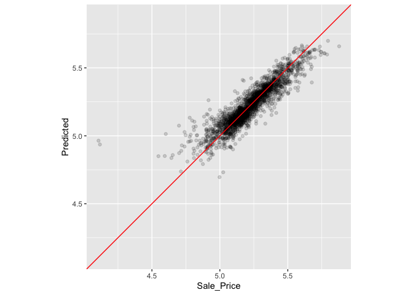

```r
library(tidymodels)
```


# Resampling for Evaluating Performance

## 10.1 The Resubstitution Approach

(bad!)

Try fitting random forest to Ames data:


```r
rf_model <- 
  rand_forest(trees = 1000) %>% 
  set_engine("ranger") %>% 
  set_mode("regression")

rf_wflow <- 
  workflow() %>% 
  add_formula(
    Sale_Price ~ Neighborhood + Gr_Liv_Area + Year_Built + Bldg_Type + 
      Latitude + Longitude) %>% 
  add_model(rf_model) 

rf_fit <- rf_wflow %>% fit(data = ames_train)
```

Compare linear and random forest models by predicting the training set.  This is a "resubstitution" metric

```r
estimate_perf <- function(model, dat) {
  # Capture the names of the `model` and `dat` objects
  cl <- match.call()
  obj_name <- as.character(cl$model)
  data_name <- as.character(cl$dat)
  data_name <- gsub("ames_", "", data_name)
  
  # Estimate these metrics:
  reg_metrics <- metric_set(rmse, rsq)
  
  model %>%
    predict(dat) %>%
    bind_cols(dat %>% select(Sale_Price)) %>%
    reg_metrics(Sale_Price, .pred) %>%
    select(-.estimator) %>%
    mutate(object = obj_name, data = data_name)
}
```


```r
estimate_perf(rf_fit, ames_train)
```

```
## # A tibble: 2 × 4
##   .metric .estimate object data 
##   <chr>       <dbl> <chr>  <chr>
## 1 rmse       0.0365 rf_fit train
## 2 rsq        0.960  rf_fit train
```


```r
estimate_perf(lm_fit, ames_train)
```

```
## # A tibble: 2 × 4
##   .metric .estimate object data 
##   <chr>       <dbl> <chr>  <chr>
## 1 rmse       0.0754 lm_fit train
## 2 rsq        0.816  lm_fit train
```
what about on the test set?


```r
estimate_perf(rf_fit, ames_test)
```

```
## # A tibble: 2 × 4
##   .metric .estimate object data 
##   <chr>       <dbl> <chr>  <chr>
## 1 rmse       0.0704 rf_fit test 
## 2 rsq        0.852  rf_fit test
```

## 10.2 Resampling Methods

## 10.2.1 Cross-validation

set up the folds:


```r
set.seed(1001)
ames_folds <- vfold_cv(ames_train, v = 10)
ames_folds
```

```
## #  10-fold cross-validation 
## # A tibble: 10 × 2
##    splits             id    
##    <list>             <chr> 
##  1 <split [2107/235]> Fold01
##  2 <split [2107/235]> Fold02
##  3 <split [2108/234]> Fold03
##  4 <split [2108/234]> Fold04
##  5 <split [2108/234]> Fold05
##  6 <split [2108/234]> Fold06
##  7 <split [2108/234]> Fold07
##  8 <split [2108/234]> Fold08
##  9 <split [2108/234]> Fold09
## 10 <split [2108/234]> Fold10
```


retreive a fold (use `assessment()` instead of `analysis()` to get the other part of the split)

```r
ames_folds$splits[[1]] %>% analysis() %>% dim()
```

```
## [1] 2107   74
```

Can do __repeated cross-validation__ to reduce sampling error.


```r
vfold_cv(ames_train, v = 10, repeats = 5)
```

```
## #  10-fold cross-validation repeated 5 times 
## # A tibble: 50 × 3
##    splits             id      id2   
##    <list>             <chr>   <chr> 
##  1 <split [2107/235]> Repeat1 Fold01
##  2 <split [2107/235]> Repeat1 Fold02
##  3 <split [2108/234]> Repeat1 Fold03
##  4 <split [2108/234]> Repeat1 Fold04
##  5 <split [2108/234]> Repeat1 Fold05
##  6 <split [2108/234]> Repeat1 Fold06
##  7 <split [2108/234]> Repeat1 Fold07
##  8 <split [2108/234]> Repeat1 Fold08
##  9 <split [2108/234]> Repeat1 Fold09
## 10 <split [2108/234]> Repeat1 Fold10
## # ℹ 40 more rows
```

Doesn't like LOO (why not?  rethinking did...)

__Monte Carlo cross validation__ randomly pick your test and training set each time:


```r
mc_cv(ames_train, prop = 9/10, times = 20)
```

```
## # Monte Carlo cross-validation (0.9/0.1) with 20 resamples  
## # A tibble: 20 × 2
##    splits             id        
##    <list>             <chr>     
##  1 <split [2107/235]> Resample01
##  2 <split [2107/235]> Resample02
##  3 <split [2107/235]> Resample03
##  4 <split [2107/235]> Resample04
##  5 <split [2107/235]> Resample05
##  6 <split [2107/235]> Resample06
##  7 <split [2107/235]> Resample07
##  8 <split [2107/235]> Resample08
##  9 <split [2107/235]> Resample09
## 10 <split [2107/235]> Resample10
## 11 <split [2107/235]> Resample11
## 12 <split [2107/235]> Resample12
## 13 <split [2107/235]> Resample13
## 14 <split [2107/235]> Resample14
## 15 <split [2107/235]> Resample15
## 16 <split [2107/235]> Resample16
## 17 <split [2107/235]> Resample17
## 18 <split [2107/235]> Resample18
## 19 <split [2107/235]> Resample19
## 20 <split [2107/235]> Resample20
```

### 10.2.3 Bootstrapping

tends to underestimate performance


```r
bootstraps(ames_train, times = 5)
```

```
## # Bootstrap sampling 
## # A tibble: 5 × 2
##   splits             id        
##   <list>             <chr>     
## 1 <split [2342/847]> Bootstrap1
## 2 <split [2342/902]> Bootstrap2
## 3 <split [2342/871]> Bootstrap3
## 4 <split [2342/856]> Bootstrap4
## 5 <split [2342/870]> Bootstrap5
```


### 10.2.4 rolling forecasti8ng origin resampling

for time series data

## 10.3 Estimating performance

use `fit_resamples()`


```r
keep_pred <- control_resamples(save_pred = TRUE, save_workflow = TRUE)

set.seed(1003)
rf_res <- 
  rf_wflow %>% 
  fit_resamples(resamples = ames_folds, control = keep_pred)
rf_res
```

```
## # Resampling results
## # 10-fold cross-validation 
## # A tibble: 10 × 5
##    splits             id     .metrics         .notes           .predictions
##    <list>             <chr>  <list>           <list>           <list>      
##  1 <split [2107/235]> Fold01 <tibble [2 × 4]> <tibble [0 × 3]> <tibble>    
##  2 <split [2107/235]> Fold02 <tibble [2 × 4]> <tibble [0 × 3]> <tibble>    
##  3 <split [2108/234]> Fold03 <tibble [2 × 4]> <tibble [0 × 3]> <tibble>    
##  4 <split [2108/234]> Fold04 <tibble [2 × 4]> <tibble [0 × 3]> <tibble>    
##  5 <split [2108/234]> Fold05 <tibble [2 × 4]> <tibble [0 × 3]> <tibble>    
##  6 <split [2108/234]> Fold06 <tibble [2 × 4]> <tibble [0 × 3]> <tibble>    
##  7 <split [2108/234]> Fold07 <tibble [2 × 4]> <tibble [0 × 3]> <tibble>    
##  8 <split [2108/234]> Fold08 <tibble [2 × 4]> <tibble [0 × 3]> <tibble>    
##  9 <split [2108/234]> Fold09 <tibble [2 × 4]> <tibble [0 × 3]> <tibble>    
## 10 <split [2108/234]> Fold10 <tibble [2 × 4]> <tibble [0 × 3]> <tibble>
```


```r
collect_metrics(rf_res)
```

```
## # A tibble: 2 × 6
##   .metric .estimator   mean     n std_err .config             
##   <chr>   <chr>       <dbl> <int>   <dbl> <chr>               
## 1 rmse    standard   0.0721    10 0.00306 Preprocessor1_Model1
## 2 rsq     standard   0.832     10 0.0108  Preprocessor1_Model1
```

Get the predictions from each fold's assessment set:

```r
assess_res <- collect_predictions(rf_res)
assess_res
```

```
## # A tibble: 2,342 × 5
##    id     .pred  .row Sale_Price .config             
##    <chr>  <dbl> <int>      <dbl> <chr>               
##  1 Fold01  5.10    10       5.09 Preprocessor1_Model1
##  2 Fold01  4.92    27       4.90 Preprocessor1_Model1
##  3 Fold01  5.20    47       5.08 Preprocessor1_Model1
##  4 Fold01  5.13    52       5.10 Preprocessor1_Model1
##  5 Fold01  5.13    59       5.10 Preprocessor1_Model1
##  6 Fold01  5.13    63       5.11 Preprocessor1_Model1
##  7 Fold01  4.87    65       4.91 Preprocessor1_Model1
##  8 Fold01  4.98    66       5.04 Preprocessor1_Model1
##  9 Fold01  4.91    67       4.84 Preprocessor1_Model1
## 10 Fold01  4.92    68       5.01 Preprocessor1_Model1
## # ℹ 2,332 more rows
```

plot it

```r
assess_res %>% 
  ggplot(aes(x = Sale_Price, y = .pred)) + 
  geom_point(alpha = .15) +
  geom_abline(color = "red") + 
  coord_obs_pred() + 
  ylab("Predicted")
```

<!-- -->

which were the poorly predicted houses?


```r
over_predicted <- 
  assess_res %>% 
  mutate(residual = Sale_Price - .pred) %>% 
  arrange(desc(abs(residual))) %>% 
  slice(1:2)
over_predicted
```

```
## # A tibble: 2 × 6
##   id     .pred  .row Sale_Price .config              residual
##   <chr>  <dbl> <int>      <dbl> <chr>                   <dbl>
## 1 Fold09  4.96    32       4.11 Preprocessor1_Model1   -0.857
## 2 Fold08  4.94   317       4.12 Preprocessor1_Model1   -0.819
```

```r
ames_train %>% 
  slice(over_predicted$.row) %>% 
  select(Gr_Liv_Area, Neighborhood, Year_Built, Bedroom_AbvGr, Full_Bath)
```

```
## # A tibble: 2 × 5
##   Gr_Liv_Area Neighborhood           Year_Built Bedroom_AbvGr Full_Bath
##         <int> <fct>                       <int>         <int>     <int>
## 1         832 Old_Town                     1923             2         1
## 2         733 Iowa_DOT_and_Rail_Road       1952             2         1
```

## 10.4 Parallel processing


```r
parallel::detectCores(logical = FALSE)
```

```
## [1] 8
```

```r
parallel::detectCores(logical = TRUE)
```

```
## [1] 8
```


```r
# Unix and macOS only
library(doMC)
```

```
## Loading required package: foreach
```

```
## 
## Attaching package: 'foreach'
```

```
## The following objects are masked from 'package:purrr':
## 
##     accumulate, when
```

```
## Loading required package: iterators
```

```
## Loading required package: parallel
```

```r
registerDoMC(cores = 2)

# Now run fit_resamples()...

registerDoSEQ() # return to single processor
```

## 10.5 Saving the resampled objects

skimmed it...not running the code


