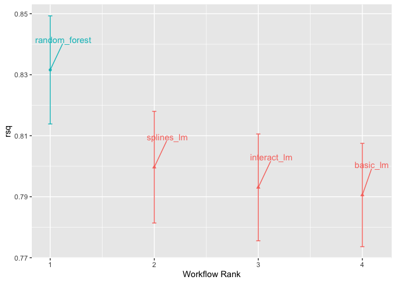
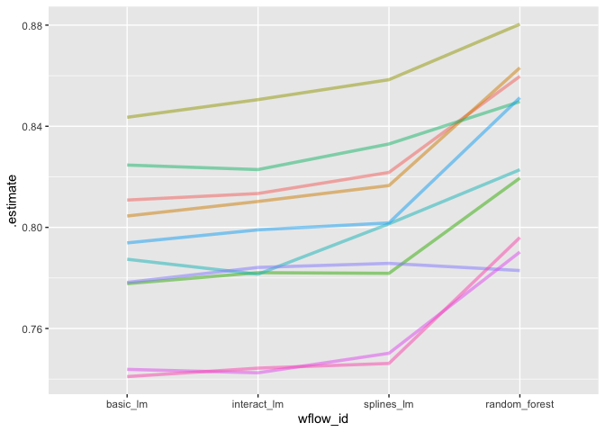
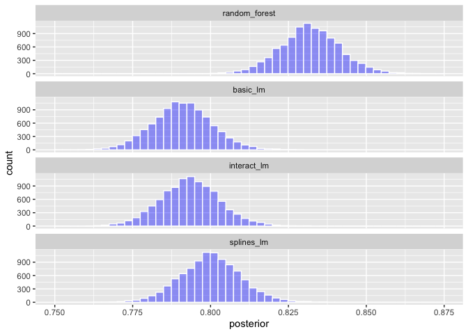
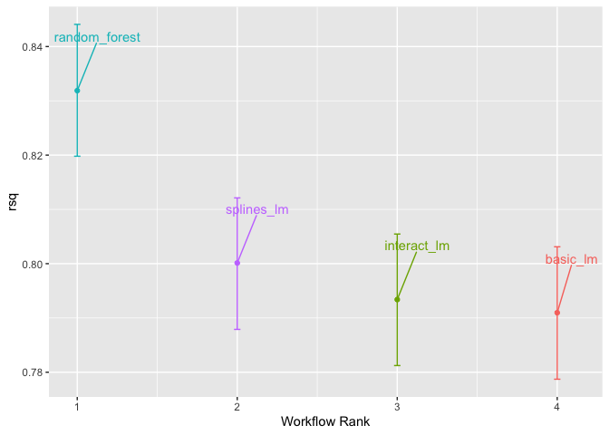
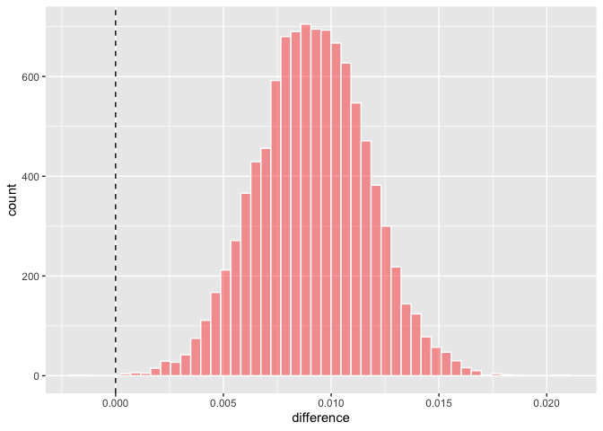

```r
library(tidymodels)
```

```
## ── Attaching packages ────────────────────────────────────── tidymodels 1.1.1 ──
```

```
## ✔ broom        1.0.5     ✔ recipes      1.0.9
## ✔ dials        1.2.0     ✔ rsample      1.2.0
## ✔ dplyr        1.1.4     ✔ tibble       3.2.1
## ✔ ggplot2      3.4.4     ✔ tidyr        1.3.0
## ✔ infer        1.0.5     ✔ tune         1.1.2
## ✔ modeldata    1.2.0     ✔ workflows    1.1.3
## ✔ parsnip      1.1.1     ✔ workflowsets 1.0.1
## ✔ purrr        1.0.2     ✔ yardstick    1.2.0
```

```
## ── Conflicts ───────────────────────────────────────── tidymodels_conflicts() ──
## ✖ purrr::discard() masks scales::discard()
## ✖ dplyr::filter()  masks stats::filter()
## ✖ dplyr::lag()     masks stats::lag()
## ✖ recipes::step()  masks stats::step()
## • Dig deeper into tidy modeling with R at https://www.tmwr.org
```

```r
tidymodels_prefer()
```


# Chapter 11 Comparing models with Resampling

## 11.1 Creating Multiple Models with Workflow Sets


```r
basic_rec <- 
  recipe(Sale_Price ~ Neighborhood + Gr_Liv_Area + Year_Built + Bldg_Type + 
           Latitude + Longitude, data = ames_train) %>%
  step_log(Gr_Liv_Area, base = 10) %>% 
  step_other(Neighborhood, threshold = 0.01) %>% 
  step_dummy(all_nominal_predictors())

interaction_rec <- 
  basic_rec %>% 
  step_interact( ~ Gr_Liv_Area:starts_with("Bldg_Type_") ) 

spline_rec <- 
  interaction_rec %>% 
  step_ns(Latitude, Longitude, deg_free = 50)

preproc <- 
  list(basic = basic_rec, 
       interact = interaction_rec, 
       splines = spline_rec
  )

lm_models <- workflow_set(preproc, list(lm = linear_reg()), cross = FALSE)
lm_models
```

```
## # A workflow set/tibble: 3 × 4
##   wflow_id    info             option    result    
##   <chr>       <list>           <list>    <list>    
## 1 basic_lm    <tibble [1 × 4]> <opts[0]> <list [0]>
## 2 interact_lm <tibble [1 × 4]> <opts[0]> <list [0]>
## 3 splines_lm  <tibble [1 × 4]> <opts[0]> <list [0]>
```

Now resample each model.  Use `workflow_map` to accomplish this.


```r
lm_models <- 
  lm_models %>% 
  workflow_map("fit_resamples", 
               # Options to `workflow_map()`: 
               seed = 1101, verbose = TRUE,
               # Options to `fit_resamples()`: 
               resamples = ames_folds, control = keep_pred)
```

```
## i 1 of 3 resampling: basic_lm
```

```
## ✔ 1 of 3 resampling: basic_lm (397ms)
```

```
## i 2 of 3 resampling: interact_lm
```

```
## ✔ 2 of 3 resampling: interact_lm (458ms)
```

```
## i 3 of 3 resampling: splines_lm
```

```
## ✔ 3 of 3 resampling: splines_lm (1s)
```

```r
lm_models
```

```
## # A workflow set/tibble: 3 × 4
##   wflow_id    info             option    result   
##   <chr>       <list>           <list>    <list>   
## 1 basic_lm    <tibble [1 × 4]> <opts[2]> <rsmp[+]>
## 2 interact_lm <tibble [1 × 4]> <opts[2]> <rsmp[+]>
## 3 splines_lm  <tibble [1 × 4]> <opts[2]> <rsmp[+]>
```

Get the metrics:

```r
collect_metrics(lm_models) %>% 
  filter(.metric == "rmse")
```

```
## # A tibble: 3 × 9
##   wflow_id    .config      preproc model .metric .estimator   mean     n std_err
##   <chr>       <chr>        <chr>   <chr> <chr>   <chr>       <dbl> <int>   <dbl>
## 1 basic_lm    Preprocesso… recipe  line… rmse    standard   0.0803    10 0.00264
## 2 interact_lm Preprocesso… recipe  line… rmse    standard   0.0799    10 0.00272
## 3 splines_lm  Preprocesso… recipe  line… rmse    standard   0.0785    10 0.00282
```

Add the random forest

```r
four_models <- 
  as_workflow_set(random_forest = rf_res) %>% 
  bind_rows(lm_models)
four_models
```

```
## # A workflow set/tibble: 4 × 4
##   wflow_id      info             option    result   
##   <chr>         <list>           <list>    <list>   
## 1 random_forest <tibble [1 × 4]> <opts[0]> <rsmp[+]>
## 2 basic_lm      <tibble [1 × 4]> <opts[2]> <rsmp[+]>
## 3 interact_lm   <tibble [1 × 4]> <opts[2]> <rsmp[+]>
## 4 splines_lm    <tibble [1 × 4]> <opts[2]> <rsmp[+]>
```

plot the R2

```r
library(ggrepel)
autoplot(four_models, metric = "rsq") +
  geom_text_repel(aes(label = wflow_id), nudge_x = 1/8, nudge_y = 1/100) +
  theme(legend.position = "none")
```

<!-- -->

## 11.2 Comparing resampled performance statistics

Test whether additional terms are increasing R2


```r
rsq_indiv_estimates <- 
  collect_metrics(four_models, summarize = FALSE) %>% 
  filter(.metric == "rsq") 

rsq_wider <- 
  rsq_indiv_estimates %>% 
  select(wflow_id, .estimate, id) %>% 
  pivot_wider(id_cols = "id", names_from = "wflow_id", values_from = ".estimate")

corrr::correlate(rsq_wider %>% select(-id), quiet = TRUE)
```

```
## # A tibble: 4 × 5
##   term          random_forest basic_lm interact_lm splines_lm
##   <chr>                 <dbl>    <dbl>       <dbl>      <dbl>
## 1 random_forest        NA        0.876       0.878      0.879
## 2 basic_lm              0.876   NA           0.993      0.997
## 3 interact_lm           0.878    0.993      NA          0.987
## 4 splines_lm            0.879    0.997       0.987     NA
```

The R2s are correlated across folds (since each resampling uses the same folds, this makes sense)


```r
rsq_indiv_estimates %>% 
  mutate(wflow_id = reorder(wflow_id, .estimate)) %>% 
  ggplot(aes(x = wflow_id, y = .estimate, group = id, color = id)) + 
  geom_line(alpha = .5, linewidth = 1.25) + 
  theme(legend.position = "none")
```

<!-- -->

This correlation casuses bias us towards not finding a difference in the models if not accounted for

## 11.3 Simple Hypothesis Testing Methods

Use hypothesis testing to make formal comparisons between models.  

Use R2 as the outcome, and model as the predictor.

Need to deal with the covariance between folds.  Could be done with a random effect.  Or the simple way is to look at the difference in R2.

Using the pairwise difference to compare two models:


```r
compare_lm <- 
  rsq_wider %>% 
  mutate(difference = splines_lm - basic_lm)

lm(difference ~ 1, data = compare_lm) %>% 
  tidy(conf.int = TRUE) %>% 
  select(estimate, p.value, starts_with("conf"))
```

```
## # A tibble: 1 × 4
##   estimate   p.value conf.low conf.high
##      <dbl>     <dbl>    <dbl>     <dbl>
## 1  0.00913 0.0000256  0.00650    0.0118
```


```r
# Alternatively, a paired t-test could also be used: 
rsq_wider %>% 
  with( t.test(splines_lm, basic_lm, paired = TRUE) ) %>%
  tidy() %>% 
  select(estimate, p.value, starts_with("conf"))
```

```
## # A tibble: 1 × 4
##   estimate   p.value conf.low conf.high
##      <dbl>     <dbl>    <dbl>     <dbl>
## 1  0.00913 0.0000256  0.00650    0.0118
```
## 11.4 Bayesian methods

`perf_mod` compare models in a workflow set using Bayesian methods.  Written to "just work"


```r
library(tidyposterior)
library(rstanarm)
```

```
## Loading required package: Rcpp
```

```
## 
## Attaching package: 'Rcpp'
```

```
## The following object is masked from 'package:rsample':
## 
##     populate
```

```
## This is rstanarm version 2.26.1
```

```
## - See https://mc-stan.org/rstanarm/articles/priors for changes to default priors!
```

```
## - Default priors may change, so it's safest to specify priors, even if equivalent to the defaults.
```

```
## - For execution on a local, multicore CPU with excess RAM we recommend calling
```

```
##   options(mc.cores = parallel::detectCores())
```

```r
rsq_anova <-
  perf_mod(
    four_models,
    metric = "rsq",
    prior_intercept = rstanarm::student_t(df = 1),
    chains = 4,
    iter = 5000,
    seed = 1102
  )
```

```
## 
## SAMPLING FOR MODEL 'continuous' NOW (CHAIN 1).
## Chain 1: 
## Chain 1: Gradient evaluation took 0.000689 seconds
## Chain 1: 1000 transitions using 10 leapfrog steps per transition would take 6.89 seconds.
## Chain 1: Adjust your expectations accordingly!
## Chain 1: 
## Chain 1: 
## Chain 1: Iteration:    1 / 5000 [  0%]  (Warmup)
## Chain 1: Iteration:  500 / 5000 [ 10%]  (Warmup)
## Chain 1: Iteration: 1000 / 5000 [ 20%]  (Warmup)
## Chain 1: Iteration: 1500 / 5000 [ 30%]  (Warmup)
## Chain 1: Iteration: 2000 / 5000 [ 40%]  (Warmup)
## Chain 1: Iteration: 2500 / 5000 [ 50%]  (Warmup)
## Chain 1: Iteration: 2501 / 5000 [ 50%]  (Sampling)
## Chain 1: Iteration: 3000 / 5000 [ 60%]  (Sampling)
## Chain 1: Iteration: 3500 / 5000 [ 70%]  (Sampling)
## Chain 1: Iteration: 4000 / 5000 [ 80%]  (Sampling)
## Chain 1: Iteration: 4500 / 5000 [ 90%]  (Sampling)
## Chain 1: Iteration: 5000 / 5000 [100%]  (Sampling)
## Chain 1: 
## Chain 1:  Elapsed Time: 1.906 seconds (Warm-up)
## Chain 1:                1.209 seconds (Sampling)
## Chain 1:                3.115 seconds (Total)
## Chain 1: 
## 
## SAMPLING FOR MODEL 'continuous' NOW (CHAIN 2).
## Chain 2: 
## Chain 2: Gradient evaluation took 1.1e-05 seconds
## Chain 2: 1000 transitions using 10 leapfrog steps per transition would take 0.11 seconds.
## Chain 2: Adjust your expectations accordingly!
## Chain 2: 
## Chain 2: 
## Chain 2: Iteration:    1 / 5000 [  0%]  (Warmup)
## Chain 2: Iteration:  500 / 5000 [ 10%]  (Warmup)
## Chain 2: Iteration: 1000 / 5000 [ 20%]  (Warmup)
## Chain 2: Iteration: 1500 / 5000 [ 30%]  (Warmup)
## Chain 2: Iteration: 2000 / 5000 [ 40%]  (Warmup)
## Chain 2: Iteration: 2500 / 5000 [ 50%]  (Warmup)
## Chain 2: Iteration: 2501 / 5000 [ 50%]  (Sampling)
## Chain 2: Iteration: 3000 / 5000 [ 60%]  (Sampling)
## Chain 2: Iteration: 3500 / 5000 [ 70%]  (Sampling)
## Chain 2: Iteration: 4000 / 5000 [ 80%]  (Sampling)
## Chain 2: Iteration: 4500 / 5000 [ 90%]  (Sampling)
## Chain 2: Iteration: 5000 / 5000 [100%]  (Sampling)
## Chain 2: 
## Chain 2:  Elapsed Time: 1.807 seconds (Warm-up)
## Chain 2:                1.27 seconds (Sampling)
## Chain 2:                3.077 seconds (Total)
## Chain 2: 
## 
## SAMPLING FOR MODEL 'continuous' NOW (CHAIN 3).
## Chain 3: 
## Chain 3: Gradient evaluation took 1.1e-05 seconds
## Chain 3: 1000 transitions using 10 leapfrog steps per transition would take 0.11 seconds.
## Chain 3: Adjust your expectations accordingly!
## Chain 3: 
## Chain 3: 
## Chain 3: Iteration:    1 / 5000 [  0%]  (Warmup)
## Chain 3: Iteration:  500 / 5000 [ 10%]  (Warmup)
## Chain 3: Iteration: 1000 / 5000 [ 20%]  (Warmup)
## Chain 3: Iteration: 1500 / 5000 [ 30%]  (Warmup)
## Chain 3: Iteration: 2000 / 5000 [ 40%]  (Warmup)
## Chain 3: Iteration: 2500 / 5000 [ 50%]  (Warmup)
## Chain 3: Iteration: 2501 / 5000 [ 50%]  (Sampling)
## Chain 3: Iteration: 3000 / 5000 [ 60%]  (Sampling)
## Chain 3: Iteration: 3500 / 5000 [ 70%]  (Sampling)
## Chain 3: Iteration: 4000 / 5000 [ 80%]  (Sampling)
## Chain 3: Iteration: 4500 / 5000 [ 90%]  (Sampling)
## Chain 3: Iteration: 5000 / 5000 [100%]  (Sampling)
## Chain 3: 
## Chain 3:  Elapsed Time: 1.929 seconds (Warm-up)
## Chain 3:                1.184 seconds (Sampling)
## Chain 3:                3.113 seconds (Total)
## Chain 3: 
## 
## SAMPLING FOR MODEL 'continuous' NOW (CHAIN 4).
## Chain 4: 
## Chain 4: Gradient evaluation took 1.6e-05 seconds
## Chain 4: 1000 transitions using 10 leapfrog steps per transition would take 0.16 seconds.
## Chain 4: Adjust your expectations accordingly!
## Chain 4: 
## Chain 4: 
## Chain 4: Iteration:    1 / 5000 [  0%]  (Warmup)
## Chain 4: Iteration:  500 / 5000 [ 10%]  (Warmup)
## Chain 4: Iteration: 1000 / 5000 [ 20%]  (Warmup)
## Chain 4: Iteration: 1500 / 5000 [ 30%]  (Warmup)
## Chain 4: Iteration: 2000 / 5000 [ 40%]  (Warmup)
## Chain 4: Iteration: 2500 / 5000 [ 50%]  (Warmup)
## Chain 4: Iteration: 2501 / 5000 [ 50%]  (Sampling)
## Chain 4: Iteration: 3000 / 5000 [ 60%]  (Sampling)
## Chain 4: Iteration: 3500 / 5000 [ 70%]  (Sampling)
## Chain 4: Iteration: 4000 / 5000 [ 80%]  (Sampling)
## Chain 4: Iteration: 4500 / 5000 [ 90%]  (Sampling)
## Chain 4: Iteration: 5000 / 5000 [100%]  (Sampling)
## Chain 4: 
## Chain 4:  Elapsed Time: 1.832 seconds (Warm-up)
## Chain 4:                1.19 seconds (Sampling)
## Chain 4:                3.022 seconds (Total)
## Chain 4:
```

Get the posteriors


```r
model_post <- 
  rsq_anova %>% 
  # Take a random sample from the posterior distribution
  # so set the seed again to be reproducible. 
  tidy(seed = 1103) 

glimpse(model_post)
```

```
## Rows: 40,000
## Columns: 2
## $ model     <chr> "random_forest", "basic_lm", "interact_lm", "splines_lm", "r…
## $ posterior <dbl> 0.8417662, 0.8045278, 0.8075135, 0.8106391, 0.8347948, 0.788…
```
plot posteriors


```r
model_post %>% 
  mutate(model = forcats::fct_inorder(model)) %>%
  ggplot(aes(x = posterior)) + 
  geom_histogram(bins = 50, color = "white", fill = "blue", alpha = 0.4) + 
  facet_wrap(~ model, ncol = 1)
```

<!-- -->
or use autoplot


```r
autoplot(rsq_anova) +
  geom_text_repel(aes(label = workflow), nudge_x = 1/8, nudge_y = 1/100) +
  theme(legend.position = "none")
```

<!-- -->

To compare two models, compute the difference in posteriors

```r
rqs_diff <-
  contrast_models(rsq_anova,
                  list_1 = "splines_lm",
                  list_2 = "basic_lm",
                  seed = 1104)

rqs_diff %>% 
  as_tibble() %>% 
  ggplot(aes(x = difference)) + 
  geom_vline(xintercept = 0, lty = 2) + 
  geom_histogram(bins = 50, color = "white", fill = "red", alpha = 0.4)
```

<!-- -->


```r
summary(rqs_diff) %>% 
  select(-starts_with("pract"))
```

```
## # A tibble: 1 × 6
##   contrast               probability    mean   lower  upper  size
##   <chr>                        <dbl>   <dbl>   <dbl>  <dbl> <dbl>
## 1 splines_lm vs basic_lm        1.00 0.00914 0.00496 0.0133     0
```

```r
#> # A tibble: 1 × 6
#>   contrast               probability    mean   lower  upper  size
#>   <chr>                        <dbl>   <dbl>   <dbl>  <dbl> <dbl>
#> 1 splines_lm vs basic_lm        1.00 0.00913 0.00510 0.0132     0
```

with a practical equivalence distance


```r
summary(rqs_diff, size = 0.02) %>% 
  select(contrast, starts_with("pract"))
```

```
## # A tibble: 1 × 4
##   contrast               pract_neg pract_equiv pract_pos
##   <chr>                      <dbl>       <dbl>     <dbl>
## 1 splines_lm vs basic_lm         0        1.00    0.0002
```

```r
#> # A tibble: 1 × 4
#>   contrast               pract_neg pract_equiv pract_pos
#>   <chr>                      <dbl>       <dbl>     <dbl>
#> 1 splines_lm vs basic_lm         0           1         0
```

