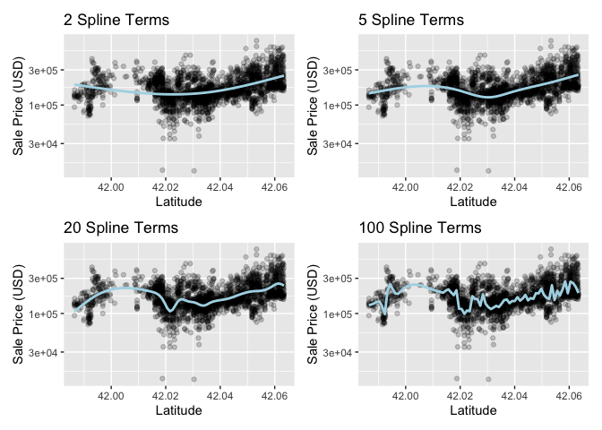

```r
library(tidymodels)
```

```
## ── Attaching packages ────────────────────────────────────── tidymodels 1.1.1 ──
```

```
## ✔ broom        1.0.5     ✔ recipes      1.0.8
## ✔ dials        1.2.0     ✔ rsample      1.2.0
## ✔ dplyr        1.1.4     ✔ tibble       3.2.1
## ✔ ggplot2      3.4.4     ✔ tidyr        1.3.0
## ✔ infer        1.0.5     ✔ tune         1.1.2
## ✔ modeldata    1.2.0     ✔ workflows    1.1.3
## ✔ parsnip      1.1.1     ✔ workflowsets 1.0.1
## ✔ purrr        1.0.2     ✔ yardstick    1.2.0
```

```
## ── Conflicts ───────────────────────────────────────── tidymodels_conflicts() ──
## ✖ purrr::discard() masks scales::discard()
## ✖ dplyr::filter()  masks stats::filter()
## ✖ dplyr::lag()     masks stats::lag()
## ✖ recipes::step()  masks stats::step()
## • Use suppressPackageStartupMessages() to eliminate package startup messages
```

```r
tidymodels_prefer()
load("Chapter_7_objects.Rdata")
```

# Feature engineering

This is basically transforming predictors in various ways to help model fit.

e.g. transformations, new derived variables via ratios, dimension reduction, etc.

The main package is __recipes__, which is a core tidymodels package

## 8.1 A simple `recipe()` for the Ames housing data

R forumlas do many pre-processing steps.  For example:


```r
lm(Sale_Price ~ Neighborhood + log10(Gr_Liv_Area) + Year_Built + Bldg_Type, data = ames)
```

Here, in addition to definint Sale_Price as the outscome and the other variables as predictors, it is log10 trasnforming Gr\_Liv\_Area and converting Neighborhood and Bldg\_Type into dummy numeric variables

IF we use a _recipe_ we can accomplish the same steps but it will be specified in pre-processing.  (although the transformation won't take place until later)

For example:


```r
simple_ames <- 
  recipe(Sale_Price ~ Neighborhood + Gr_Liv_Area + Year_Built + Bldg_Type,
         data = ames_train) %>%
  step_log(Gr_Liv_Area, base = 10) %>% 
  step_dummy(all_nominal_predictors())
simple_ames
```

```
## 
```

```
## ── Recipe ──────────────────────────────────────────────────────────────────────
```

```
## 
```

```
## ── Inputs
```

```
## Number of variables by role
```

```
## outcome:   1
## predictor: 4
```

```
## 
```

```
## ── Operations
```

```
## • Log transformation on: Gr_Liv_Area
```

```
## • Dummy variables from: all_nominal_predictors()
```

Recipe advantages:

* Can be recycled across different data sets and models
* more options than what is avaible inside a formula
* more compact specification if operating on many variables.
* all data processing captured in a single R object

## 8.2 Using recipes

Include them in your workflow.  Here we have to remove the previous list/formual from our workflow before adding the recipe


```r
lm_wflow <- 
  lm_wflow %>% 
  remove_variables() %>% 
  add_recipe(simple_ames)
lm_wflow
```

```
## ══ Workflow ════════════════════════════════════════════════════════════════════
## Preprocessor: Recipe
## Model: linear_reg()
## 
## ── Preprocessor ────────────────────────────────────────────────────────────────
## 2 Recipe Steps
## 
## • step_log()
## • step_dummy()
## 
## ── Model ───────────────────────────────────────────────────────────────────────
## Linear Regression Model Specification (regression)
## 
## Computational engine: lm
```

The books says "let's estimate both the recipe and the model".  What do they mean by estimate the recipe?  Maybe calculate the recipe...


```r
lm_fit <- fit(lm_wflow, ames_train)
```

Predict will use the same recipe specified in the workflow (nice!)


```r
predict(lm_fit, ames_test %>% slice(1:3))
```

```
## Warning in predict.lm(object = object$fit, newdata = new_data, type =
## "response", : prediction from rank-deficient fit; consider predict(.,
## rankdeficient="NA")
```

```
## # A tibble: 3 × 1
##   .pred
##   <dbl>
## 1  5.32
## 2  5.18
## 3  5.25
```
You can extract the recipe

```r
lm_fit %>% extract_recipe()
```

```
## 
```

```
## ── Recipe ──────────────────────────────────────────────────────────────────────
```

```
## 
```

```
## ── Inputs
```

```
## Number of variables by role
```

```
## outcome:   1
## predictor: 4
```

```
## 
```

```
## ── Training information
```

```
## Training data contained 2344 data points and no incomplete rows.
```

```
## 
```

```
## ── Operations
```

```
## • Log transformation on: Gr_Liv_Area | Trained
```

```
## • Dummy variables from: Neighborhood, Bldg_Type | Trained
```

You can extract the fit:

```r
lm_fit %>%
  extract_fit_parsnip() %>%
  tidy() %>%
  slice(1:5)
```

```
## # A tibble: 5 × 5
##   term                       estimate std.error statistic   p.value
##   <chr>                         <dbl>     <dbl>     <dbl>     <dbl>
## 1 (Intercept)                -0.910    0.234        -3.88 1.06e-  4
## 2 Gr_Liv_Area                 0.623    0.0143       43.4  7.06e-302
## 3 Year_Built                  0.00211  0.000119     17.8  1.55e- 66
## 4 Neighborhood_College_Creek  0.00984  0.00825       1.19 2.33e-  1
## 5 Neighborhood_Old_Town      -0.0335   0.00860      -3.90 1.00e-  4
```
## 8.3 how does recipe() use data?

at fit time and at predict time.  note that for standardizaton, etc the training set parameters are used in the test set preductions (nice)!

## 8.4 Examples of recipe steps

### 8.4.1 Encoding qualitative data in numeric format

step_dummy() has a bunch of nice features including better naming, option for one_hot encoding, etc

there is also a step_other() function that can group low frequencing categories into an "other" category


```r
simple_ames <- 
  recipe(Sale_Price ~ Neighborhood + Gr_Liv_Area + Year_Built + Bldg_Type,
         data = ames_train) %>%
  step_log(Gr_Liv_Area, base = 10) %>% 
  step_other(Neighborhood, threshold = 0.01) %>% 
  step_dummy(all_nominal_predictors())
```

## 8.4.2 Interaction Terms

Example: interaction between building type and gross living area


```r
ggplot(ames_train, aes(x = Gr_Liv_Area, y = 10^Sale_Price)) + 
  geom_point(alpha = .2) + 
  facet_wrap(~ Bldg_Type) + 
  geom_smooth(method = lm, formula = y ~ x, se = FALSE, color = "lightblue") + 
  scale_x_log10() + 
  scale_y_log10() + 
  labs(x = "Gross Living Area", y = "Sale Price (USD)")
```

<!-- -->

Can use step_interact().  Be sure to create the dummy variables first!


```r
simple_ames <- 
  recipe(Sale_Price ~ Neighborhood + Gr_Liv_Area + Year_Built + Bldg_Type,
         data = ames_train) %>%
  step_log(Gr_Liv_Area, base = 10) %>% 
  step_other(Neighborhood, threshold = 0.01) %>% 
  step_dummy(all_nominal_predictors()) %>% 
  # Gr_Liv_Area is on the log scale from a previous step
  step_interact( ~ Gr_Liv_Area:starts_with("Bldg_Type_") )
```


## 8.4.3 Spline functions

Example from smoothing:


```r
library(patchwork)
library(splines)

plot_smoother <- function(deg_free) {
  ggplot(ames_train, aes(x = Latitude, y = 10^Sale_Price)) + 
    geom_point(alpha = .2) + 
    scale_y_log10() +
    geom_smooth(
      method = lm,
      formula = y ~ ns(x, df = deg_free),
      color = "lightblue",
      se = FALSE
    ) +
    labs(title = paste(deg_free, "Spline Terms"),
         y = "Sale Price (USD)")
}

( plot_smoother(2) + plot_smoother(5) ) / ( plot_smoother(20) + plot_smoother(100) )
```

<!-- -->

Adding a spline using recipes:


```r
recipe(Sale_Price ~ Neighborhood + Gr_Liv_Area + Year_Built + Bldg_Type + Latitude,
         data = ames_train) %>%
  step_log(Gr_Liv_Area, base = 10) %>% 
  step_other(Neighborhood, threshold = 0.01) %>% 
  step_dummy(all_nominal_predictors()) %>% 
  step_interact( ~ Gr_Liv_Area:starts_with("Bldg_Type_") ) %>% 
  step_ns(Latitude, deg_free = 20)
```

```
## 
```

```
## ── Recipe ──────────────────────────────────────────────────────────────────────
```

```
## 
```

```
## ── Inputs
```

```
## Number of variables by role
```

```
## outcome:   1
## predictor: 5
```

```
## 
```

```
## ── Operations
```

```
## • Log transformation on: Gr_Liv_Area
```

```
## • Collapsing factor levels for: Neighborhood
```

```
## • Dummy variables from: all_nominal_predictors()
```

```
## • Interactions with: Gr_Liv_Area:starts_with("Bldg_Type_")
```

```
## • Natural splines on: Latitude
```

### 8.4.4 Feature extractions

e.g. pca, MDS, etc, etc.  Nice step functions for this.

### 8.4.5 Row sampling steps

Downsampling, upsampling, hybrid sampling, etc

### 8.4.6

General transformations

`step_mutate()`

## 8.5 Skipping steps for new data

Outcome transformations should be done outside of the recipe

Step functions have a `skip` arugment that keep them from operating on predictor data sets

## 8.6 Tidy a recipe()

```r
ames_rec <- 
  recipe(Sale_Price ~ Neighborhood + Gr_Liv_Area + Year_Built + Bldg_Type + 
           Latitude + Longitude, data = ames_train) %>%
  step_log(Gr_Liv_Area, base = 10) %>% 
  step_other(Neighborhood, threshold = 0.01) %>% 
  step_dummy(all_nominal_predictors()) %>% 
  step_interact( ~ Gr_Liv_Area:starts_with("Bldg_Type_") ) %>% 
  step_ns(Latitude, Longitude, deg_free = 20)

tidy(ames_rec)
```

```
## # A tibble: 5 × 6
##   number operation type     trained skip  id            
##    <int> <chr>     <chr>    <lgl>   <lgl> <chr>         
## 1      1 step      log      FALSE   FALSE log_yYVqx     
## 2      2 step      other    FALSE   FALSE other_yOIRH   
## 3      3 step      dummy    FALSE   FALSE dummy_b5B8Z   
## 4      4 step      interact FALSE   FALSE interact_2In8E
## 5      5 step      ns       FALSE   FALSE ns_5X8Rt
```

Can specify the ID:


```r
ames_rec <- 
  recipe(Sale_Price ~ Neighborhood + Gr_Liv_Area + Year_Built + Bldg_Type + 
           Latitude + Longitude, data = ames_train) %>%
  step_log(Gr_Liv_Area, base = 10) %>% 
  step_other(Neighborhood, threshold = 0.01, id = "my_id") %>% 
  step_dummy(all_nominal_predictors()) %>% 
  step_interact( ~ Gr_Liv_Area:starts_with("Bldg_Type_") ) %>% 
  step_ns(Latitude, Longitude, deg_free = 20)

tidy(ames_rec)
```

```
## # A tibble: 5 × 6
##   number operation type     trained skip  id            
##    <int> <chr>     <chr>    <lgl>   <lgl> <chr>         
## 1      1 step      log      FALSE   FALSE log_i96j6     
## 2      2 step      other    FALSE   FALSE my_id         
## 3      3 step      dummy    FALSE   FALSE dummy_iVdpf   
## 4      4 step      interact FALSE   FALSE interact_aFwby
## 5      5 step      ns       FALSE   FALSE ns_bqGmo
```

refit the workflow:


```r
lm_wflow <- 
  workflow() %>% 
  add_model(lm_model) %>% 
  add_recipe(ames_rec)

lm_fit <- fit(lm_wflow, ames_train)
```

then can pull out by id

```r
estimated_recipe <- 
  lm_fit %>% 
  extract_recipe(estimated = TRUE)

tidy(estimated_recipe, id = "my_id")
```

```
## # A tibble: 22 × 3
##    terms        retained           id   
##    <chr>        <chr>              <chr>
##  1 Neighborhood North_Ames         my_id
##  2 Neighborhood College_Creek      my_id
##  3 Neighborhood Old_Town           my_id
##  4 Neighborhood Edwards            my_id
##  5 Neighborhood Somerset           my_id
##  6 Neighborhood Northridge_Heights my_id
##  7 Neighborhood Gilbert            my_id
##  8 Neighborhood Sawyer             my_id
##  9 Neighborhood Northwest_Ames     my_id
## 10 Neighborhood Sawyer_West        my_id
## # ℹ 12 more rows
```

## 8.7 Column Roles

by default recipes assign columns to an outcome or predictor role, based on the formula.  But we can create new roles.


```r
ames_rec %>% update_role(address, new_role = "street address")
```


