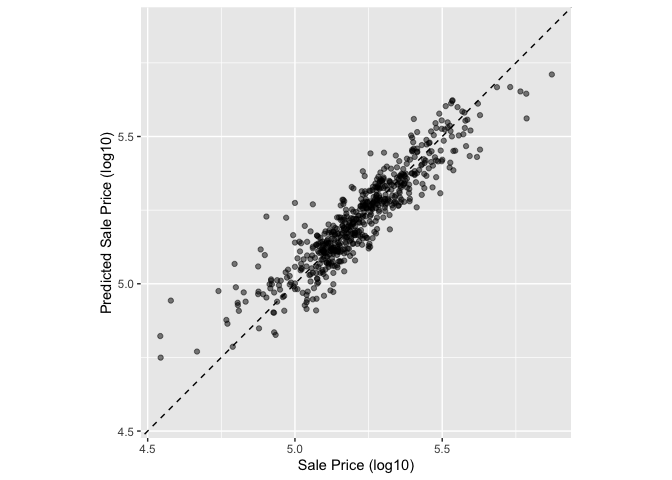

# Set up


```r
library(tidymodels)
```

```
## ── Attaching packages ────────────────────────────────────── tidymodels 1.1.1 ──
```

```
## ✔ broom        1.0.5     ✔ recipes      1.0.9
## ✔ dials        1.2.0     ✔ rsample      1.2.0
## ✔ dplyr        1.1.4     ✔ tibble       3.2.1
## ✔ ggplot2      3.4.4     ✔ tidyr        1.3.0
## ✔ infer        1.0.5     ✔ tune         1.1.2
## ✔ modeldata    1.2.0     ✔ workflows    1.1.3
## ✔ parsnip      1.1.1     ✔ workflowsets 1.0.1
## ✔ purrr        1.0.2     ✔ yardstick    1.2.0
```

```
## ── Conflicts ───────────────────────────────────────── tidymodels_conflicts() ──
## ✖ purrr::discard() masks scales::discard()
## ✖ dplyr::filter()  masks stats::filter()
## ✖ dplyr::lag()     masks stats::lag()
## ✖ recipes::step()  masks stats::step()
## • Learn how to get started at https://www.tidymodels.org/start/
```

```r
data(ames)
ames <- mutate(ames, Sale_Price = log10(Sale_Price))

set.seed(502)
ames_split <- initial_split(ames, prop = 0.80, strata = Sale_Price)
ames_train <- training(ames_split)
ames_test  <-  testing(ames_split)

ames_rec <- 
  recipe(Sale_Price ~ Neighborhood + Gr_Liv_Area + Year_Built + Bldg_Type + 
           Latitude + Longitude, data = ames_train) %>%
  step_log(Gr_Liv_Area, base = 10) %>% 
  step_other(Neighborhood, threshold = 0.01) %>% 
  step_dummy(all_nominal_predictors()) %>% 
  step_interact( ~ Gr_Liv_Area:starts_with("Bldg_Type_") ) %>% 
  step_ns(Latitude, Longitude, deg_free = 20)
  
lm_model <- linear_reg() %>% set_engine("lm")

lm_wflow <- 
  workflow() %>% 
  add_model(lm_model) %>% 
  add_recipe(ames_rec)

lm_fit <- fit(lm_wflow, ames_train)
```

## 9.1 Performance metrics and inference

Advise to assess prediction accuracy even if your focus in inference.  Need to know model fidelity to the data.

## 9.2 Regression metrics

practice with predictions on the ames test set:


```r
ames_test_res <- predict(lm_fit, new_data = ames_test %>% select(-Sale_Price))
ames_test_res
```

```
## # A tibble: 588 × 1
##    .pred
##    <dbl>
##  1  5.07
##  2  5.31
##  3  5.28
##  4  5.33
##  5  5.30
##  6  5.24
##  7  5.67
##  8  5.52
##  9  5.34
## 10  5.00
## # ℹ 578 more rows
```
 
 add in the observed values:
 

```r
ames_test_res <- bind_cols(ames_test_res, ames_test %>% select(Sale_Price))
ames_test_res
```

```
## # A tibble: 588 × 2
##    .pred Sale_Price
##    <dbl>      <dbl>
##  1  5.07       5.02
##  2  5.31       5.39
##  3  5.28       5.28
##  4  5.33       5.28
##  5  5.30       5.28
##  6  5.24       5.26
##  7  5.67       5.73
##  8  5.52       5.60
##  9  5.34       5.32
## 10  5.00       4.98
## # ℹ 578 more rows
```

plot observed vs predicted 

```r
ggplot(ames_test_res, aes(x = Sale_Price, y = .pred)) + 
  # Create a diagonal line:
  geom_abline(lty = 2) + 
  geom_point(alpha = 0.5) + 
  labs(y = "Predicted Sale Price (log10)", x = "Sale Price (log10)") +
  # Scale and size the x- and y-axis uniformly:
  coord_obs_pred()
```

<!-- -->

calculate RMSE


```r
rmse(ames_test_res, truth = Sale_Price, estimate = .pred)
```

```
## # A tibble: 1 × 3
##   .metric .estimator .estimate
##   <chr>   <chr>          <dbl>
## 1 rmse    standard      0.0736
```

can use a metric set to look at multiple metrics


```r
ames_metrics <- metric_set(rmse, rsq, mae)
ames_metrics(ames_test_res, truth = Sale_Price, estimate = .pred)
```

```
## # A tibble: 3 × 3
##   .metric .estimator .estimate
##   <chr>   <chr>          <dbl>
## 1 rmse    standard      0.0736
## 2 rsq     standard      0.836 
## 3 mae     standard      0.0549
```

NB don't need adj.R2 if working with a test set

## 9.3 Binary Classification Metrics


```r
data(two_class_example)
tibble(two_class_example)
```

```
## # A tibble: 500 × 4
##    truth   Class1   Class2 predicted
##    <fct>    <dbl>    <dbl> <fct>    
##  1 Class2 0.00359 0.996    Class2   
##  2 Class1 0.679   0.321    Class1   
##  3 Class2 0.111   0.889    Class2   
##  4 Class1 0.735   0.265    Class1   
##  5 Class2 0.0162  0.984    Class2   
##  6 Class1 0.999   0.000725 Class1   
##  7 Class1 0.999   0.000799 Class1   
##  8 Class1 0.812   0.188    Class1   
##  9 Class2 0.457   0.543    Class2   
## 10 Class2 0.0976  0.902    Class2   
## # ℹ 490 more rows
```


```r
# A confusion matrix: 
conf_mat(two_class_example, truth = truth, estimate = predicted)
```

```
##           Truth
## Prediction Class1 Class2
##     Class1    227     50
##     Class2     31    192
```


```r
# Accuracy:
accuracy(two_class_example, truth, predicted)
```

```
## # A tibble: 1 × 3
##   .metric  .estimator .estimate
##   <chr>    <chr>          <dbl>
## 1 accuracy binary         0.838
```
Accuracy is correct / total


```r
# Matthews correlation coefficient:
mcc(two_class_example, truth, predicted)
```

```
## # A tibble: 1 × 3
##   .metric .estimator .estimate
##   <chr>   <chr>          <dbl>
## 1 mcc     binary         0.677
```


```r
# F1 metric:
f_meas(two_class_example, truth, predicted)
```

```
## # A tibble: 1 × 3
##   .metric .estimator .estimate
##   <chr>   <chr>          <dbl>
## 1 f_meas  binary         0.849
```
F1 is correct class 1 / (correct class 1 + (incorrect class 1 + incorrect class 2) / 2))


```r
# Combining these three classification metrics together
classification_metrics <- metric_set(accuracy, mcc, f_meas)
classification_metrics(two_class_example, truth = truth, estimate = predicted)
```

```
## # A tibble: 3 × 3
##   .metric  .estimator .estimate
##   <chr>    <chr>          <dbl>
## 1 accuracy binary         0.838
## 2 mcc      binary         0.677
## 3 f_meas   binary         0.849
```


```r
two_class_curve <- roc_curve(two_class_example, truth, Class1)
two_class_curve
```

```
## # A tibble: 502 × 3
##    .threshold specificity sensitivity
##         <dbl>       <dbl>       <dbl>
##  1 -Inf           0                 1
##  2    1.79e-7     0                 1
##  3    4.50e-6     0.00413           1
##  4    5.81e-6     0.00826           1
##  5    5.92e-6     0.0124            1
##  6    1.22e-5     0.0165            1
##  7    1.40e-5     0.0207            1
##  8    1.43e-5     0.0248            1
##  9    2.38e-5     0.0289            1
## 10    3.30e-5     0.0331            1
## # ℹ 492 more rows
```


```r
roc_auc(two_class_example, truth, Class1)
```

```
## # A tibble: 1 × 3
##   .metric .estimator .estimate
##   <chr>   <chr>          <dbl>
## 1 roc_auc binary         0.939
```


```r
autoplot(two_class_curve)
```

<!-- -->

## 9.4 Multiclass classification metrics


```r
data(hpc_cv)
tibble(hpc_cv)
```

```
## # A tibble: 3,467 × 7
##    obs   pred     VF      F       M          L Resample
##    <fct> <fct> <dbl>  <dbl>   <dbl>      <dbl> <chr>   
##  1 VF    VF    0.914 0.0779 0.00848 0.0000199  Fold01  
##  2 VF    VF    0.938 0.0571 0.00482 0.0000101  Fold01  
##  3 VF    VF    0.947 0.0495 0.00316 0.00000500 Fold01  
##  4 VF    VF    0.929 0.0653 0.00579 0.0000156  Fold01  
##  5 VF    VF    0.942 0.0543 0.00381 0.00000729 Fold01  
##  6 VF    VF    0.951 0.0462 0.00272 0.00000384 Fold01  
##  7 VF    VF    0.914 0.0782 0.00767 0.0000354  Fold01  
##  8 VF    VF    0.918 0.0744 0.00726 0.0000157  Fold01  
##  9 VF    VF    0.843 0.128  0.0296  0.000192   Fold01  
## 10 VF    VF    0.920 0.0728 0.00703 0.0000147  Fold01  
## # ℹ 3,457 more rows
```


```r
conf_mat(hpc_cv, obs, pred)
```

```
##           Truth
## Prediction   VF    F    M    L
##         VF 1620  371   64    9
##         F   141  647  219   60
##         M     6   24   79   28
##         L     2   36   50  111
```


```r
accuracy(hpc_cv, obs, pred)
```

```
## # A tibble: 1 × 3
##   .metric  .estimator .estimate
##   <chr>    <chr>          <dbl>
## 1 accuracy multiclass     0.709
```

```r
#> # A tibble: 1 × 3
#>   .metric  .estimator .estimate
#>   <chr>    <chr>          <dbl>
#> 1 accuracy multiclass     0.709

mcc(hpc_cv, obs, pred)
```

```
## # A tibble: 1 × 3
##   .metric .estimator .estimate
##   <chr>   <chr>          <dbl>
## 1 mcc     multiclass     0.515
```

```r
#> # A tibble: 1 × 3
#>   .metric .estimator .estimate
#>   <chr>   <chr>          <dbl>
#> 1 mcc     multiclass     0.515
```

### multiclass sensitivity analysis
There are various ways of computing this:


```r
sensitivity(hpc_cv, obs, pred, estimator = "macro")
```

```
## # A tibble: 1 × 3
##   .metric     .estimator .estimate
##   <chr>       <chr>          <dbl>
## 1 sensitivity macro          0.560
```

```r
#> # A tibble: 1 × 3
#>   .metric     .estimator .estimate
#>   <chr>       <chr>          <dbl>
#> 1 sensitivity macro          0.560
sensitivity(hpc_cv, obs, pred, estimator = "macro_weighted")
```

```
## # A tibble: 1 × 3
##   .metric     .estimator     .estimate
##   <chr>       <chr>              <dbl>
## 1 sensitivity macro_weighted     0.709
```

```r
#> # A tibble: 1 × 3
#>   .metric     .estimator     .estimate
#>   <chr>       <chr>              <dbl>
#> 1 sensitivity macro_weighted     0.709
sensitivity(hpc_cv, obs, pred, estimator = "micro")
```

```
## # A tibble: 1 × 3
##   .metric     .estimator .estimate
##   <chr>       <chr>          <dbl>
## 1 sensitivity micro          0.709
```

```r
#> # A tibble: 1 × 3
#>   .metric     .estimator .estimate
#>   <chr>       <chr>          <dbl>
#> 1 sensitivity micro          0.709
```


```r
roc_auc(hpc_cv, obs, VF, F, M, L)
```

```
## # A tibble: 1 × 3
##   .metric .estimator .estimate
##   <chr>   <chr>          <dbl>
## 1 roc_auc hand_till      0.829
```


```r
roc_auc(hpc_cv, obs, VF, F, M, L, estimator = "macro_weighted")
```

```
## # A tibble: 1 × 3
##   .metric .estimator     .estimate
##   <chr>   <chr>              <dbl>
## 1 roc_auc macro_weighted     0.868
```

### grouped analysis
e.g. for different folds


```r
hpc_cv %>% 
  group_by(Resample) %>% 
  accuracy(obs, pred)
```

```
## # A tibble: 10 × 4
##    Resample .metric  .estimator .estimate
##    <chr>    <chr>    <chr>          <dbl>
##  1 Fold01   accuracy multiclass     0.726
##  2 Fold02   accuracy multiclass     0.712
##  3 Fold03   accuracy multiclass     0.758
##  4 Fold04   accuracy multiclass     0.712
##  5 Fold05   accuracy multiclass     0.712
##  6 Fold06   accuracy multiclass     0.697
##  7 Fold07   accuracy multiclass     0.675
##  8 Fold08   accuracy multiclass     0.721
##  9 Fold09   accuracy multiclass     0.673
## 10 Fold10   accuracy multiclass     0.699
```


also for ROC curve plotting:


```r
# Four 1-vs-all ROC curves for each fold
hpc_cv %>% 
  group_by(Resample) %>% 
  roc_curve(obs, VF, F, M, L) %>% 
  autoplot()
```

<!-- -->

