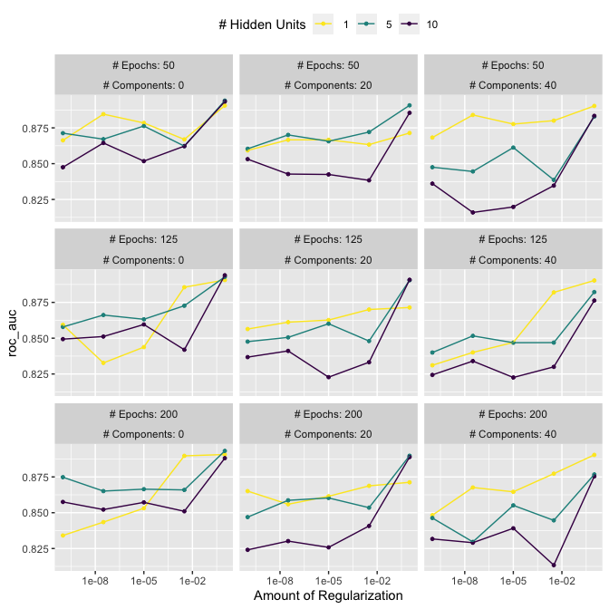

```r
library(ggforce)
```

```
## Loading required package: ggplot2
```

```r
library(tidymodels)
```

```
## ── Attaching packages ────────────────────────────────────── tidymodels 1.1.1 ──
```

```
## ✔ broom        1.0.5     ✔ rsample      1.2.0
## ✔ dials        1.2.0     ✔ tibble       3.2.1
## ✔ dplyr        1.1.4     ✔ tidyr        1.3.0
## ✔ infer        1.0.5     ✔ tune         1.1.2
## ✔ modeldata    1.2.0     ✔ workflows    1.1.3
## ✔ parsnip      1.1.1     ✔ workflowsets 1.0.1
## ✔ purrr        1.0.2     ✔ yardstick    1.2.0
## ✔ recipes      1.0.9
```

```
## ── Conflicts ───────────────────────────────────────── tidymodels_conflicts() ──
## ✖ purrr::discard() masks scales::discard()
## ✖ dplyr::filter()  masks stats::filter()
## ✖ dplyr::lag()     masks stats::lag()
## ✖ recipes::step()  masks stats::step()
## • Use suppressPackageStartupMessages() to eliminate package startup messages
```

```r
tidymodels_prefer()
library(doMC)
```

```
## Loading required package: foreach
```

```
## 
## Attaching package: 'foreach'
```

```
## The following objects are masked from 'package:purrr':
## 
##     accumulate, when
```

```
## Loading required package: iterators
```

```
## Loading required package: parallel
```

```r
registerDoMC(cores = 7)
```

# 13.1 REGULAR AND NONREGULAR GRIDS

How do we search parameter space?  Can use a grid of specified values.  A regular grid is a factorial combination whereas a nonregular will have a smaller subset of the possible combinations.

Example: neural network.  Can vary the number of hidden units, the penalty, and the epochs.


```r
mlp_spec <- 
  mlp(hidden_units = tune(), penalty = tune(), epochs = tune()) %>% 
  set_engine("nnet", trace = 0) %>% 
  set_mode("classification")
```

Use `extract parameter dials` to get what is going to be tuned


```r
mlp_param <- extract_parameter_set_dials(mlp_spec)
mlp_param %>% extract_parameter_dials("hidden_units")
```

```
## # Hidden Units (quantitative)
## Range: [1, 10]
```


```r
mlp_param %>% extract_parameter_dials("penalty")
```

```
## Amount of Regularization (quantitative)
## Transformer: log-10 [1e-100, Inf]
## Range (transformed scale): [-10, 0]
```


```r
mlp_param %>% extract_parameter_dials("epochs")
```

```
## # Epochs (quantitative)
## Range: [10, 1000]
```

Can create your own regular grid with `crossing` or `expand_grid` or use the smart function `grid_regular`


```r
mlp_param %>% 
  grid_regular(levels = c(hidden_units = 3, penalty = 2, epochs = 2))
```

```
## # A tibble: 12 × 3
##    hidden_units      penalty epochs
##           <int>        <dbl>  <int>
##  1            1 0.0000000001     10
##  2            5 0.0000000001     10
##  3           10 0.0000000001     10
##  4            1 1                10
##  5            5 1                10
##  6           10 1                10
##  7            1 0.0000000001   1000
##  8            5 0.0000000001   1000
##  9           10 0.0000000001   1000
## 10            1 1              1000
## 11            5 1              1000
## 12           10 1              1000
```

### nonregular grid

Could use random, but this is suboptimal.  maximum entropy or latin hypercubes are better.


```r
set.seed(1303)
mlp_param %>% 
  grid_latin_hypercube(size = 20, original = FALSE) %>% 
  ggplot(aes(x = .panel_x, y = .panel_y)) + 
  geom_point() +
  geom_blank() +
  facet_matrix(vars(hidden_units, penalty, epochs), layer.diag = 2) + 
  labs(title = "Latin Hypercube design with 20 candidates") 
```

<!-- -->

## 13.2 evaluating the grid

Example data set: cancer image classification


```r
data(cells)
cells <- cells %>% select(-case)
set.seed(1304)
cell_folds <- vfold_cv(cells)
```

set up a recipe


```r
mlp_rec <-
  recipe(class ~ ., data = cells) %>%
  step_YeoJohnson(all_numeric_predictors()) %>% # removes skew in the data
  step_normalize(all_numeric_predictors()) %>% 
  step_pca(all_numeric_predictors(), num_comp = tune()) %>% 
  step_normalize(all_numeric_predictors())

mlp_wflow <- 
  workflow() %>% 
  add_model(mlp_spec) %>% 
  add_recipe(mlp_rec)
```

update the ranges that we will tune over


```r
mlp_param <- 
  mlp_wflow %>% 
  extract_parameter_set_dials() %>% 
  update(
    epochs = epochs(c(50, 200)),
    num_comp = num_comp(c(0, 40)) # 0 PCA components doesn't do a transformation at all
  )
```

Tune it (using a regular grid)

```r
roc_res <- metric_set(roc_auc)
set.seed(1305)
mlp_reg_tune <-
  mlp_wflow %>%
  tune_grid(
    cell_folds,
    grid = mlp_param %>% grid_regular(levels = c(hidden_units=3, penalty=5, epochs=3, num_comp=3)),
    metrics = roc_res
  )
mlp_reg_tune
```

```
## # Tuning results
## # 10-fold cross-validation 
## # A tibble: 10 × 4
##    splits             id     .metrics           .notes          
##    <list>             <chr>  <list>             <list>          
##  1 <split [1817/202]> Fold01 <tibble [135 × 8]> <tibble [0 × 3]>
##  2 <split [1817/202]> Fold02 <tibble [135 × 8]> <tibble [0 × 3]>
##  3 <split [1817/202]> Fold03 <tibble [135 × 8]> <tibble [0 × 3]>
##  4 <split [1817/202]> Fold04 <tibble [135 × 8]> <tibble [0 × 3]>
##  5 <split [1817/202]> Fold05 <tibble [135 × 8]> <tibble [0 × 3]>
##  6 <split [1817/202]> Fold06 <tibble [135 × 8]> <tibble [0 × 3]>
##  7 <split [1817/202]> Fold07 <tibble [135 × 8]> <tibble [0 × 3]>
##  8 <split [1817/202]> Fold08 <tibble [135 × 8]> <tibble [0 × 3]>
##  9 <split [1817/202]> Fold09 <tibble [135 × 8]> <tibble [0 × 3]>
## 10 <split [1818/201]> Fold10 <tibble [135 × 8]> <tibble [0 × 3]>
```


```r
autoplot(mlp_reg_tune) + 
  scale_color_viridis_d(direction = -1) + 
  theme(legend.position = "top")
```

<!-- -->

```r
show_best(mlp_reg_tune) %>% select(-.estimator)
```

```
## # A tibble: 5 × 9
##   hidden_units penalty epochs num_comp .metric  mean     n std_err .config      
##          <int>   <dbl>  <int>    <int> <chr>   <dbl> <int>   <dbl> <chr>        
## 1            5       1     50        0 roc_auc 0.894    10 0.00927 Preprocessor…
## 2           10       1    125        0 roc_auc 0.894    10 0.00911 Preprocessor…
## 3           10       1     50        0 roc_auc 0.893    10 0.00999 Preprocessor…
## 4            5       1    200        0 roc_auc 0.893    10 0.00993 Preprocessor…
## 5            5       1    125        0 roc_auc 0.893    10 0.00956 Preprocessor…
```

now with a space-filling design:


```r
set.seed(1306)
mlp_sfd_tune <-
  mlp_wflow %>%
  tune_grid(
    cell_folds,
    grid = 20, # or specify a grid function.  By default this will use maximum entropy.
    # Pass in the parameter object to use the appropriate range: 
    param_info = mlp_param,
    metrics = roc_res
  )
mlp_sfd_tune
```

```
## # Tuning results
## # 10-fold cross-validation 
## # A tibble: 10 × 4
##    splits             id     .metrics          .notes          
##    <list>             <chr>  <list>            <list>          
##  1 <split [1817/202]> Fold01 <tibble [20 × 8]> <tibble [0 × 3]>
##  2 <split [1817/202]> Fold02 <tibble [20 × 8]> <tibble [0 × 3]>
##  3 <split [1817/202]> Fold03 <tibble [20 × 8]> <tibble [0 × 3]>
##  4 <split [1817/202]> Fold04 <tibble [20 × 8]> <tibble [0 × 3]>
##  5 <split [1817/202]> Fold05 <tibble [20 × 8]> <tibble [0 × 3]>
##  6 <split [1817/202]> Fold06 <tibble [20 × 8]> <tibble [0 × 3]>
##  7 <split [1817/202]> Fold07 <tibble [20 × 8]> <tibble [0 × 3]>
##  8 <split [1817/202]> Fold08 <tibble [20 × 8]> <tibble [0 × 3]>
##  9 <split [1817/202]> Fold09 <tibble [20 × 8]> <tibble [0 × 3]>
## 10 <split [1818/201]> Fold10 <tibble [20 × 8]> <tibble [0 × 3]>
```

```r
autoplot(mlp_sfd_tune)
```

<!-- -->
hard to tell because for these marginal plots the other values are being averaged over.  But contrary to what the book says, it looks like more regularization is giving better results.

But in any case:


```r
show_best(mlp_sfd_tune) %>% select(-.estimator)
```

```
## # A tibble: 5 × 9
##   hidden_units       penalty epochs num_comp .metric  mean     n std_err .config
##          <int>         <dbl>  <int>    <int> <chr>   <dbl> <int>   <dbl> <chr>  
## 1            8 0.594             97       22 roc_auc 0.880    10 0.00998 Prepro…
## 2            3 0.00000000649    135        8 roc_auc 0.878    10 0.00957 Prepro…
## 3            9 0.141            177       11 roc_auc 0.873    10 0.0104  Prepro…
## 4            8 0.0000000103      74        9 roc_auc 0.869    10 0.00761 Prepro…
## 5            6 0.00581          129       15 roc_auc 0.865    10 0.00659 Prepro…
```
more clear with more samples?

now with a space-filling design:


```r
set.seed(1306)
mlp_sfd_tune <-
  mlp_wflow %>%
  tune_grid(
    cell_folds,
    grid = 100, # or specify a grid function.  By default this will use maximum entropy.
    # Pass in the parameter object to use the appropriate range: 
    param_info = mlp_param,
    metrics = roc_res
  )
mlp_sfd_tune
```

```
## # Tuning results
## # 10-fold cross-validation 
## # A tibble: 10 × 4
##    splits             id     .metrics           .notes          
##    <list>             <chr>  <list>             <list>          
##  1 <split [1817/202]> Fold01 <tibble [100 × 8]> <tibble [0 × 3]>
##  2 <split [1817/202]> Fold02 <tibble [100 × 8]> <tibble [0 × 3]>
##  3 <split [1817/202]> Fold03 <tibble [100 × 8]> <tibble [0 × 3]>
##  4 <split [1817/202]> Fold04 <tibble [100 × 8]> <tibble [0 × 3]>
##  5 <split [1817/202]> Fold05 <tibble [100 × 8]> <tibble [0 × 3]>
##  6 <split [1817/202]> Fold06 <tibble [100 × 8]> <tibble [0 × 3]>
##  7 <split [1817/202]> Fold07 <tibble [100 × 8]> <tibble [0 × 3]>
##  8 <split [1817/202]> Fold08 <tibble [100 × 8]> <tibble [0 × 3]>
##  9 <split [1817/202]> Fold09 <tibble [100 × 8]> <tibble [0 × 3]>
## 10 <split [1818/201]> Fold10 <tibble [100 × 8]> <tibble [0 × 3]>
```


```r
autoplot(mlp_sfd_tune)
```

<!-- -->
hard to tell because for these marginal plots the other values are being averaged over.  But contrary to what the book says, it looks like more regularization is giving better results.

But in any case:


```r
show_best(mlp_sfd_tune) %>% select(-.estimator)
```

```
## # A tibble: 5 × 9
##   hidden_units       penalty epochs num_comp .metric  mean     n std_err .config
##          <int>         <dbl>  <int>    <int> <chr>   <dbl> <int>   <dbl> <chr>  
## 1            2 0.492             53       38 roc_auc 0.890    10 0.00941 Prepro…
## 2            3 0.782            151       17 roc_auc 0.889    10 0.00684 Prepro…
## 3            3 0.000000866       95        8 roc_auc 0.885    10 0.00769 Prepro…
## 4            3 0.292            163       17 roc_auc 0.883    10 0.00884 Prepro…
## 5            3 0.00000000144    162        6 roc_auc 0.882    10 0.00841 Prepro…
```


Try it with Bayes


```r
set.seed(1306)
mlp_sfd_tune <-
  mlp_wflow %>%
  tune_bayes(
    cell_folds,
    iter = 20, 
    initial = 10,
    # Pass in the parameter object to use the appropriate range: 
    param_info = mlp_param,
    metrics = roc_res
  )
```

```
## ! No improvement for 10 iterations; returning current results.
```

```r
mlp_sfd_tune
```

```
## # Tuning results
## # 10-fold cross-validation 
## # A tibble: 200 × 5
##    splits             id     .metrics          .notes           .iter
##    <list>             <chr>  <list>            <list>           <int>
##  1 <split [1817/202]> Fold01 <tibble [10 × 8]> <tibble [0 × 3]>     0
##  2 <split [1817/202]> Fold02 <tibble [10 × 8]> <tibble [0 × 3]>     0
##  3 <split [1817/202]> Fold03 <tibble [10 × 8]> <tibble [0 × 3]>     0
##  4 <split [1817/202]> Fold04 <tibble [10 × 8]> <tibble [0 × 3]>     0
##  5 <split [1817/202]> Fold05 <tibble [10 × 8]> <tibble [0 × 3]>     0
##  6 <split [1817/202]> Fold06 <tibble [10 × 8]> <tibble [0 × 3]>     0
##  7 <split [1817/202]> Fold07 <tibble [10 × 8]> <tibble [0 × 3]>     0
##  8 <split [1817/202]> Fold08 <tibble [10 × 8]> <tibble [0 × 3]>     0
##  9 <split [1817/202]> Fold09 <tibble [10 × 8]> <tibble [0 × 3]>     0
## 10 <split [1818/201]> Fold10 <tibble [10 × 8]> <tibble [0 × 3]>     0
## # ℹ 190 more rows
```


```r
autoplot(mlp_sfd_tune)
```

<!-- -->

```r
show_best(mlp_sfd_tune) %>% select(-.estimator)
```

```
## # A tibble: 5 × 10
##   hidden_units penalty epochs num_comp .metric  mean     n std_err .config .iter
##          <int>   <dbl>  <int>    <int> <chr>   <dbl> <int>   <dbl> <chr>   <int>
## 1            7   0.528     56       10 roc_auc 0.891    10 0.0110  Iter9       9
## 2            4   0.566    139       12 roc_auc 0.889    10 0.0111  Iter5       5
## 3            7   0.852    191       15 roc_auc 0.889    10 0.00836 Iter12     12
## 4            7   0.982     89        7 roc_auc 0.889    10 0.00797 Iter19     19
## 5            4   0.354     87       11 roc_auc 0.888    10 0.00994 Iter11     11
```


## 13.3 finalzing the model

Get the best parameters


```r
select_best(mlp_reg_tune, metric = "roc_auc")
```

```
## # A tibble: 1 × 5
##   hidden_units penalty epochs num_comp .config              
##          <int>   <dbl>  <int>    <int> <chr>                
## 1            5       1     50        0 Preprocessor1_Model14
```

```r
logistic_param <- select_best(mlp_reg_tune, metric = "roc_auc") %>% select(-.config)


final_mlp_wflow <- 
  mlp_wflow %>% 
  finalize_workflow(logistic_param)
final_mlp_wflow
```

```
## ══ Workflow ════════════════════════════════════════════════════════════════════
## Preprocessor: Recipe
## Model: mlp()
## 
## ── Preprocessor ────────────────────────────────────────────────────────────────
## 4 Recipe Steps
## 
## • step_YeoJohnson()
## • step_normalize()
## • step_pca()
## • step_normalize()
## 
## ── Model ───────────────────────────────────────────────────────────────────────
## Single Layer Neural Network Model Specification (classification)
## 
## Main Arguments:
##   hidden_units = 5
##   penalty = 1
##   epochs = 50
## 
## Engine-Specific Arguments:
##   trace = 0
## 
## Computational engine: nnet
```
do final fit


```r
final_mlp_fit <- 
  final_mlp_wflow %>% 
  fit(cells)
```

## 13.4 TOOLS FOR CREATING TUNING SPECIFICATIONS


```r
library(usemodels)

load("ames_test_train.Rdata")

use_xgboost(Sale_Price ~ Neighborhood + Gr_Liv_Area + Year_Built + Bldg_Type + 
              Latitude + Longitude, 
            data = ames_train,
            # Add comments explaining some of the code:
            verbose = TRUE)
```

```
## xgboost_recipe <- 
##   recipe(formula = Sale_Price ~ Neighborhood + Gr_Liv_Area + Year_Built + Bldg_Type + 
##     Latitude + Longitude, data = ames_train) %>% 
##   step_zv(all_predictors()) 
## 
## xgboost_spec <- 
##   boost_tree(trees = tune(), min_n = tune(), tree_depth = tune(), learn_rate = tune(), 
##     loss_reduction = tune(), sample_size = tune()) %>% 
##   set_mode("classification") %>% 
##   set_engine("xgboost") 
## 
## xgboost_workflow <- 
##   workflow() %>% 
##   add_recipe(xgboost_recipe) %>% 
##   add_model(xgboost_spec) 
## 
## set.seed(3034)
## xgboost_tune <-
##   tune_grid(xgboost_workflow, resamples = stop("add your rsample object"), grid = stop("add number of candidate points"))
```
## 13.5 TOOLS FOR EFFICIENT GRID SEARCH
  
### 13.5.1 SUBMODEL OPTIMIZATION

Often different paramters can be tested from a single fit.  Examples include regularization, boosting iterations, number of components in a PLS

example:


```r
c5_spec <- 
  boost_tree(trees = tune()) %>% 
  set_engine("C5.0") %>% 
  set_mode("classification")

set.seed(1307)
system.time(c5_tune <- c5_spec %>%
  tune_grid(
    class ~ .,
    resamples = cell_folds,
    grid = data.frame(trees = 1:100),
    metrics = roc_res
  ))
```

```
##    user  system elapsed 
##  97.071   4.865  28.960
```

```r
autoplot(c5_tune)
```

<!-- -->

### 13.5.2 Parallel processing

Can loop over folds, tuning parameters, or evertyhing.  Set this in "parallel_over" in control_grid (but it will choose "resamples" automatically if not specified and resamples are present)

### 13.5.3 BENCHMARKING BOOSTED TREES

In the demo, parallel over everything had little benefit for the simple cases and was worse than parallel_over resampling when there was a heavy pre-processing step.

### 13.5.4 ACCESS TO GLOBAL VARIABLES

For parallel processing access global variables with `!!` or `!!!` so that they get evaluated in advance

### 13.5.5 RACING METHODS

Compare performance after just some folds and then select the best ones to move forward with:


```r
library(finetune)

set.seed(1308)
mlp_sfd_race <-
  mlp_wflow %>%
  tune_race_anova(
    cell_folds,
    grid = 20,
    param_info = mlp_param,
    metrics = roc_res,
    control = control_race(verbose_elim = TRUE)
  )
```

```
## ℹ Racing will maximize the roc_auc metric.
## ℹ Resamples are analyzed in a random order.
## ℹ Fold10: 14 eliminated; 6 candidates remain.
## 
## ℹ Fold06: 3 eliminated; 3 candidates remain.
## 
## ℹ Fold08: 0 eliminated; 3 candidates remain.
## 
## ℹ Fold09: 1 eliminated; 2 candidates remain.
## 
## ℹ Fold05: 0 eliminated; 2 candidates remain.
## 
## ℹ Fold01: 0 eliminated; 2 candidates remain.
## 
## ℹ Fold07: 0 eliminated; 2 candidates remain.
```


```r
autoplot(mlp_sfd_race)
```

<!-- -->

```r
show_best(mlp_sfd_race, n = 10)
```

```
## # A tibble: 2 × 10
##   hidden_units penalty epochs num_comp .metric .estimator  mean     n std_err
##          <int>   <dbl>  <int>    <int> <chr>   <chr>      <dbl> <int>   <dbl>
## 1            8  0.814     177       15 roc_auc binary     0.887    10 0.0103 
## 2            3  0.0402    151       10 roc_auc binary     0.885    10 0.00810
## # ℹ 1 more variable: .config <chr>
```

