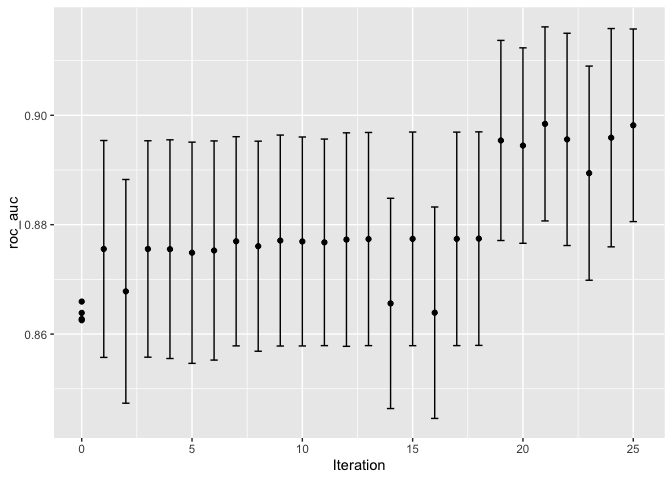
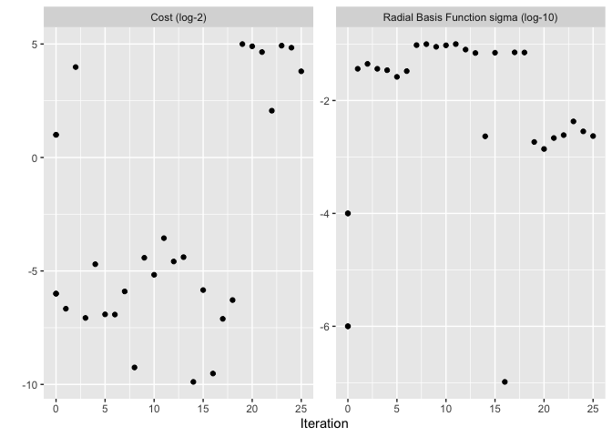
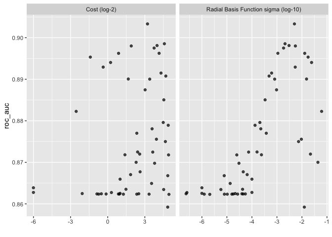
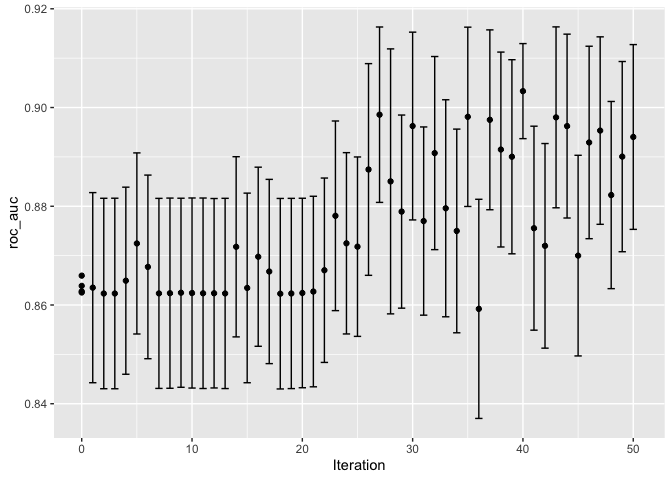

Chapter 13 code:

```r
library(tidymodels)
```

```
## ── Attaching packages ────────────────────────────────────── tidymodels 1.1.1 ──
```

```
## ✔ broom        1.0.5     ✔ recipes      1.0.9
## ✔ dials        1.2.0     ✔ rsample      1.2.0
## ✔ dplyr        1.1.4     ✔ tibble       3.2.1
## ✔ ggplot2      3.4.4     ✔ tidyr        1.3.0
## ✔ infer        1.0.5     ✔ tune         1.1.2
## ✔ modeldata    1.2.0     ✔ workflows    1.1.3
## ✔ parsnip      1.1.1     ✔ workflowsets 1.0.1
## ✔ purrr        1.0.2     ✔ yardstick    1.2.0
```

```
## ── Conflicts ───────────────────────────────────────── tidymodels_conflicts() ──
## ✖ purrr::discard() masks scales::discard()
## ✖ dplyr::filter()  masks stats::filter()
## ✖ dplyr::lag()     masks stats::lag()
## ✖ recipes::step()  masks stats::step()
## • Use suppressPackageStartupMessages() to eliminate package startup messages
```

```r
data(cells)
cells <- cells %>% select(-case)

set.seed(1304)
cell_folds <- vfold_cv(cells)

roc_res <- metric_set(roc_auc)
```

# 14.1 SVM model


```r
library(tidymodels)
library(finetune)
tidymodels_prefer()
library(doMC)
```

```
## Loading required package: foreach
```

```
## 
## Attaching package: 'foreach'
```

```
## The following objects are masked from 'package:purrr':
## 
##     accumulate, when
```

```
## Loading required package: iterators
```

```
## Loading required package: parallel
```

```r
registerDoMC(cores = 8)

svm_rec <- 
  recipe(class ~ ., data = cells) %>%
  step_YeoJohnson(all_numeric_predictors()) %>%
  step_normalize(all_numeric_predictors())

svm_spec <- 
  svm_rbf(cost = tune(), rbf_sigma = tune()) %>% 
  set_engine("kernlab") %>% 
  set_mode("classification")

svm_wflow <- 
  workflow() %>% 
  add_model(svm_spec) %>% 
  add_recipe(svm_rec)
```

tuning parameter defaults

```r
cost()
```

```
## Cost (quantitative)
## Transformer: log-2 [1e-100, Inf]
## Range (transformed scale): [-10, 5]
```

```r
rbf_sigma()
```

```
## Radial Basis Function sigma (quantitative)
## Transformer: log-10 [1e-100, Inf]
## Range (transformed scale): [-10, 0]
```
update the parameter for rbf_sigma

```r
svm_param <- 
  svm_wflow %>% 
  extract_parameter_set_dials() %>% 
  update(rbf_sigma = rbf_sigma(c(-7, -1)))
```

do an initial grid search.  This will serve as a starting point for the iterative search

```r
set.seed(1401)
start_grid <- 
  svm_param %>% 
  update(
    cost = cost(c(-6, 1)),
    rbf_sigma = rbf_sigma(c(-6, -4))
  ) %>% 
  grid_regular(levels = 2)

set.seed(1402)
svm_initial <- 
  svm_wflow %>% 
  tune_grid(resamples = cell_folds, grid = start_grid, metrics = roc_res)

collect_metrics(svm_initial)
```

```
## # A tibble: 4 × 8
##     cost rbf_sigma .metric .estimator  mean     n std_err .config             
##    <dbl>     <dbl> <chr>   <chr>      <dbl> <int>   <dbl> <chr>               
## 1 0.0156  0.000001 roc_auc binary     0.864    10 0.00864 Preprocessor1_Model1
## 2 2       0.000001 roc_auc binary     0.863    10 0.00867 Preprocessor1_Model2
## 3 0.0156  0.0001   roc_auc binary     0.863    10 0.00862 Preprocessor1_Model3
## 4 2       0.0001   roc_auc binary     0.866    10 0.00855 Preprocessor1_Model4
```

# 14.2 tune_bayes

How to choise next parameer values to test?

A gaussian process model models an output (in this case a fit metric) as a function of a multivariate Gaussian distribution (in this case of the tuning parameters).  With a few data points in can predict the mean and variance (uncertainity) at other parameter values.

We could pick the next parameters based on choosing the highest predicted mean, the highest variance, or expected improvement (area under the predicted distribution that is better than current best estimate).  Default is expected improvement.  IF we did mean only, we wouldn't explore areas far away from our current paraemeters.  This can be good for refinement but not at initial stages.

## 14.2.3 Tune Bayes example


```r
ctrl <- control_bayes(verbose = TRUE, verbose_iter = TRUE)

set.seed(1403) # even so, get different results different times
svm_bo <-
  svm_wflow %>%
  tune_bayes(
    resamples = cell_folds,
    metrics = roc_res,
    initial = svm_initial,
    param_info = svm_param,
    iter = 25,
    control = ctrl
  )
```

```
## Optimizing roc_auc using the expected improvement
```

```
## 
```

```
## ── Iteration 1 ─────────────────────────────────────────────────────────────────
```

```
## 
```

```
## i Current best:		roc_auc=0.8659 (@iter 0)
```

```
## i Gaussian process model
```

```
## ✓ Gaussian process model
```

```
## i Generating 5000 candidates
```

```
## i Predicted candidates
```

```
## i cost=0.00986, rbf_sigma=0.0365
```

```
## i Estimating performance
```

```
## ✓ Estimating performance
```

```
## ♥ Newest results:	roc_auc=0.8756 (+/-0.0089)
```

```
## 
```

```
## ── Iteration 2 ─────────────────────────────────────────────────────────────────
```

```
## 
```

```
## i Current best:		roc_auc=0.8756 (@iter 1)
```

```
## i Gaussian process model
```

```
## ✓ Gaussian process model
```

```
## i Generating 5000 candidates
```

```
## i Predicted candidates
```

```
## i cost=15.8, rbf_sigma=0.0446
```

```
## i Estimating performance
```

```
## ✓ Estimating performance
```

```
## ⓧ Newest results:	roc_auc=0.8678 (+/-0.00918)
```

```
## 
```

```
## ── Iteration 3 ─────────────────────────────────────────────────────────────────
```

```
## 
```

```
## i Current best:		roc_auc=0.8756 (@iter 1)
```

```
## i Gaussian process model
```

```
## ✓ Gaussian process model
```

```
## i Generating 5000 candidates
```

```
## i Predicted candidates
```

```
## i cost=0.00744, rbf_sigma=0.0365
```

```
## i Estimating performance
```

```
## ✓ Estimating performance
```

```
## ⓧ Newest results:	roc_auc=0.8756 (+/-0.00888)
```

```
## 
```

```
## ── Iteration 4 ─────────────────────────────────────────────────────────────────
```

```
## 
```

```
## i Current best:		roc_auc=0.8756 (@iter 1)
```

```
## i Gaussian process model
```

```
## ✓ Gaussian process model
```

```
## i Generating 5000 candidates
```

```
## i Predicted candidates
```

```
## i cost=0.0384, rbf_sigma=0.0345
```

```
## i Estimating performance
```

```
## ✓ Estimating performance
```

```
## ⓧ Newest results:	roc_auc=0.8755 (+/-0.00897)
```

```
## 
```

```
## ── Iteration 5 ─────────────────────────────────────────────────────────────────
```

```
## 
```

```
## i Current best:		roc_auc=0.8756 (@iter 1)
```

```
## i Gaussian process model
```

```
## ✓ Gaussian process model
```

```
## i Generating 5000 candidates
```

```
## i Predicted candidates
```

```
## i cost=0.0083, rbf_sigma=0.0263
```

```
## i Estimating performance
```

```
## ✓ Estimating performance
```

```
## ⓧ Newest results:	roc_auc=0.8749 (+/-0.00908)
```

```
## 
```

```
## ── Iteration 6 ─────────────────────────────────────────────────────────────────
```

```
## 
```

```
## i Current best:		roc_auc=0.8756 (@iter 1)
```

```
## i Gaussian process model
```

```
## ✓ Gaussian process model
```

```
## i Generating 5000 candidates
```

```
## i Predicted candidates
```

```
## i cost=0.00825, rbf_sigma=0.0332
```

```
## i Estimating performance
```

```
## ✓ Estimating performance
```

```
## ⓧ Newest results:	roc_auc=0.8753 (+/-0.00899)
```

```
## 
```

```
## ── Iteration 7 ─────────────────────────────────────────────────────────────────
```

```
## 
```

```
## i Current best:		roc_auc=0.8756 (@iter 1)
```

```
## i Gaussian process model
```

```
## ✓ Gaussian process model
```

```
## i Generating 5000 candidates
```

```
## i Predicted candidates
```

```
## i cost=0.0167, rbf_sigma=0.0958
```

```
## i Estimating performance
```

```
## ✓ Estimating performance
```

```
## ♥ Newest results:	roc_auc=0.877 (+/-0.00858)
```

```
## 
```

```
## ── Iteration 8 ─────────────────────────────────────────────────────────────────
```

```
## 
```

```
## i Current best:		roc_auc=0.877 (@iter 7)
```

```
## i Gaussian process model
```

```
## ✓ Gaussian process model
```

```
## i Generating 5000 candidates
```

```
## i Predicted candidates
```

```
## i cost=0.00164, rbf_sigma=0.0997
```

```
## i Estimating performance
```

```
## ✓ Estimating performance
```

```
## ⓧ Newest results:	roc_auc=0.8761 (+/-0.00862)
```

```
## 
```

```
## ── Iteration 9 ─────────────────────────────────────────────────────────────────
```

```
## 
```

```
## i Current best:		roc_auc=0.877 (@iter 7)
```

```
## i Gaussian process model
```

```
## ✓ Gaussian process model
```

```
## i Generating 5000 candidates
```

```
## i Predicted candidates
```

```
## i cost=0.0467, rbf_sigma=0.0895
```

```
## i Estimating performance
```

```
## ✓ Estimating performance
```

```
## ♥ Newest results:	roc_auc=0.8771 (+/-0.00865)
```

```
## 
```

```
## ── Iteration 10 ────────────────────────────────────────────────────────────────
```

```
## 
```

```
## i Current best:		roc_auc=0.8771 (@iter 9)
```

```
## i Gaussian process model
```

```
## ✓ Gaussian process model
```

```
## i Generating 5000 candidates
```

```
## i Predicted candidates
```

```
## i cost=0.0278, rbf_sigma=0.095
```

```
## i Estimating performance
```

```
## ✓ Estimating performance
```

```
## ⓧ Newest results:	roc_auc=0.8769 (+/-0.00857)
```

```
## 
```

```
## ── Iteration 11 ────────────────────────────────────────────────────────────────
```

```
## 
```

```
## i Current best:		roc_auc=0.8771 (@iter 9)
```

```
## i Gaussian process model
```

```
## ✓ Gaussian process model
```

```
## i Generating 5000 candidates
```

```
## i Predicted candidates
```

```
## i cost=0.0851, rbf_sigma=0.1
```

```
## i Estimating performance
```

```
## ✓ Estimating performance
```

```
## ⓧ Newest results:	roc_auc=0.8768 (+/-0.00847)
```

```
## 
```

```
## ── Iteration 12 ────────────────────────────────────────────────────────────────
```

```
## 
```

```
## i Current best:		roc_auc=0.8771 (@iter 9)
```

```
## i Gaussian process model
```

```
## ✓ Gaussian process model
```

```
## i Generating 5000 candidates
```

```
## i Predicted candidates
```

```
## i cost=0.0417, rbf_sigma=0.0799
```

```
## i Estimating performance
```

```
## ✓ Estimating performance
```

```
## ♥ Newest results:	roc_auc=0.8773 (+/-0.00876)
```

```
## 
```

```
## ── Iteration 13 ────────────────────────────────────────────────────────────────
```

```
## 
```

```
## i Current best:		roc_auc=0.8773 (@iter 12)
```

```
## i Gaussian process model
```

```
## ✓ Gaussian process model
```

```
## i Generating 5000 candidates
```

```
## i Predicted candidates
```

```
## i cost=0.0477, rbf_sigma=0.0695
```

```
## i Estimating performance
```

```
## ✓ Estimating performance
```

```
## ♥ Newest results:	roc_auc=0.8774 (+/-0.00874)
```

```
## 
```

```
## ── Iteration 14 ────────────────────────────────────────────────────────────────
```

```
## 
```

```
## i Current best:		roc_auc=0.8774 (@iter 13)
```

```
## i Gaussian process model
```

```
## ✓ Gaussian process model
```

```
## i Generating 5000 candidates
```

```
## i Predicted candidates
```

```
## i cost=0.00106, rbf_sigma=0.00232
```

```
## i Estimating performance
```

```
## ✓ Estimating performance
```

```
## ⓧ Newest results:	roc_auc=0.8656 (+/-0.00863)
```

```
## 
```

```
## ── Iteration 15 ────────────────────────────────────────────────────────────────
```

```
## 
```

```
## i Current best:		roc_auc=0.8774 (@iter 13)
```

```
## i Gaussian process model
```

```
## ✓ Gaussian process model
```

```
## i Generating 5000 candidates
```

```
## i Predicted candidates
```

```
## i cost=0.0174, rbf_sigma=0.0702
```

```
## i Estimating performance
```

```
## ✓ Estimating performance
```

```
## ♥ Newest results:	roc_auc=0.8774 (+/-0.00876)
```

```
## 
```

```
## ── Iteration 16 ────────────────────────────────────────────────────────────────
```

```
## 
```

```
## i Current best:		roc_auc=0.8774 (@iter 15)
```

```
## i Gaussian process model
```

```
## ✓ Gaussian process model
```

```
## i Generating 5000 candidates
```

```
## i Predicted candidates
```

```
## i cost=0.00136, rbf_sigma=1.04e-07
```

```
## i Estimating performance
```

```
## ✓ Estimating performance
```

```
## ⓧ Newest results:	roc_auc=0.8639 (+/-0.00867)
```

```
## 
```

```
## ── Iteration 17 ────────────────────────────────────────────────────────────────
```

```
## 
```

```
## i Current best:		roc_auc=0.8774 (@iter 15)
```

```
## i Gaussian process model
```

```
## ✓ Gaussian process model
```

```
## i Generating 5000 candidates
```

```
## i Predicted candidates
```

```
## i cost=0.00724, rbf_sigma=0.0713
```

```
## i Estimating performance
```

```
## ✓ Estimating performance
```

```
## ⓧ Newest results:	roc_auc=0.8774 (+/-0.00876)
```

```
## 
```

```
## ── Iteration 18 ────────────────────────────────────────────────────────────────
```

```
## 
```

```
## i Current best:		roc_auc=0.8774 (@iter 15)
```

```
## i Gaussian process model
```

```
## ✓ Gaussian process model
```

```
## i Generating 5000 candidates
```

```
## i Predicted candidates
```

```
## i cost=0.0128, rbf_sigma=0.0709
```

```
## i Estimating performance
```

```
## ✓ Estimating performance
```

```
## ♥ Newest results:	roc_auc=0.8775 (+/-0.00876)
```

```
## 
```

```
## ── Iteration 19 ────────────────────────────────────────────────────────────────
```

```
## 
```

```
## i Current best:		roc_auc=0.8775 (@iter 18)
```

```
## i Gaussian process model
```

```
## ✓ Gaussian process model
```

```
## i Generating 5000 candidates
```

```
## i Predicted candidates
```

```
## i cost=31.9, rbf_sigma=0.00184
```

```
## i Estimating performance
```

```
## ✓ Estimating performance
```

```
## ♥ Newest results:	roc_auc=0.8954 (+/-0.00809)
```

```
## 
```

```
## ── Iteration 20 ────────────────────────────────────────────────────────────────
```

```
## 
```

```
## i Current best:		roc_auc=0.8954 (@iter 19)
```

```
## i Gaussian process model
```

```
## ✓ Gaussian process model
```

```
## i Generating 5000 candidates
```

```
## i Predicted candidates
```

```
## i cost=29.8, rbf_sigma=0.00139
```

```
## i Estimating performance
```

```
## ✓ Estimating performance
```

```
## ⓧ Newest results:	roc_auc=0.8945 (+/-0.0079)
```

```
## 
```

```
## ── Iteration 21 ────────────────────────────────────────────────────────────────
```

```
## 
```

```
## i Current best:		roc_auc=0.8954 (@iter 19)
```

```
## i Gaussian process model
```

```
## ✓ Gaussian process model
```

```
## i Generating 5000 candidates
```

```
## i Predicted candidates
```

```
## i cost=25, rbf_sigma=0.00217
```

```
## i Estimating performance
```

```
## ✓ Estimating performance
```

```
## ♥ Newest results:	roc_auc=0.8984 (+/-0.00796)
```

```
## 
```

```
## ── Iteration 22 ────────────────────────────────────────────────────────────────
```

```
## 
```

```
## i Current best:		roc_auc=0.8984 (@iter 21)
```

```
## i Gaussian process model
```

```
## ✓ Gaussian process model
```

```
## i Generating 5000 candidates
```

```
## i Predicted candidates
```

```
## i cost=4.17, rbf_sigma=0.00244
```

```
## i Estimating performance
```

```
## ✓ Estimating performance
```

```
## ⓧ Newest results:	roc_auc=0.8956 (+/-0.00871)
```

```
## 
```

```
## ── Iteration 23 ────────────────────────────────────────────────────────────────
```

```
## 
```

```
## i Current best:		roc_auc=0.8984 (@iter 21)
```

```
## i Gaussian process model
```

```
## ✓ Gaussian process model
```

```
## i Generating 5000 candidates
```

```
## i Predicted candidates
```

```
## i cost=30.4, rbf_sigma=0.00426
```

```
## i Estimating performance
```

```
## ✓ Estimating performance
```

```
## ⓧ Newest results:	roc_auc=0.8894 (+/-0.00879)
```

```
## 
```

```
## ── Iteration 24 ────────────────────────────────────────────────────────────────
```

```
## 
```

```
## i Current best:		roc_auc=0.8984 (@iter 21)
```

```
## i Gaussian process model
```

```
## ✓ Gaussian process model
```

```
## i Generating 5000 candidates
```

```
## i Predicted candidates
```

```
## i cost=28.6, rbf_sigma=0.00284
```

```
## i Estimating performance
```

```
## ✓ Estimating performance
```

```
## ⓧ Newest results:	roc_auc=0.8959 (+/-0.00882)
```

```
## 
```

```
## ── Iteration 25 ────────────────────────────────────────────────────────────────
```

```
## 
```

```
## i Current best:		roc_auc=0.8984 (@iter 21)
```

```
## i Gaussian process model
```

```
## ✓ Gaussian process model
```

```
## i Generating 5000 candidates
```

```
## i Predicted candidates
```

```
## i cost=13.9, rbf_sigma=0.00235
```

```
## i Estimating performance
```

```
## ✓ Estimating performance
```

```
## ⓧ Newest results:	roc_auc=0.8982 (+/-0.0079)
```


```r
collect_metrics(svm_bo)
```

```
## # A tibble: 29 × 9
##        cost rbf_sigma .metric .estimator  mean     n std_err .config       .iter
##       <dbl>     <dbl> <chr>   <chr>      <dbl> <int>   <dbl> <chr>         <int>
##  1  0.0156   0.000001 roc_auc binary     0.864    10 0.00864 Preprocessor…     0
##  2  2        0.000001 roc_auc binary     0.863    10 0.00867 Preprocessor…     0
##  3  0.0156   0.0001   roc_auc binary     0.863    10 0.00862 Preprocessor…     0
##  4  2        0.0001   roc_auc binary     0.866    10 0.00855 Preprocessor…     0
##  5  0.00986  0.0365   roc_auc binary     0.876    10 0.00890 Iter1             1
##  6 15.8      0.0446   roc_auc binary     0.868    10 0.00918 Iter2             2
##  7  0.00744  0.0365   roc_auc binary     0.876    10 0.00888 Iter3             3
##  8  0.0384   0.0345   roc_auc binary     0.876    10 0.00897 Iter4             4
##  9  0.00830  0.0263   roc_auc binary     0.875    10 0.00908 Iter5             5
## 10  0.00825  0.0332   roc_auc binary     0.875    10 0.00899 Iter6             6
## # ℹ 19 more rows
```


```r
show_best(svm_bo)
```

```
## # A tibble: 5 × 9
##    cost rbf_sigma .metric .estimator  mean     n std_err .config .iter
##   <dbl>     <dbl> <chr>   <chr>      <dbl> <int>   <dbl> <chr>   <int>
## 1 25.0    0.00217 roc_auc binary     0.898    10 0.00796 Iter21     21
## 2 13.9    0.00235 roc_auc binary     0.898    10 0.00790 Iter25     25
## 3 28.6    0.00284 roc_auc binary     0.896     9 0.00882 Iter24     24
## 4  4.17   0.00244 roc_auc binary     0.896    10 0.00871 Iter22     22
## 5 31.9    0.00184 roc_auc binary     0.895     9 0.00809 Iter19     19
```


```r
autoplot(svm_bo, type = "performance")
```

<!-- -->

```r
autoplot(svm_bo, type = "parameters")
```

<!-- -->

# 14.3 Simulated Annealing

Tuning parameters are rescaled between 0 and 1.  A local search space is defined by a radius parameter (typically .1 or .15) that defines where new proposed parameters can come from.  c defines the cooling; higher values "cool" faster, meaning that exploration of bad areas is less likely.


```r
ctrl_sa <- control_sim_anneal(verbose = TRUE, no_improve = 10L)

set.seed(1404)
svm_sa <-
  svm_wflow %>%
  tune_sim_anneal(
    resamples = cell_folds,
    metrics = roc_res,
    initial = svm_initial,
    param_info = svm_param,
    iter = 50,
    control = ctrl_sa
  )
```

```
## Optimizing roc_auc
```

```
## Initial best: 0.86594
```

```
## 1 ◯ accept suboptimal  roc_auc=0.86351 (+/-0.008642)
```

```
## 2 ◯ accept suboptimal  roc_auc=0.86233 (+/-0.008657)
```

```
## 3 + better suboptimal  roc_auc=0.86233 (+/-0.008661)
```

```
## 4 + better suboptimal  roc_auc=0.86492 (+/-0.008504)
```

```
## 5 ♥ new best           roc_auc=0.87247 (+/-0.008232)
```

```
## 6 ◯ accept suboptimal  roc_auc=0.86772 (+/-0.008347)
```

```
## 7 ◯ accept suboptimal  roc_auc=0.86235 (+/-0.008638)
```

```
## 8 + better suboptimal  roc_auc=0.86239 (+/-0.008645)
```

```
## 9 + better suboptimal  roc_auc=0.86248 (+/-0.008593)
```

```
## 10 ◯ accept suboptimal  roc_auc=0.86243 (+/-0.00864)
```

```
## 11 ◯ accept suboptimal  roc_auc=0.86238 (+/-0.008659)
```

```
## 12 + better suboptimal  roc_auc=0.86238 (+/-0.008611)
```

```
## 13 ✖ restart from best  roc_auc=0.86234 (+/-0.008647)
```

```
## 14 ◯ accept suboptimal  roc_auc=0.87179 (+/-0.00819)
```

```
## 15 ◯ accept suboptimal  roc_auc=0.86346 (+/-0.008619)
```

```
## 16 + better suboptimal  roc_auc=0.86978 (+/-0.008141)
```

```
## 17 ◯ accept suboptimal  roc_auc=0.86678 (+/-0.008375)
```

```
## 18 ◯ accept suboptimal  roc_auc=0.86229 (+/-0.008659)
```

```
## 19 + better suboptimal  roc_auc=0.86233 (+/-0.008647)
```

```
## 20 + better suboptimal  roc_auc=0.86243 (+/-0.008614)
```

```
## 21 ✖ restart from best  roc_auc=0.86273 (+/-0.008662)
```

```
## 22 ◯ accept suboptimal  roc_auc=0.86704 (+/-0.008381)
```

```
## 23 ♥ new best           roc_auc=0.87807 (+/-0.00862)
```

```
## 24 ◯ accept suboptimal  roc_auc=0.8725 (+/-0.008241)
```

```
## 25 ◯ accept suboptimal  roc_auc=0.87181 (+/-0.008155)
```

```
## 26 ♥ new best           roc_auc=0.88745 (+/-0.009478)
```

```
## 27 ♥ new best           roc_auc=0.89855 (+/-0.007973)
```

```
## 28 ◯ accept suboptimal  roc_auc=0.88504 (+/-0.01135)
```

```
## 29 ─ discard suboptimal roc_auc=0.87892 (+/-0.008778)
```

```
## 30 + better suboptimal  roc_auc=0.89625 (+/-0.008535)
```

```
## 31 ─ discard suboptimal roc_auc=0.877 (+/-0.008556)
```

```
## 32 ─ discard suboptimal roc_auc=0.89077 (+/-0.008778)
```

```
## 33 ─ discard suboptimal roc_auc=0.87959 (+/-0.009717)
```

```
## 34 ─ discard suboptimal roc_auc=0.875 (+/-0.009259)
```

```
## 35 ✖ restart from best  roc_auc=0.89812 (+/-0.00815)
```

```
## 36 ─ discard suboptimal roc_auc=0.85922 (+/-0.009962)
```

```
## 37 ◯ accept suboptimal  roc_auc=0.89751 (+/-0.008176)
```

```
## 38 ─ discard suboptimal roc_auc=0.89149 (+/-0.008859)
```

```
## 39 ─ discard suboptimal roc_auc=0.89003 (+/-0.008824)
```

```
## 40 ♥ new best           roc_auc=0.90332 (+/-0.004256)
```

```
## 41 ─ discard suboptimal roc_auc=0.87556 (+/-0.009272)
```

```
## 42 ─ discard suboptimal roc_auc=0.87198 (+/-0.009301)
```

```
## 43 ◯ accept suboptimal  roc_auc=0.89801 (+/-0.008224)
```

```
## 44 ◯ accept suboptimal  roc_auc=0.89624 (+/-0.008357)
```

```
## 45 ─ discard suboptimal roc_auc=0.87 (+/-0.00912)
```

```
## 46 ◯ accept suboptimal  roc_auc=0.89292 (+/-0.008748)
```

```
## 47 + better suboptimal  roc_auc=0.89533 (+/-0.008521)
```

```
## 48 ✖ restart from best  roc_auc=0.88227 (+/-0.008508)
```

```
## 49 ◯ accept suboptimal  roc_auc=0.89005 (+/-0.008646)
```

```
## 50 + better suboptimal  roc_auc=0.89403 (+/-0.008399)
```


```r
show_best(svm_bo)
```

```
## # A tibble: 5 × 9
##    cost rbf_sigma .metric .estimator  mean     n std_err .config .iter
##   <dbl>     <dbl> <chr>   <chr>      <dbl> <int>   <dbl> <chr>   <int>
## 1 25.0    0.00217 roc_auc binary     0.898    10 0.00796 Iter21     21
## 2 13.9    0.00235 roc_auc binary     0.898    10 0.00790 Iter25     25
## 3 28.6    0.00284 roc_auc binary     0.896     9 0.00882 Iter24     24
## 4  4.17   0.00244 roc_auc binary     0.896    10 0.00871 Iter22     22
## 5 31.9    0.00184 roc_auc binary     0.895     9 0.00809 Iter19     19
```

```r
show_best(svm_sa)
```

```
## # A tibble: 5 × 9
##    cost rbf_sigma .metric .estimator  mean     n std_err .config .iter
##   <dbl>     <dbl> <chr>   <chr>      <dbl> <int>   <dbl> <chr>   <int>
## 1  9.28   0.00500 roc_auc binary     0.903     9 0.00426 Iter40     40
## 2 23.9    0.00210 roc_auc binary     0.899    10 0.00797 Iter27     27
## 3 15.9    0.00305 roc_auc binary     0.898    10 0.00815 Iter35     35
## 4  3.74   0.00546 roc_auc binary     0.898    10 0.00822 Iter43     43
## 5 13.4    0.00184 roc_auc binary     0.898    10 0.00818 Iter37     37
```


```r
autoplot(svm_sa)
```

<!-- -->

```r
autoplot(svm_sa, type="performance")
```

<!-- -->

