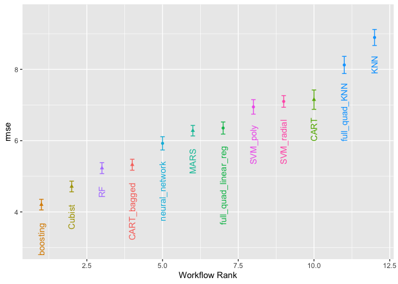
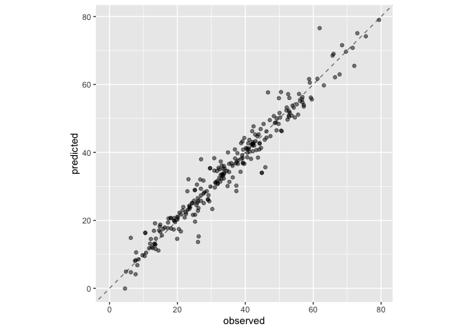

# 15 Screening many models

## 15.1 Modeling Concrete Mixture Strength


```r
library(tidymodels)
```

```
## ── Attaching packages ────────────────────────────────────── tidymodels 1.1.1 ──
```

```
## ✔ broom        1.0.5     ✔ recipes      1.0.9
## ✔ dials        1.2.0     ✔ rsample      1.2.0
## ✔ dplyr        1.1.4     ✔ tibble       3.2.1
## ✔ ggplot2      3.4.4     ✔ tidyr        1.3.0
## ✔ infer        1.0.5     ✔ tune         1.1.2
## ✔ modeldata    1.2.0     ✔ workflows    1.1.3
## ✔ parsnip      1.1.1     ✔ workflowsets 1.0.1
## ✔ purrr        1.0.2     ✔ yardstick    1.2.0
```

```
## ── Conflicts ───────────────────────────────────────── tidymodels_conflicts() ──
## ✖ purrr::discard() masks scales::discard()
## ✖ dplyr::filter()  masks stats::filter()
## ✖ dplyr::lag()     masks stats::lag()
## ✖ recipes::step()  masks stats::step()
## • Learn how to get started at https://www.tidymodels.org/start/
```

```r
tidymodels_prefer()
library(rules)
library(baguette)
data(concrete, package = "modeldata")
glimpse(concrete)
```

```
## Rows: 1,030
## Columns: 9
## $ cement               <dbl> 540.0, 540.0, 332.5, 332.5, 198.6, 266.0, 380.0, …
## $ blast_furnace_slag   <dbl> 0.0, 0.0, 142.5, 142.5, 132.4, 114.0, 95.0, 95.0,…
## $ fly_ash              <dbl> 0, 0, 0, 0, 0, 0, 0, 0, 0, 0, 0, 0, 0, 0, 0, 0, 0…
## $ water                <dbl> 162, 162, 228, 228, 192, 228, 228, 228, 228, 228,…
## $ superplasticizer     <dbl> 2.5, 2.5, 0.0, 0.0, 0.0, 0.0, 0.0, 0.0, 0.0, 0.0,…
## $ coarse_aggregate     <dbl> 1040.0, 1055.0, 932.0, 932.0, 978.4, 932.0, 932.0…
## $ fine_aggregate       <dbl> 676.0, 676.0, 594.0, 594.0, 825.5, 670.0, 594.0, …
## $ age                  <int> 28, 28, 270, 365, 360, 90, 365, 28, 28, 28, 90, 2…
## $ compressive_strength <dbl> 79.99, 61.89, 40.27, 41.05, 44.30, 47.03, 43.70, …
```

```r
library(doMC)
```

```
## Loading required package: foreach
```

```
## 
## Attaching package: 'foreach'
```

```
## The following objects are masked from 'package:purrr':
## 
##     accumulate, when
```

```
## Loading required package: iterators
```

```
## Loading required package: parallel
```

```r
registerDoMC(cores = 8)
```


```r
concrete <- 
   concrete %>% 
   group_by(across(-compressive_strength)) %>% 
   summarize(compressive_strength = mean(compressive_strength),
             .groups = "drop")
nrow(concrete)
```

```
## [1] 992
```

```r
#> [1] 992
```


```r
set.seed(1501)
concrete_split <- initial_split(concrete, strata = compressive_strength)
concrete_train <- training(concrete_split)
concrete_test  <- testing(concrete_split)

set.seed(1502)
concrete_folds <- 
   vfold_cv(concrete_train, strata = compressive_strength, repeats = 5)
```

recipes

```r
normalized_rec <- 
   recipe(compressive_strength ~ ., data = concrete_train) %>% 
   step_normalize(all_predictors()) 

poly_recipe <- 
   normalized_rec %>% 
   step_poly(all_predictors()) %>% 
   step_interact(~ all_predictors():all_predictors())
```

models

```r
linear_reg_spec <- 
   linear_reg(penalty = tune(), mixture = tune()) %>% 
   set_engine("glmnet")

nnet_spec <- 
   mlp(hidden_units = tune(), penalty = tune(), epochs = tune()) %>% 
   set_engine("nnet", MaxNWts = 2600) %>% 
   set_mode("regression")

mars_spec <- 
   mars(prod_degree = tune()) %>%  #<- use GCV to choose terms
   set_engine("earth") %>% 
   set_mode("regression")

svm_r_spec <- 
   svm_rbf(cost = tune(), rbf_sigma = tune()) %>% 
   set_engine("kernlab") %>% 
   set_mode("regression")

svm_p_spec <- 
   svm_poly(cost = tune(), degree = tune()) %>% 
   set_engine("kernlab") %>% 
   set_mode("regression")

knn_spec <- 
   nearest_neighbor(neighbors = tune(), dist_power = tune(), weight_func = tune()) %>% 
   set_engine("kknn") %>% 
   set_mode("regression")

cart_spec <- 
   decision_tree(cost_complexity = tune(), min_n = tune()) %>% 
   set_engine("rpart") %>% 
   set_mode("regression")

bag_cart_spec <- 
   bag_tree() %>% 
   set_engine("rpart", times = 50L) %>% 
   set_mode("regression")

rf_spec <- 
   rand_forest(mtry = tune(), min_n = tune(), trees = 1000) %>% 
   set_engine("ranger") %>% 
   set_mode("regression")

xgb_spec <- 
   boost_tree(tree_depth = tune(), learn_rate = tune(), loss_reduction = tune(), 
              min_n = tune(), sample_size = tune(), trees = tune()) %>% 
   set_engine("xgboost") %>% 
   set_mode("regression")

cubist_spec <- 
   cubist_rules(committees = tune(), neighbors = tune()) %>% 
   set_engine("Cubist") 
```

set the limits of the hidden layers in the nn

```r
nnet_param <- 
   nnet_spec %>% 
   extract_parameter_set_dials() %>% 
   update(hidden_units = hidden_units(c(1, 27)))
```

## 15.2 CREATING THE WORKFLOW SET

first workflow set is for the models that need normalized predictors

```r
normalized <- 
   workflow_set(
      preproc = list(normalized = normalized_rec), 
      models = list(SVM_radial = svm_r_spec, SVM_poly = svm_p_spec, 
                    KNN = knn_spec, neural_network = nnet_spec)
   )
normalized
```

```
## # A workflow set/tibble: 4 × 4
##   wflow_id                  info             option    result    
##   <chr>                     <list>           <list>    <list>    
## 1 normalized_SVM_radial     <tibble [1 × 4]> <opts[0]> <list [0]>
## 2 normalized_SVM_poly       <tibble [1 × 4]> <opts[0]> <list [0]>
## 3 normalized_KNN            <tibble [1 × 4]> <opts[0]> <list [0]>
## 4 normalized_neural_network <tibble [1 × 4]> <opts[0]> <list [0]>
```

Add the parameter info for the nn tuning:

```r
normalized <- 
   normalized %>% 
   option_add(param_info = nnet_param, id = "normalized_neural_network")
normalized
```

```
## # A workflow set/tibble: 4 × 4
##   wflow_id                  info             option    result    
##   <chr>                     <list>           <list>    <list>    
## 1 normalized_SVM_radial     <tibble [1 × 4]> <opts[0]> <list [0]>
## 2 normalized_SVM_poly       <tibble [1 × 4]> <opts[0]> <list [0]>
## 3 normalized_KNN            <tibble [1 × 4]> <opts[0]> <list [0]>
## 4 normalized_neural_network <tibble [1 × 4]> <opts[1]> <list [0]>
```

The straight-ahead models


```r
model_vars <- 
   workflow_variables(outcomes = compressive_strength, 
                      predictors = everything())

no_pre_proc <- 
   workflow_set(
      preproc = list(simple = model_vars), 
      models = list(MARS = mars_spec, CART = cart_spec, CART_bagged = bag_cart_spec,
                    RF = rf_spec, boosting = xgb_spec, Cubist = cubist_spec)
   )
no_pre_proc
```

```
## # A workflow set/tibble: 6 × 4
##   wflow_id           info             option    result    
##   <chr>              <list>           <list>    <list>    
## 1 simple_MARS        <tibble [1 × 4]> <opts[0]> <list [0]>
## 2 simple_CART        <tibble [1 × 4]> <opts[0]> <list [0]>
## 3 simple_CART_bagged <tibble [1 × 4]> <opts[0]> <list [0]>
## 4 simple_RF          <tibble [1 × 4]> <opts[0]> <list [0]>
## 5 simple_boosting    <tibble [1 × 4]> <opts[0]> <list [0]>
## 6 simple_Cubist      <tibble [1 × 4]> <opts[0]> <list [0]>
```

Then with the polynomical and interaction predictors:

```r
with_features <- 
   workflow_set(
      preproc = list(full_quad = poly_recipe), 
      models = list(linear_reg = linear_reg_spec, KNN = knn_spec)
   )
```

Bind them all together into one workflow set:

```r
all_workflows <- 
   bind_rows(no_pre_proc, normalized, with_features) %>% 
   # Make the workflow ID's a little more simple: 
   mutate(wflow_id = gsub("(simple_)|(normalized_)", "", wflow_id))
all_workflows
```

```
## # A workflow set/tibble: 12 × 4
##    wflow_id             info             option    result    
##    <chr>                <list>           <list>    <list>    
##  1 MARS                 <tibble [1 × 4]> <opts[0]> <list [0]>
##  2 CART                 <tibble [1 × 4]> <opts[0]> <list [0]>
##  3 CART_bagged          <tibble [1 × 4]> <opts[0]> <list [0]>
##  4 RF                   <tibble [1 × 4]> <opts[0]> <list [0]>
##  5 boosting             <tibble [1 × 4]> <opts[0]> <list [0]>
##  6 Cubist               <tibble [1 × 4]> <opts[0]> <list [0]>
##  7 SVM_radial           <tibble [1 × 4]> <opts[0]> <list [0]>
##  8 SVM_poly             <tibble [1 × 4]> <opts[0]> <list [0]>
##  9 KNN                  <tibble [1 × 4]> <opts[0]> <list [0]>
## 10 neural_network       <tibble [1 × 4]> <opts[1]> <list [0]>
## 11 full_quad_linear_reg <tibble [1 × 4]> <opts[0]> <list [0]>
## 12 full_quad_KNN        <tibble [1 × 4]> <opts[0]> <list [0]>
```

## 15.3 Tuning and Evaluating

We could do the whole thing, but this will take a long time...

```r
grid_ctrl <-
   control_grid(
     verbose = TRUE,
      save_pred = TRUE,
      parallel_over = "everything",
      save_workflow = TRUE
   )

grid_results <-
   all_workflows %>%
   workflow_map(
      seed = 1503,
      resamples = concrete_folds,
      grid = 25,
      control = grid_ctrl
   )
```

Alternatively, use "racing"


```r
library(finetune)

race_ctrl <-
   control_race(
   #  verbose = TRUE,verbose_elim = TRUE,
      save_pred = TRUE,
      parallel_over = "everything",
      save_workflow = TRUE
   )

race_results <-
   all_workflows %>%
   workflow_map(
      "tune_race_anova",
      seed = 1503,
      resamples = concrete_folds,
      grid = 25,
      control = race_ctrl
   )
```

```
## i Creating pre-processing data to finalize unknown parameter: mtry
```


```r
race_results
```

```
## # A workflow set/tibble: 12 × 4
##    wflow_id             info             option    result   
##    <chr>                <list>           <list>    <list>   
##  1 MARS                 <tibble [1 × 4]> <opts[3]> <race[+]>
##  2 CART                 <tibble [1 × 4]> <opts[3]> <race[+]>
##  3 CART_bagged          <tibble [1 × 4]> <opts[3]> <rsmp[+]>
##  4 RF                   <tibble [1 × 4]> <opts[3]> <race[+]>
##  5 boosting             <tibble [1 × 4]> <opts[3]> <race[+]>
##  6 Cubist               <tibble [1 × 4]> <opts[3]> <race[+]>
##  7 SVM_radial           <tibble [1 × 4]> <opts[3]> <race[+]>
##  8 SVM_poly             <tibble [1 × 4]> <opts[3]> <race[+]>
##  9 KNN                  <tibble [1 × 4]> <opts[3]> <race[+]>
## 10 neural_network       <tibble [1 × 4]> <opts[4]> <race[+]>
## 11 full_quad_linear_reg <tibble [1 × 4]> <opts[3]> <race[+]>
## 12 full_quad_KNN        <tibble [1 × 4]> <opts[3]> <race[+]>
```


```r
autoplot(
   race_results,
   rank_metric = "rmse",  
   metric = "rmse",       
   select_best = TRUE    
) +
   geom_text(aes(y = mean - 1/2, label = wflow_id), angle = 90, hjust = 1) +
   lims(y = c(3.0, 9.5)) +
   theme(legend.position = "none")
```

<!-- -->


```r
race_results %>% 
   rank_results(select_best = TRUE) %>% 
   filter(.metric == "rmse") %>% 
   select(model, .config, rmse = mean, rank)
```

```
## # A tibble: 12 × 4
##    model            .config                rmse  rank
##    <chr>            <chr>                 <dbl> <int>
##  1 boost_tree       Preprocessor1_Model04  4.21     1
##  2 cubist_rules     Preprocessor1_Model25  4.71     2
##  3 rand_forest      Preprocessor1_Model11  5.23     3
##  4 bag_tree         Preprocessor1_Model1   5.32     4
##  5 mlp              Preprocessor1_Model16  5.92     5
##  6 mars             Preprocessor1_Model2   6.28     6
##  7 linear_reg       Preprocessor1_Model25  6.35     7
##  8 svm_poly         Preprocessor1_Model18  6.95     8
##  9 svm_rbf          Preprocessor1_Model23  7.10     9
## 10 decision_tree    Preprocessor1_Model05  7.15    10
## 11 nearest_neighbor Preprocessor1_Model16  8.12    11
## 12 nearest_neighbor Preprocessor1_Model16  8.89    12
```


## 15.5 Finalizing the model:

Get the best results from boosting 

```r
best_results <- 
   race_results %>% 
   extract_workflow_set_result("boosting") %>% 
   select_best(metric = "rmse")
best_results
```

```
## # A tibble: 1 × 7
##   trees min_n tree_depth learn_rate loss_reduction sample_size .config          
##   <int> <int>      <int>      <dbl>          <dbl>       <dbl> <chr>            
## 1  1957     8          7     0.0756    0.000000145       0.679 Preprocessor1_Mo…
```

finalize it on the training set and eval on test set

```r
boosting_test_results <- 
   race_results %>% 
   extract_workflow("boosting") %>% 
   finalize_workflow(best_results) %>% 
   last_fit(split = concrete_split)
```

Get the metrics and predictions:

```r
collect_metrics(boosting_test_results)
```

```
## # A tibble: 2 × 4
##   .metric .estimator .estimate .config             
##   <chr>   <chr>          <dbl> <chr>               
## 1 rmse    standard       3.48  Preprocessor1_Model1
## 2 rsq     standard       0.952 Preprocessor1_Model1
```


```r
boosting_test_results %>% 
   collect_predictions() %>% 
   ggplot(aes(x = compressive_strength, y = .pred)) + 
   geom_abline(color = "gray50", lty = 2) + 
   geom_point(alpha = 0.5) + 
   coord_obs_pred() + 
   labs(x = "observed", y = "predicted")
```

<!-- -->


