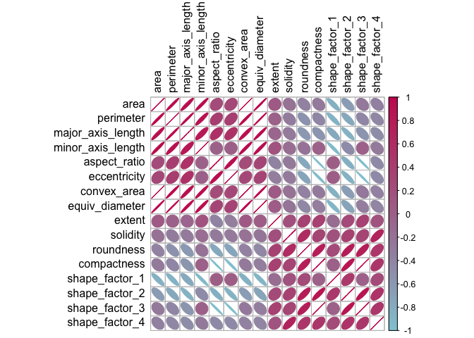
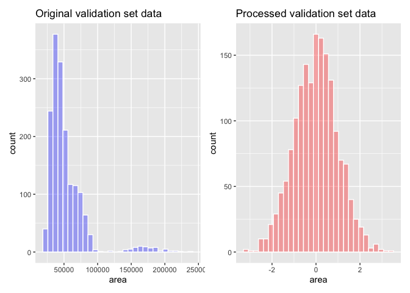
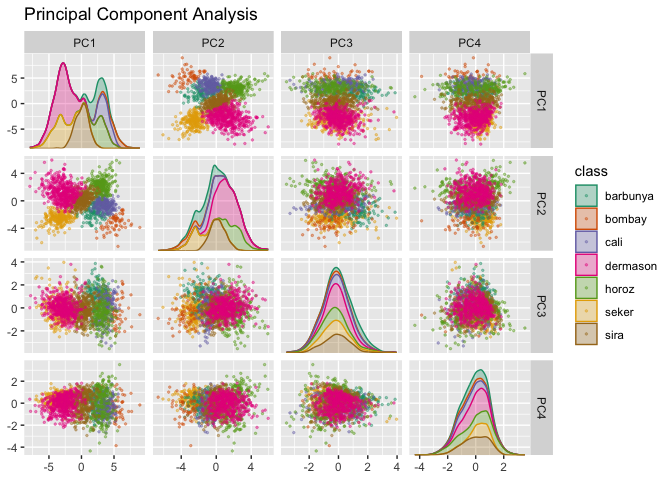
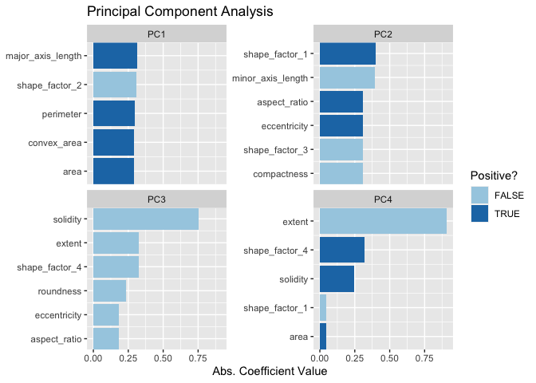
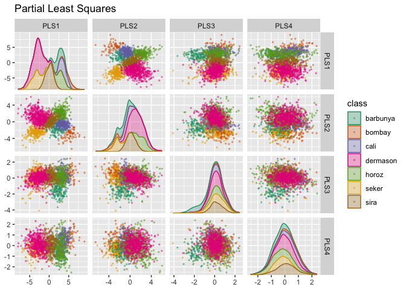
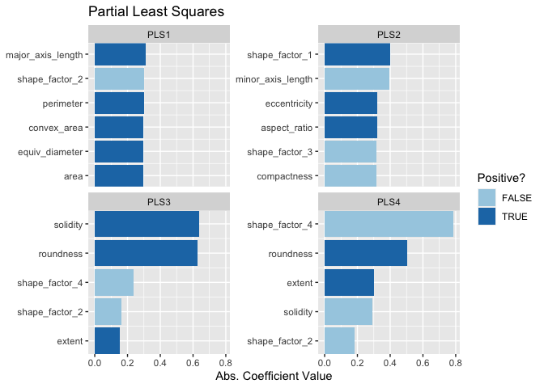
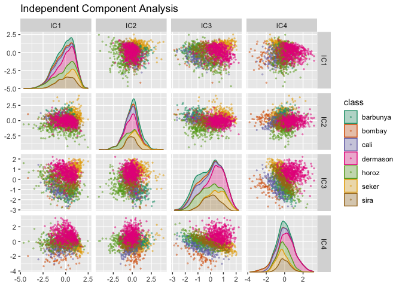
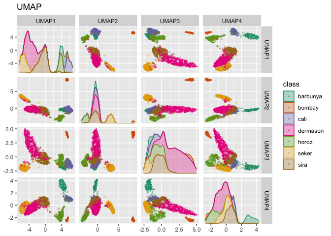
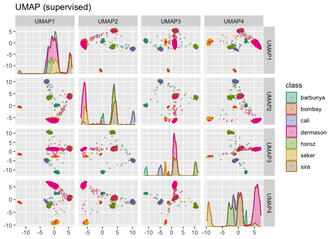

# Dimensionality Reduction

## 16.2 A PICTURE IS WORTH A THOUSAND… BEANS


```r
library(tidymodels)
```

```
## ── Attaching packages ────────────────────────────────────── tidymodels 1.1.1 ──
```

```
## ✔ broom        1.0.5     ✔ recipes      1.0.9
## ✔ dials        1.2.0     ✔ rsample      1.2.0
## ✔ dplyr        1.1.4     ✔ tibble       3.2.1
## ✔ ggplot2      3.4.4     ✔ tidyr        1.3.0
## ✔ infer        1.0.5     ✔ tune         1.1.2
## ✔ modeldata    1.2.0     ✔ workflows    1.1.3
## ✔ parsnip      1.1.1     ✔ workflowsets 1.0.1
## ✔ purrr        1.0.2     ✔ yardstick    1.2.0
```

```
## ── Conflicts ───────────────────────────────────────── tidymodels_conflicts() ──
## ✖ purrr::discard() masks scales::discard()
## ✖ dplyr::filter()  masks stats::filter()
## ✖ dplyr::lag()     masks stats::lag()
## ✖ recipes::step()  masks stats::step()
## • Search for functions across packages at https://www.tidymodels.org/find/
```

```r
tidymodels_prefer()
library(beans)
library(doMC)
```

```
## Loading required package: foreach
```

```
## 
## Attaching package: 'foreach'
```

```
## The following objects are masked from 'package:purrr':
## 
##     accumulate, when
```

```
## Loading required package: iterators
```

```
## Loading required package: parallel
```

```r
registerDoMC(cores = 8)
```

```r
set.seed(1601)
bean_split <- initial_validation_split(beans, strata = class, prop = c(0.75, 0.125))
```

```
## Warning: Too little data to stratify.
## • Resampling will be unstratified.
```

```r
#> Warning: Too little data to stratify.
#> • Resampling will be unstratified.
bean_split
```

```
## <Training/Validation/Testing/Total>
## <10206/1702/1703/13611>
```

```r
#> <Training/Validation/Testing/Total>
#> <10206/1702/1703/13611>

# Return data frames:
bean_train <- training(bean_split)
bean_test <- testing(bean_split)
bean_validation <- validation(bean_split)


set.seed(1602)
# Return an 'rset' object to use with the tune functions:
bean_val <- validation_set(bean_split)
bean_val$splits[[1]]
```

```
## <Training/Validation/Total>
## <10206/1702/11908>
```

```r
#> <Training/Validation/Total>
#> <10206/1702/11908>
```


```r
library(corrplot)
```

```
## corrplot 0.92 loaded
```

```r
tmwr_cols <- colorRampPalette(c("#91CBD765", "#CA225E"))
bean_train %>% 
  select(-class) %>% 
  cor() %>% 
  corrplot(col = tmwr_cols(200), tl.col = "black", method = "ellipse")
```

<!-- -->

## 16.3 A starting recipe


```r
library(bestNormalize)
bean_rec <-
  # Use the training data from the bean_val split object
  recipe(class ~ ., data = bean_train) %>%
  step_zv(all_numeric_predictors()) %>%
  step_orderNorm(all_numeric_predictors()) %>% 
  step_normalize(all_numeric_predictors())
```

## 16.4 recipe in the wild

prep for a recipe is like fit for a model...it gits the recipe using the training data.  You can then bake it to apply it to new data


```r
bean_rec_trained <- prep(bean_rec)
bean_rec_trained
```

```
## 
```

```
## ── Recipe ──────────────────────────────────────────────────────────────────────
```

```
## 
```

```
## ── Inputs
```

```
## Number of variables by role
```

```
## outcome:    1
## predictor: 16
```

```
## 
```

```
## ── Training information
```

```
## Training data contained 10206 data points and no incomplete rows.
```

```
## 
```

```
## ── Operations
```

```
## • Zero variance filter removed: <none> | Trained
```

```
## • orderNorm transformation on: area and perimeter, ... | Trained
```

```
## • Centering and scaling for: area and perimeter, ... | Trained
```

pass verbpse argument to help troubleshoot


```r
bean_rec_trained %>% 
  step_dummy(cornbread) %>%  # <- not a real predictor
  prep(verbose = TRUE)
```

```
## oper 1 step zv [pre-trained]
## oper 2 step orderNorm [pre-trained]
## oper 3 step normalize [pre-trained]
## oper 4 step dummy [training]
```

```
## Error in `step_dummy()`:
## Caused by error in `prep()`:
## ! Can't subset columns that don't exist.
## ✖ Column `cornbread` doesn't exist.
```
log changes can also be helpful


```r
show_variables <- 
  bean_rec %>% 
  prep(log_changes = TRUE)
```

```
## step_zv (zv_RLYwH): same number of columns
## 
## step_orderNorm (orderNorm_Jx8oD): same number of columns
## 
## step_normalize (normalize_GU75D): same number of columns
```
### 16.4.2 baking for new data

```r
bean_val_processed <- bake(bean_rec_trained, new_data = bean_validation)
```


```r
library(patchwork)
p1 <- 
  bean_validation %>% 
  ggplot(aes(x = area)) + 
  geom_histogram(bins = 30, color = "white", fill = "blue", alpha = 1/3) + 
  ggtitle("Original validation set data")

p2 <- 
  bean_val_processed %>% 
  ggplot(aes(x = area)) + 
  geom_histogram(bins = 30, color = "white", fill = "red", alpha = 1/3) + 
  ggtitle("Processed validation set data")

p1 + p2
```

<!-- -->

## 16.5 feature extractions

A function to test and plot results of recipes


```r
library(ggforce)
plot_validation_results <- function(recipe, dat = bean_validation) {
  recipe %>%
    # Estimate any additional steps
    prep() %>%
    # Process the data (the validation set by default)
    bake(new_data = dat) %>%
    # Create the scatterplot matrix
    ggplot(aes(x = .panel_x, y = .panel_y, color = class, fill = class)) +
    geom_point(alpha = 0.4, size = 0.5) +
    geom_autodensity(alpha = .3) +
    facet_matrix(vars(-class), layer.diag = 2) + 
    scale_color_brewer(palette = "Dark2") + 
    scale_fill_brewer(palette = "Dark2")
}
```


### 16.2.1 PCA


```r
bean_rec_trained %>%
  step_pca(all_numeric_predictors(), num_comp = 4) %>%
  plot_validation_results() + 
  ggtitle("Principal Component Analysis")
```

<!-- -->

Plot the loadings


```r
library(learntidymodels)
```

```
## Loading required package: tidyverse
```

```
## ── Attaching core tidyverse packages ──────────────────────── tidyverse 2.0.0 ──
## ✔ forcats   1.0.0     ✔ readr     2.1.5
## ✔ lubridate 1.9.3     ✔ stringr   1.5.1
## ── Conflicts ────────────────────────────────────────── tidyverse_conflicts() ──
## ✖ foreach::accumulate() masks purrr::accumulate()
## ✖ readr::col_factor()   masks scales::col_factor()
## ✖ purrr::discard()      masks scales::discard()
## ✖ dplyr::filter()       masks stats::filter()
## ✖ stringr::fixed()      masks recipes::fixed()
## ✖ dplyr::lag()          masks stats::lag()
## ✖ readr::spec()         masks yardstick::spec()
## ✖ foreach::when()       masks purrr::when()
## ℹ Use the conflicted package (<http://conflicted.r-lib.org/>) to force all conflicts to become errors
```

```r
bean_rec_trained %>%
  step_pca(all_numeric_predictors(), num_comp = 4) %>% 
  prep() %>% 
  plot_top_loadings(component_number <= 4, n = 5) + 
  scale_fill_brewer(palette = "Paired") +
  ggtitle("Principal Component Analysis")
```

<!-- -->
What if we want to get the loadings ourselves?


```r
bean_prep <- bean_rec_trained %>%
  step_pca(all_numeric_predictors(), num_comp = 4) %>% 
  prep() 
```


```r
map(bean_prep$steps, ~ .x$id)
```

```
## [[1]]
## [1] "zv_RLYwH"
## 
## [[2]]
## [1] "orderNorm_Jx8oD"
## 
## [[3]]
## [1] "normalize_GU75D"
## 
## [[4]]
## [1] "pca_RtQpj"
```


```r
bean_prep$steps[[4]]
```

```
## $terms
## <list_of<quosure>>
## 
## [[1]]
## <quosure>
## expr: ^all_numeric_predictors()
## env:  0x1325f0bd8
## 
## 
## $role
## [1] "predictor"
## 
## $trained
## [1] TRUE
## 
## $num_comp
## [1] 4
## 
## $threshold
## [1] NA
## 
## $options
## list()
## 
## $res
## Standard deviations (1, .., p=16):
##  [1] 3.083719e+00 1.977524e+00 1.051075e+00 9.370183e-01 6.301632e-01
##  [6] 3.378913e-01 2.428881e-01 1.327794e-01 8.376013e-02 4.442611e-02
## [11] 1.817622e-02 8.262779e-03 4.695144e-03 3.957726e-15 7.293144e-16
## [16] 4.519456e-17
## 
## Rotation (n x k) = (16 x 16):
##                           PC1         PC2         PC3           PC4
## area               0.28984771 -0.22394898 -0.03330845  0.0450248587
## perimeter          0.29905810 -0.18966083  0.00522004  0.0372498709
## major_axis_length  0.31378199 -0.09588712 -0.09976064  0.0263946815
## minor_axis_length  0.20107178 -0.39234855  0.06091599  0.0407401460
## aspect_ratio       0.24729510  0.31048400 -0.18352159 -0.0003938356
## eccentricity       0.24729510  0.31048400 -0.18352159 -0.0003938356
## convex_area        0.29043988 -0.22247875 -0.02493806  0.0424344965
## equiv_diameter     0.28984771 -0.22394898 -0.03330845  0.0450248587
## extent            -0.04795316 -0.17742437 -0.32559756 -0.9079442062
## solidity          -0.13888184 -0.13647244 -0.75394991  0.2452208616
## roundness         -0.26054494 -0.18877656 -0.23609840  0.0372397803
## compactness       -0.24893802 -0.30933821  0.17153452  0.0077792671
## shape_factor_1    -0.19755514  0.39694415 -0.05130207 -0.0478106477
## shape_factor_2    -0.31002091 -0.08387043  0.13903580  0.0028167635
## shape_factor_3    -0.24893802 -0.30933821  0.17153452  0.0077792671
## shape_factor_4    -0.22007768 -0.12873787 -0.32419271  0.3195355315
##                            PC5          PC6           PC7          PC8
## area              -0.007566790  0.028380450 -7.190899e-02 -0.209979076
## perimeter         -0.074556680 -0.081401517  9.696076e-02 -0.392369023
## major_axis_length  0.023867038  0.135307592  3.828409e-01 -0.252350166
## minor_axis_length  0.023578809  0.005778522 -2.664102e-01  0.431903053
## aspect_ratio      -0.024509790  0.097446747 -2.194332e-01  0.037311756
## eccentricity      -0.024509790  0.097446747 -2.194332e-01  0.037311756
## convex_area       -0.009254704  0.032775215 -6.641486e-02 -0.226609123
## equiv_diameter    -0.007566790  0.028380450 -7.190899e-02 -0.209979076
## extent            -0.188416484 -0.005542548 -1.586613e-02 -0.007622714
## solidity           0.297025991 -0.494279778  2.128348e-02  0.019426611
## roundness          0.459320861  0.772378337 -6.294547e-02 -0.089044385
## compactness        0.004983151 -0.096666546  2.162639e-01 -0.040506464
## shape_factor_1    -0.003769195 -0.005220842  2.587939e-01 -0.445581300
## shape_factor_2    -0.014557636 -0.154487585 -7.048554e-01 -0.493064943
## shape_factor_3     0.004983151 -0.096666546  2.162639e-01 -0.040506464
## shape_factor_4    -0.810516764  0.264313030 -9.137396e-05  0.014337424
##                            PC9          PC10         PC11          PC12
## area               0.301878013  0.2571299869  0.039248739  0.0662007847
## perimeter         -0.036834173 -0.8319641315  0.041866603  0.0080291644
## major_axis_length -0.743369796  0.3145977593 -0.031378868  0.0018468389
## minor_axis_length -0.174987728 -0.0814000236 -0.352840502 -0.6013380010
## aspect_ratio      -0.043900077 -0.0129166003  0.427959113 -0.2526565732
## eccentricity      -0.043900077 -0.0129166003  0.427959113 -0.2526565732
## convex_area        0.291727418  0.1878547193 -0.094144022 -0.1311666968
## equiv_diameter     0.301878013  0.2571299869  0.039248739  0.0662007847
## extent             0.001322701 -0.0004342764 -0.001113094 -0.0003460493
## solidity          -0.006039673  0.0019760752 -0.006857359 -0.0019148403
## roundness          0.043473632 -0.1333253213  0.014244486  0.0025130457
## compactness        0.023641612  0.0535122475  0.430495722 -0.2574448308
## shape_factor_1     0.189323820  0.0534846797 -0.350378286 -0.5933153736
## shape_factor_2    -0.324511707  0.0895209303 -0.009447531  0.0094621328
## shape_factor_3     0.023641612  0.0535122475  0.430495722 -0.2574448308
## shape_factor_4    -0.002550045  0.0013314899 -0.027669582 -0.0024091666
##                            PC13          PC14          PC15          PC16
## area              -3.865288e-01 -7.070892e-01  4.991399e-03  1.329761e-04
## perimeter         -4.795963e-02 -9.606188e-16  1.359384e-15  1.420847e-16
## major_axis_length  3.695332e-03  1.239944e-15 -1.310093e-15  2.286856e-17
## minor_axis_length -1.371414e-01  2.217799e-16  6.120173e-15 -2.209423e-16
## aspect_ratio       6.812128e-03 -4.990917e-03 -7.070851e-01  2.410540e-03
## eccentricity       6.812128e-03  4.990917e-03  7.070851e-01 -2.410540e-03
## convex_area        8.126135e-01  8.054262e-15 -1.235171e-15 -1.828439e-15
## equiv_diameter    -3.865288e-01  7.070892e-01 -4.991399e-03 -1.329761e-04
## extent             8.007451e-05 -6.059231e-17 -3.095599e-16  5.836037e-18
## solidity           7.414982e-03  1.138562e-16 -2.205134e-16  1.459106e-17
## roundness         -6.378173e-03 -1.358791e-16 -1.223485e-16  1.901400e-17
## compactness        6.937302e-03 -1.499878e-04 -2.409541e-03 -7.071027e-01
## shape_factor_1    -1.394234e-01 -2.875420e-17  4.636050e-16 -1.224095e-16
## shape_factor_2    -8.401609e-04  2.859517e-16  4.154630e-16  1.745227e-17
## shape_factor_3     6.937302e-03  1.499878e-04  2.409541e-03  7.071027e-01
## shape_factor_4    -2.109733e-03  4.380982e-17  1.196553e-16 -1.226177e-18
## 
## $columns
##                area           perimeter   major_axis_length   minor_axis_length 
##              "area"         "perimeter" "major_axis_length" "minor_axis_length" 
##        aspect_ratio        eccentricity         convex_area      equiv_diameter 
##      "aspect_ratio"      "eccentricity"       "convex_area"    "equiv_diameter" 
##              extent            solidity           roundness         compactness 
##            "extent"          "solidity"         "roundness"       "compactness" 
##      shape_factor_1      shape_factor_2      shape_factor_3      shape_factor_4 
##    "shape_factor_1"    "shape_factor_2"    "shape_factor_3"    "shape_factor_4" 
## 
## $prefix
## [1] "PC"
## 
## $keep_original_cols
## [1] FALSE
## 
## $skip
## [1] FALSE
## 
## $id
## [1] "pca_RtQpj"
## 
## $case_weights
## NULL
## 
## attr(,"class")
## [1] "step_pca" "step"
```


```r
bean_prep$steps[[4]]$res %>% summary
```

```
## Importance of components:
##                           PC1    PC2     PC3     PC4     PC5     PC6     PC7
## Standard deviation     3.0837 1.9775 1.05108 0.93702 0.63016 0.33789 0.24289
## Proportion of Variance 0.5943 0.2444 0.06905 0.05488 0.02482 0.00714 0.00369
## Cumulative Proportion  0.5943 0.8387 0.90779 0.96267 0.98749 0.99462 0.99831
##                           PC8     PC9    PC10    PC11     PC12     PC13
## Standard deviation     0.1328 0.08376 0.04443 0.01818 0.008263 0.004695
## Proportion of Variance 0.0011 0.00044 0.00012 0.00002 0.000000 0.000000
## Cumulative Proportion  0.9994 0.99985 0.99997 0.99999 1.000000 1.000000
##                             PC14      PC15      PC16
## Standard deviation     3.958e-15 7.293e-16 4.519e-17
## Proportion of Variance 0.000e+00 0.000e+00 0.000e+00
## Cumulative Proportion  1.000e+00 1.000e+00 1.000e+00
```

### 16.5.2 PLS

supervised


```r
bean_rec_trained %>%
  step_pls(all_numeric_predictors(), outcome = "class", num_comp = 4) %>%
  plot_validation_results() + 
  ggtitle("Partial Least Squares")
```

<!-- -->


```r
bean_rec_trained %>%
  step_pls(all_numeric_predictors(), outcome = "class", num_comp = 4) %>%
  prep() %>% 
  plot_top_loadings(component_number <= 4, n = 5, type = "pls") + 
  scale_fill_brewer(palette = "Paired") +
  ggtitle("Partial Least Squares")
```

<!-- -->
### 16.5.3 ICA


```r
bean_rec_trained %>%
  step_ica(all_numeric_predictors(), num_comp = 4) %>%
  plot_validation_results() + 
  ggtitle("Independent Component Analysis")
```

<!-- -->

### 16.5.4 UMAP


```r
library(embed)
bean_rec_trained %>%
  step_umap(all_numeric_predictors(), num_comp = 4) %>%
  plot_validation_results() +
  ggtitle("UMAP")
```

<!-- -->

```r
bean_rec_trained %>%
  step_umap(all_numeric_predictors(), outcome = "class", num_comp = 4) %>%
  plot_validation_results() +
  ggtitle("UMAP (supervised)")
```

<!-- -->
## 16.6 models

models

```r
library(baguette)
library(discrim)

mlp_spec <-
  mlp(hidden_units = tune(), penalty = tune(), epochs = tune()) %>%
  set_engine('nnet') %>%
  set_mode('classification')

bagging_spec <-
  bag_tree() %>%
  set_engine('rpart') %>%
  set_mode('classification')

fda_spec <-
  discrim_flexible(
    prod_degree = tune()
  ) %>%
  set_engine('earth')

rda_spec <-
  discrim_regularized(frac_common_cov = tune(), frac_identity = tune()) %>%
  set_engine('klaR')

bayes_spec <-
  naive_Bayes() %>%
  set_engine('klaR')
```

recipes

```r
bean_rec <-
  recipe(class ~ ., data = bean_train) %>%
  step_zv(all_numeric_predictors()) %>%
  step_orderNorm(all_numeric_predictors()) %>%
  step_normalize(all_numeric_predictors())

pls_rec <- 
  bean_rec %>% 
  step_pls(all_numeric_predictors(), outcome = "class", num_comp = tune())

umap_rec <-
  bean_rec %>%
  step_umap(
    all_numeric_predictors(),
    outcome = "class",
    num_comp = tune(),
    neighbors = tune(),
    min_dist = tune()
  )
```

workflowset


```r
ctrl <- control_grid(parallel_over = "everything")
bean_res <- 
  workflow_set(
    preproc = list(basic = class ~., pls = pls_rec, umap = umap_rec), 
    models = list(bayes = bayes_spec, fda = fda_spec,
                  rda = rda_spec, bag = bagging_spec,
                  mlp = mlp_spec)
  ) %>% 
  workflow_map(
    verbose = TRUE,
    seed = 1603,
    resamples = bean_val,
    grid = 10,
    metrics = metric_set(roc_auc),
    control = ctrl
  )
```

```
## i	No tuning parameters. `fit_resamples()` will be attempted
```

```
## i  1 of 15 resampling: basic_bayes
```

```
## Warning in `[.tbl_df`(x, is.finite(x <- as.numeric(x))): NAs introduced by
## coercion
```

```
## ! validation: preprocessor 1/1, model 1/1 (predictions): Numerical 0 probability for all classes with observation 1, Numerical 0 ...
```

```
## ✔  1 of 15 resampling: basic_bayes (2.6s)
```

```
## i  2 of 15 tuning:     basic_fda
```

```
## Warning in `[.tbl_df`(x, is.finite(x <- as.numeric(x))): NAs introduced by
## coercion
```

```
## ✔  2 of 15 tuning:     basic_fda (1.2s)
```

```
## i  3 of 15 tuning:     basic_rda
```

```
## Warning in `[.tbl_df`(x, is.finite(x <- as.numeric(x))): NAs introduced by
## coercion
```

```
## ✔  3 of 15 tuning:     basic_rda (2.1s)
```

```
## i	No tuning parameters. `fit_resamples()` will be attempted
```

```
## i  4 of 15 resampling: basic_bag
```

```
## Warning in `[.tbl_df`(x, is.finite(x <- as.numeric(x))): NAs introduced by
## coercion
```

```
## ✔  4 of 15 resampling: basic_bag (1.3s)
```

```
## i  5 of 15 tuning:     basic_mlp
```

```
## Warning in `[.tbl_df`(x, is.finite(x <- as.numeric(x))): NAs introduced by
## coercion
```

```
## ✔  5 of 15 tuning:     basic_mlp (2.9s)
```

```
## i  6 of 15 tuning:     pls_bayes
```

```
## Warning in `[.tbl_df`(x, is.finite(x <- as.numeric(x))): NAs introduced by
## coercion
```

```
## ✔  6 of 15 tuning:     pls_bayes (2.5s)
```

```
## i  7 of 15 tuning:     pls_fda
```

```
## Warning in `[.tbl_df`(x, is.finite(x <- as.numeric(x))): NAs introduced by
## coercion
```

```
## ✔  7 of 15 tuning:     pls_fda (2s)
```

```
## i  8 of 15 tuning:     pls_rda
```

```
## Warning in `[.tbl_df`(x, is.finite(x <- as.numeric(x))): NAs introduced by
## coercion
```

```
## ✔  8 of 15 tuning:     pls_rda (4.8s)
```

```
## i  9 of 15 tuning:     pls_bag
```

```
## Warning in `[.tbl_df`(x, is.finite(x <- as.numeric(x))): NAs introduced by
## coercion
```

```
## ✔  9 of 15 tuning:     pls_bag (2.3s)
```

```
## i 10 of 15 tuning:     pls_mlp
```

```
## Warning in `[.tbl_df`(x, is.finite(x <- as.numeric(x))): NAs introduced by
## coercion
```

```
## ✔ 10 of 15 tuning:     pls_mlp (7.6s)
```

```
## i 11 of 15 tuning:     umap_bayes
```

```
## Warning in `[.tbl_df`(x, is.finite(x <- as.numeric(x))): NAs introduced by
## coercion
```

```
## ✔ 11 of 15 tuning:     umap_bayes (1m 5s)
```

```
## i 12 of 15 tuning:     umap_fda
```

```
## Warning in `[.tbl_df`(x, is.finite(x <- as.numeric(x))): NAs introduced by
## coercion
```

```
## ✔ 12 of 15 tuning:     umap_fda (1m 7s)
```

```
## i 13 of 15 tuning:     umap_rda
```

```
## Warning in `[.tbl_df`(x, is.finite(x <- as.numeric(x))): NAs introduced by
## coercion
```

```
## ✔ 13 of 15 tuning:     umap_rda (1m 4s)
```

```
## i 14 of 15 tuning:     umap_bag
```

```
## Warning in `[.tbl_df`(x, is.finite(x <- as.numeric(x))): NAs introduced by
## coercion
```

```
## ✔ 14 of 15 tuning:     umap_bag (59.4s)
```

```
## i 15 of 15 tuning:     umap_mlp
```

```
## Warning in `[.tbl_df`(x, is.finite(x <- as.numeric(x))): NAs introduced by
## coercion
```

```
## ✔ 15 of 15 tuning:     umap_mlp (1m 9.1s)
```

rank

```r
rankings <- 
  rank_results(bean_res, select_best = TRUE) %>% 
  mutate(method = map_chr(wflow_id, ~ str_split(.x, "_", simplify = TRUE)[1])) 

tidymodels_prefer()
filter(rankings, rank <= 10) %>% dplyr::select(rank, mean, model, method)
```

```
## # A tibble: 10 × 4
##     rank  mean model               method
##    <int> <dbl> <chr>               <chr> 
##  1     1 0.996 mlp                 pls   
##  2     2 0.996 discrim_regularized pls   
##  3     3 0.995 discrim_flexible    basic 
##  4     4 0.995 naive_Bayes         pls   
##  5     5 0.994 naive_Bayes         basic 
##  6     6 0.993 mlp                 basic 
##  7     7 0.993 mlp                 umap  
##  8     8 0.993 discrim_flexible    pls   
##  9     9 0.992 bag_tree            basic 
## 10    10 0.991 discrim_flexible    umap
```

finalize it

```r
rda_res <- 
  bean_res %>% 
  extract_workflow("pls_rda") %>% 
  finalize_workflow(
    bean_res %>% 
      extract_workflow_set_result("pls_rda") %>% 
      select_best(metric = "roc_auc")
  ) %>% 
  last_fit(split = bean_split, metrics = metric_set(roc_auc))

rda_wflow_fit <- extract_workflow(rda_res)
```


```r
collect_metrics(rda_res)
```

```
## # A tibble: 1 × 4
##   .metric .estimator .estimate .config             
##   <chr>   <chr>          <dbl> <chr>               
## 1 roc_auc hand_till      0.995 Preprocessor1_Model1
```

