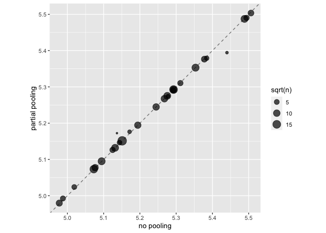

```r
library(tidymodels)
```

```
## ── Attaching packages ────────────────────────────────────── tidymodels 1.1.1 ──
```

```
## ✔ broom        1.0.5     ✔ recipes      1.0.9
## ✔ dials        1.2.0     ✔ rsample      1.2.0
## ✔ dplyr        1.1.4     ✔ tibble       3.2.1
## ✔ ggplot2      3.4.4     ✔ tidyr        1.3.0
## ✔ infer        1.0.5     ✔ tune         1.1.2
## ✔ modeldata    1.2.0     ✔ workflows    1.1.3
## ✔ parsnip      1.1.1     ✔ workflowsets 1.0.1
## ✔ purrr        1.0.2     ✔ yardstick    1.2.0
```

```
## ── Conflicts ───────────────────────────────────────── tidymodels_conflicts() ──
## ✖ purrr::discard() masks scales::discard()
## ✖ dplyr::filter()  masks stats::filter()
## ✖ dplyr::lag()     masks stats::lag()
## ✖ recipes::step()  masks stats::step()
## • Use tidymodels_prefer() to resolve common conflicts.
```

```r
data(ames)
ames <- mutate(ames, Sale_Price = log10(Sale_Price))

set.seed(502)
ames_split <- initial_split(ames, prop = 0.80, strata = Sale_Price)
ames_train <- training(ames_split)
ames_test  <-  testing(ames_split)

ames_rec <- 
  recipe(Sale_Price ~ Neighborhood + Gr_Liv_Area + Year_Built + Bldg_Type + 
           Latitude + Longitude, data = ames_train) %>%
  step_log(Gr_Liv_Area, base = 10) %>% 
  step_other(Neighborhood, threshold = 0.01) %>% 
  step_dummy(all_nominal_predictors()) %>% 
  step_interact( ~ Gr_Liv_Area:starts_with("Bldg_Type_") ) %>% 
  step_ns(Latitude, Longitude, deg_free = 20)
  
lm_model <- linear_reg() %>% set_engine("lm")

lm_wflow <- 
  workflow() %>% 
  add_model(lm_model) %>% 
  add_recipe(ames_rec)

lm_fit <- fit(lm_wflow, ames_train)
```

# Chapter 17 Encoding Categorical Data

Focus on alternatives to dummy variable encoding

Packages `embed` and `textrecipes`

## 17.1 is an encoding necessary?

Some models do not need recoding: e.g. tree-based models and Naive Bayes models.

Generally transforming when it wasn't required did not improve model fit but did increase training time.

## 17.2 Encoding Ordinal predictors

Default in base R is polynomial, but this isn't so helpful

Try `step_unorder` or `step_ordinalscore`

## 17.3 Using the outcome for encoding predictors

Huh: calculate the median or mean for each level of the factor and then use those as the predictor values.  Double dipping?

Best if you have many levels

`step_lencode_glm`, `step_lencode_mixed` and `step_lenconde_bayes`


```r
library(embed)

ames_glm <- 
  recipe(Sale_Price ~ Neighborhood + Gr_Liv_Area + Year_Built + Bldg_Type + 
           Latitude + Longitude, data = ames_train) %>%
  step_log(Gr_Liv_Area, base = 10) %>% 
  step_lencode_glm(Neighborhood, outcome = vars(Sale_Price)) %>%
  step_dummy(all_nominal_predictors()) %>% 
  step_interact( ~ Gr_Liv_Area:starts_with("Bldg_Type_") ) %>% 
  step_ns(Latitude, Longitude, deg_free = 20)

ames_glm
```

```
## 
```

```
## ── Recipe ──────────────────────────────────────────────────────────────────────
```

```
## 
```

```
## ── Inputs
```

```
## Number of variables by role
```

```
## outcome:   1
## predictor: 6
```

```
## 
```

```
## ── Operations
```

```
## • Log transformation on: Gr_Liv_Area
```

```
## • Linear embedding for factors via GLM for: Neighborhood
```

```
## • Dummy variables from: all_nominal_predictors()
```

```
## • Interactions with: Gr_Liv_Area:starts_with("Bldg_Type_")
```

```
## • Natural splines on: Latitude and Longitude
```


```r
glm_estimates <-
  prep(ames_glm) %>%
  tidy(number = 2)

glm_estimates
```

```
## # A tibble: 29 × 4
##    level              value terms        id               
##    <chr>              <dbl> <chr>        <chr>            
##  1 North_Ames          5.15 Neighborhood lencode_glm_AmBz1
##  2 College_Creek       5.29 Neighborhood lencode_glm_AmBz1
##  3 Old_Town            5.07 Neighborhood lencode_glm_AmBz1
##  4 Edwards             5.09 Neighborhood lencode_glm_AmBz1
##  5 Somerset            5.35 Neighborhood lencode_glm_AmBz1
##  6 Northridge_Heights  5.49 Neighborhood lencode_glm_AmBz1
##  7 Gilbert             5.28 Neighborhood lencode_glm_AmBz1
##  8 Sawyer              5.13 Neighborhood lencode_glm_AmBz1
##  9 Northwest_Ames      5.27 Neighborhood lencode_glm_AmBz1
## 10 Sawyer_West         5.24 Neighborhood lencode_glm_AmBz1
## # ℹ 19 more rows
```

For a new neighborhood:


```r
glm_estimates %>%
  filter(level == "..new")
```

```
## # A tibble: 1 × 4
##   level value terms        id               
##   <chr> <dbl> <chr>        <chr>            
## 1 ..new  5.23 Neighborhood lencode_glm_AmBz1
```

Use with care and estimate on training set only.  

## 17.3.1 Effect Encodings with Partial Pooling

helps with estimations for categories with little info...shrink towards mean.


```r
ames_mixed <- 
  recipe(Sale_Price ~ Neighborhood + Gr_Liv_Area + Year_Built + Bldg_Type + 
           Latitude + Longitude, data = ames_train) %>%
  step_log(Gr_Liv_Area, base = 10) %>% 
  step_lencode_mixed(Neighborhood, outcome = vars(Sale_Price)) %>%
  step_dummy(all_nominal_predictors()) %>% 
  step_interact( ~ Gr_Liv_Area:starts_with("Bldg_Type_") ) %>% 
  step_ns(Latitude, Longitude, deg_free = 20)

ames_mixed
```

```
## 
```

```
## ── Recipe ──────────────────────────────────────────────────────────────────────
```

```
## 
```

```
## ── Inputs
```

```
## Number of variables by role
```

```
## outcome:   1
## predictor: 6
```

```
## 
```

```
## ── Operations
```

```
## • Log transformation on: Gr_Liv_Area
```

```
## • Linear embedding for factors via mixed effects for: Neighborhood
```

```
## • Dummy variables from: all_nominal_predictors()
```

```
## • Interactions with: Gr_Liv_Area:starts_with("Bldg_Type_")
```

```
## • Natural splines on: Latitude and Longitude
```


```r
mixed_estimates <-
  prep(ames_mixed) %>%
  tidy(number = 2)

mixed_estimates
```

```
## # A tibble: 29 × 4
##    level              value terms        id                 
##    <chr>              <dbl> <chr>        <chr>              
##  1 North_Ames          5.15 Neighborhood lencode_mixed_UkBd2
##  2 College_Creek       5.29 Neighborhood lencode_mixed_UkBd2
##  3 Old_Town            5.07 Neighborhood lencode_mixed_UkBd2
##  4 Edwards             5.10 Neighborhood lencode_mixed_UkBd2
##  5 Somerset            5.35 Neighborhood lencode_mixed_UkBd2
##  6 Northridge_Heights  5.49 Neighborhood lencode_mixed_UkBd2
##  7 Gilbert             5.28 Neighborhood lencode_mixed_UkBd2
##  8 Sawyer              5.13 Neighborhood lencode_mixed_UkBd2
##  9 Northwest_Ames      5.27 Neighborhood lencode_mixed_UkBd2
## 10 Sawyer_West         5.24 Neighborhood lencode_mixed_UkBd2
## # ℹ 19 more rows
```

Compare:


```r
glm_estimates %>%
  rename(`no pooling` = value) %>%
  left_join(
    mixed_estimates %>%
      rename(`partial pooling` = value), by = "level"
  ) %>%
  left_join(
    ames_train %>% 
      count(Neighborhood) %>% 
      mutate(level = as.character(Neighborhood))
  ) %>%
  ggplot(aes(`no pooling`, `partial pooling`, size = sqrt(n))) +
  geom_abline(color = "gray50", lty = 2) +
  geom_point(alpha = 0.7) +
  coord_fixed()
```

```
## Joining with `by = join_by(level)`
```

```
## Warning: Removed 1 rows containing missing values (`geom_point()`).
```

<!-- -->

```r
#> Warning: Removed 1 rows containing missing values (`geom_point()`).
```

## 17.4 Feature Hashing

Why does this help?  Isn't it just randomly assigning a number to the category?

```r
library(rlang)
```

```
## 
## Attaching package: 'rlang'
```

```
## The following objects are masked from 'package:purrr':
## 
##     %@%, flatten, flatten_chr, flatten_dbl, flatten_int, flatten_lgl,
##     flatten_raw, invoke, splice
```

```r
ames_hashed <-
  ames_train %>%
  mutate(Hash = map_chr(Neighborhood, hash))

ames_hashed %>%
  select(Neighborhood, Hash)
```

```
## # A tibble: 2,342 × 2
##    Neighborhood    Hash                            
##    <fct>           <chr>                           
##  1 North_Ames      076543f71313e522efe157944169d919
##  2 North_Ames      076543f71313e522efe157944169d919
##  3 Briardale       b598bec306983e3e68a3118952df8cf0
##  4 Briardale       b598bec306983e3e68a3118952df8cf0
##  5 Northpark_Villa 6af95b5db968bf393e78188a81e0e1e4
##  6 Northpark_Villa 6af95b5db968bf393e78188a81e0e1e4
##  7 Sawyer_West     5b8ac3fb32a9671d55da7b13c6e5ef49
##  8 Sawyer_West     5b8ac3fb32a9671d55da7b13c6e5ef49
##  9 Sawyer          2491e7eceb561d5a5f19abea49145c68
## 10 Sawyer          2491e7eceb561d5a5f19abea49145c68
## # ℹ 2,332 more rows
```

Reducing the number of hashed values:


```r
ames_hashed %>%
  ## first make a smaller hash for integers that R can handle
  mutate(Hash = strtoi(substr(Hash, 26, 32), base = 16L),  
         ## now take the modulo
         Hash = Hash %% 16) %>%
  select(Neighborhood, Hash)
```

```
## # A tibble: 2,342 × 2
##    Neighborhood     Hash
##    <fct>           <dbl>
##  1 North_Ames          9
##  2 North_Ames          9
##  3 Briardale           0
##  4 Briardale           0
##  5 Northpark_Villa     4
##  6 Northpark_Villa     4
##  7 Sawyer_West         9
##  8 Sawyer_West         9
##  9 Sawyer              8
## 10 Sawyer              8
## # ℹ 2,332 more rows
```

In a recipe


```r
library(textrecipes)
ames_hash <- 
  recipe(Sale_Price ~ Neighborhood + Gr_Liv_Area + Year_Built + Bldg_Type + 
           Latitude + Longitude, data = ames_train) %>%
  step_log(Gr_Liv_Area, base = 10) %>% 
  step_dummy_hash(Neighborhood, signed = FALSE, num_terms = 16L) %>%
  step_dummy(all_nominal_predictors()) %>% 
  step_interact( ~ Gr_Liv_Area:starts_with("Bldg_Type_") ) %>% 
  step_ns(Latitude, Longitude, deg_free = 20)
```

```
## 1 package (text2vec) is needed for this step but is not installed.
```

```
## To install run: `install.packages("text2vec")`
```

```r
ames_hash
```

```
## 
```

```
## ── Recipe ──────────────────────────────────────────────────────────────────────
```

```
## 
```

```
## ── Inputs
```

```
## Number of variables by role
```

```
## outcome:   1
## predictor: 6
```

```
## 
```

```
## ── Operations
```

```
## • Log transformation on: Gr_Liv_Area
```

```
## • Feature hashing with: Neighborhood
```

```
## • Dummy variables from: all_nominal_predictors()
```

```
## • Interactions with: Gr_Liv_Area:starts_with("Bldg_Type_")
```

```
## • Natural splines on: Latitude and Longitude
```

