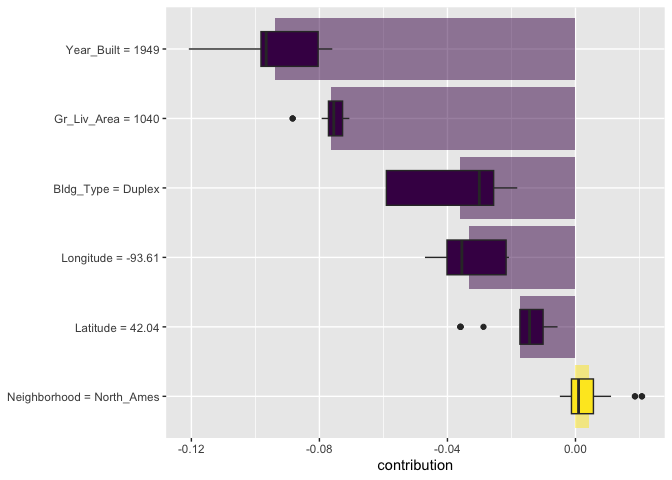
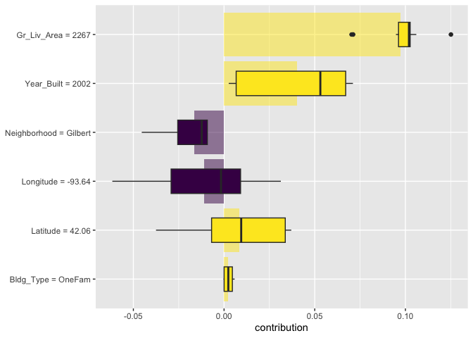
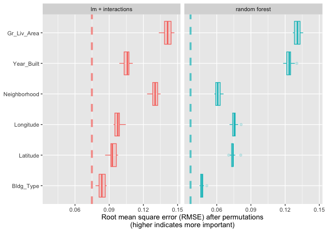
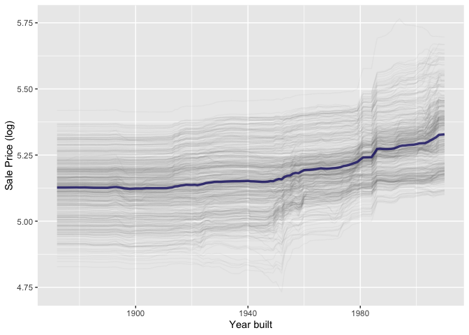
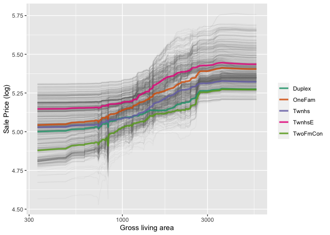
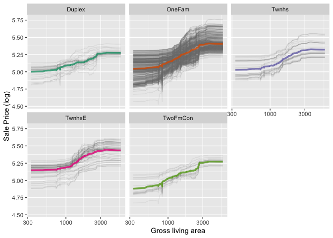
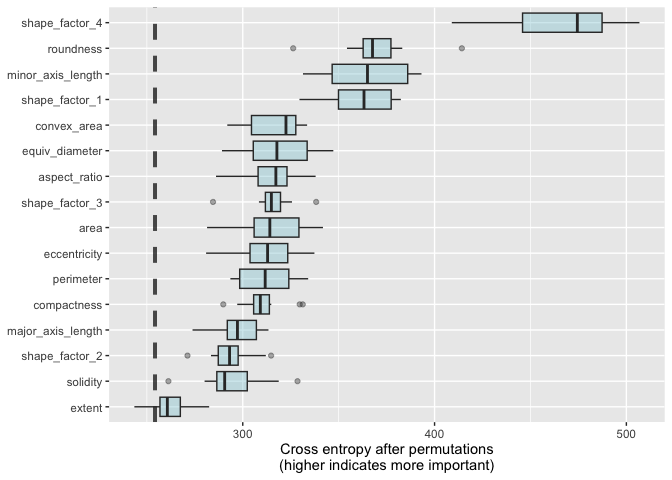

Focus of this chapter is on how a model makes its predictions

Relevant packages are lime, vip and DALEX

vip takes advantage of model structure

DALEX is agnostic to model structure


```r
library(tidymodels)
```

```
## ── Attaching packages ────────────────────────────────────── tidymodels 1.1.1 ──
```

```
## ✔ broom        1.0.5     ✔ recipes      1.0.9
## ✔ dials        1.2.0     ✔ rsample      1.2.0
## ✔ dplyr        1.1.4     ✔ tibble       3.2.1
## ✔ ggplot2      3.4.4     ✔ tidyr        1.3.0
## ✔ infer        1.0.5     ✔ tune         1.1.2
## ✔ modeldata    1.2.0     ✔ workflows    1.1.3
## ✔ parsnip      1.1.1     ✔ workflowsets 1.0.1
## ✔ purrr        1.0.2     ✔ yardstick    1.2.0
```

```
## ── Conflicts ───────────────────────────────────────── tidymodels_conflicts() ──
## ✖ purrr::discard() masks scales::discard()
## ✖ dplyr::filter()  masks stats::filter()
## ✖ dplyr::lag()     masks stats::lag()
## ✖ recipes::step()  masks stats::step()
## • Learn how to get started at https://www.tidymodels.org/start/
```

```r
library(doMC)
```

```
## Loading required package: foreach
```

```
## 
## Attaching package: 'foreach'
```

```
## The following objects are masked from 'package:purrr':
## 
##     accumulate, when
```

```
## Loading required package: iterators
```

```
## Loading required package: parallel
```

```r
registerDoMC(cores = 7)
data(ames)
ames <- mutate(ames, Sale_Price = log10(Sale_Price))

set.seed(502)
ames_split <- initial_split(ames, prop = 0.80, strata = Sale_Price)
ames_train <- training(ames_split)
ames_test  <-  testing(ames_split)

ames_rec <- 
  recipe(Sale_Price ~ Neighborhood + Gr_Liv_Area + Year_Built + Bldg_Type + 
           Latitude + Longitude, data = ames_train) %>%
  step_log(Gr_Liv_Area, base = 10) %>% 
  step_other(Neighborhood, threshold = 0.01) %>% 
  step_dummy(all_nominal_predictors()) %>% 
  step_interact( ~ Gr_Liv_Area:starts_with("Bldg_Type_") ) %>% 
  step_ns(Latitude, Longitude, deg_free = 20)

lm_model <- linear_reg() %>% set_engine("lm")

lm_wflow <- 
  workflow() %>% 
  add_model(lm_model) %>% 
  add_recipe(ames_rec)

lm_fit <- fit(lm_wflow, ames_train)

rf_model <- 
  rand_forest(trees = 1000) %>% 
  set_engine("ranger") %>% 
  set_mode("regression")

rf_wflow <- 
  workflow() %>% 
  add_formula(
    Sale_Price ~ Neighborhood + Gr_Liv_Area + Year_Built + Bldg_Type + 
      Latitude + Longitude) %>% 
  add_model(rf_model) 

set.seed(1001)
ames_folds <- vfold_cv(ames_train, v = 10)

keep_pred <- control_resamples(save_pred = TRUE, save_workflow = TRUE)

set.seed(1003)
rf_res <- rf_wflow %>% fit_resamples(resamples = ames_folds, control = keep_pred)

rf_fit <- rf_wflow %>% fit(data = ames_train)
```


## 18.1 Software for model explanations

use DALEXtra

Set up variables and an explainer:


```r
library(DALEXtra)
```

```
## Loading required package: DALEX
```

```
## Welcome to DALEX (version: 2.4.3).
## Find examples and detailed introduction at: http://ema.drwhy.ai/
## Additional features will be available after installation of: ggpubr.
## Use 'install_dependencies()' to get all suggested dependencies
```

```
## 
## Attaching package: 'DALEX'
```

```
## The following object is masked from 'package:dplyr':
## 
##     explain
```

```r
vip_features <- c("Neighborhood", "Gr_Liv_Area", "Year_Built", 
                  "Bldg_Type", "Latitude", "Longitude")

vip_train <- 
  ames_train %>% 
  select(all_of(vip_features))

explainer_lm <- 
  explain_tidymodels(
    lm_fit, 
    data = vip_train, 
    y = ames_train$Sale_Price,
    label = "lm + interactions",
    verbose = FALSE
  )

explainer_rf <- 
  explain_tidymodels(
    rf_fit, 
    data = vip_train, 
    y = ames_train$Sale_Price,
    label = "random forest",
    verbose = FALSE
  )
```

## 18.2 LOCAL EXPLANATIONS

Local explanations mean explanations for a single observation

Take this observation for example

```r
duplex <- vip_train[120,]
duplex
```

```
## # A tibble: 1 × 6
##   Neighborhood Gr_Liv_Area Year_Built Bldg_Type Latitude Longitude
##   <fct>              <int>      <int> <fct>        <dbl>     <dbl>
## 1 North_Ames          1040       1949 Duplex        42.0     -93.6
```
use predict_parts

```r
lm_breakdown <- predict_parts(explainer = explainer_lm, new_observation = duplex)
lm_breakdown
```

```
##                                              contribution
## lm + interactions: intercept                        5.221
## lm + interactions: Gr_Liv_Area = 1040              -0.082
## lm + interactions: Bldg_Type = Duplex              -0.049
## lm + interactions: Longitude = -93.608903          -0.043
## lm + interactions: Year_Built = 1949               -0.039
## lm + interactions: Latitude = 42.035841            -0.007
## lm + interactions: Neighborhood = North_Ames        0.001
## lm + interactions: prediction                       5.002
```


```r
rf_breakdown <- predict_parts(explainer = explainer_rf, new_observation = duplex)
rf_breakdown
```

```
##                                          contribution
## random forest: intercept                        5.221
## random forest: Year_Built = 1949               -0.076
## random forest: Gr_Liv_Area = 1040              -0.077
## random forest: Bldg_Type = Duplex              -0.026
## random forest: Longitude = -93.608903          -0.039
## random forest: Latitude = 42.035841            -0.030
## random forest: Neighborhood = North_Ames       -0.005
## random forest: prediction                       4.968
```

But in this method, the order of the features changes their reported importance.  Change the rf to match the lm order:


```r
predict_parts(
  explainer = explainer_rf, 
  new_observation = duplex,
  order = lm_breakdown$variable_name
)
```

```
##                                          contribution
## random forest: intercept                        5.221
## random forest: Gr_Liv_Area = 1040              -0.075
## random forest: Bldg_Type = Duplex              -0.018
## random forest: Longitude = -93.608903          -0.023
## random forest: Year_Built = 1949               -0.102
## random forest: Latitude = 42.035841            -0.030
## random forest: Neighborhood = North_Ames       -0.005
## random forest: prediction                       4.968
```

Can average across many orders using SHAP


```r
set.seed(1801)
shap_duplex <- 
  predict_parts(
    explainer = explainer_rf, 
    new_observation = duplex, 
    type = "shap",
    B = 20
  )
```

Plot it


```r
library(forcats)
shap_duplex %>%
  group_by(variable) %>%
  mutate(mean_val = mean(contribution)) %>%
  ungroup() %>%
  mutate(variable = fct_reorder(variable, abs(mean_val))) %>%
  ggplot(aes(contribution, variable, fill = mean_val > 0)) +
  geom_col(data = ~distinct(., variable, mean_val), 
           aes(mean_val, variable), 
           alpha = 0.5) +
  geom_boxplot(width = 0.5) +
  theme(legend.position = "none") +
  scale_fill_viridis_d() +
  labs(y = NULL)
```

<!-- -->

Look at a different observation:


```r
big_house <- vip_train[1269,]
big_house
```

```
## # A tibble: 1 × 6
##   Neighborhood Gr_Liv_Area Year_Built Bldg_Type Latitude Longitude
##   <fct>              <int>      <int> <fct>        <dbl>     <dbl>
## 1 Gilbert             2267       2002 OneFam        42.1     -93.6
```


```r
set.seed(1802)
shap_house <- 
  predict_parts(
    explainer = explainer_rf, 
    new_observation = big_house, 
    type = "shap",
    B = 20
  )
```


```r
shap_house %>%
    group_by(variable) %>%
  mutate(mean_val = mean(contribution)) %>%
  ungroup() %>%
  mutate(variable = fct_reorder(variable, abs(mean_val))) %>%
  ggplot(aes(contribution, variable, fill = mean_val > 0)) +
  geom_col(data = ~distinct(., variable, mean_val), 
           aes(mean_val, variable), 
           alpha = 0.5) +
  geom_boxplot(width = 0.5) +
  theme(legend.position = "none") +
  scale_fill_viridis_d() +
  labs(y = NULL)
```

<!-- -->

## 18.3 Global Explanations

One way to do this is to shuffle predictor columns one at a time and see how much worse the model is.


```r
set.seed(1803)
system.time(vip_lm <- model_parts(explainer_lm, loss_function = loss_root_mean_square))
```

```
##    user  system elapsed 
##   0.589   0.025   0.616
```

```r
set.seed(1804)
system.time(vip_rf <- model_parts(explainer_rf, loss_function = loss_root_mean_square))
```

```
##    user  system elapsed 
##  12.977   0.427   2.946
```
Create a function to plot


```r
ggplot_imp <- function(...) {
  obj <- list(...)
  metric_name <- attr(obj[[1]], "loss_name")
  metric_lab <- paste(metric_name, 
                      "after permutations\n(higher indicates more important)")
  
  full_vip <- bind_rows(obj) %>%
    filter(variable != "_baseline_")
  
  perm_vals <- full_vip %>% 
    filter(variable == "_full_model_") %>% 
    group_by(label) %>% 
    summarise(dropout_loss = mean(dropout_loss))
  
  p <- full_vip %>%
    filter(variable != "_full_model_") %>% 
    mutate(variable = fct_reorder(variable, dropout_loss)) %>%
    ggplot(aes(dropout_loss, variable)) 
  if(length(obj) > 1) {
    p <- p + 
      facet_wrap(vars(label)) +
      geom_vline(data = perm_vals, aes(xintercept = dropout_loss, color = label),
                 linewidth = 1.4, lty = 2, alpha = 0.7) +
      geom_boxplot(aes(color = label, fill = label), alpha = 0.2)
  } else {
    p <- p + 
      geom_vline(data = perm_vals, aes(xintercept = dropout_loss),
                 linewidth = 1.4, lty = 2, alpha = 0.7) +
      geom_boxplot(fill = "#91CBD765", alpha = 0.4)
    
  }
  p +
    theme(legend.position = "none") +
    labs(x = metric_lab, 
         y = NULL,  fill = NULL,  color = NULL)
}
```


```r
ggplot_imp(vip_lm, vip_rf)
```

<!-- -->

## 18.4 BUILDING GLOBAL EXPLANATIONS FROM LOCAL EXPLANATIONS

Average across many local explanations.

So for year built:


```r
set.seed(1805)
pdp_age <- model_profile(explainer_rf, N = 500, variables = "Year_Built")
```

plot it:


```r
ggplot_pdp <- function(obj, x) {
  
  p <- 
    as_tibble(obj$agr_profiles) %>%
    mutate(`_label_` = stringr::str_remove(`_label_`, "^[^_]*_")) %>%
    ggplot(aes(`_x_`, `_yhat_`)) +
    geom_line(data = as_tibble(obj$cp_profiles),
              aes(x = {{ x }}, group = `_ids_`),
              linewidth = 0.5, alpha = 0.05, color = "gray50")
  
  num_colors <- n_distinct(obj$agr_profiles$`_label_`)
  
  if (num_colors > 1) {
    p <- p + geom_line(aes(color = `_label_`), linewidth = 1.2, alpha = 0.8)
  } else {
    p <- p + geom_line(color = "midnightblue", linewidth = 1.2, alpha = 0.8)
  }
  
  p
}
```


```r
ggplot_pdp(pdp_age, Year_Built)  +
  labs(x = "Year built", 
       y = "Sale Price (log)", 
       color = NULL)
```

<!-- -->

Now look at groups and sqaure foot


```r
set.seed(1806)
pdp_liv <- model_profile(explainer_rf, N = 1000, 
                         variables = "Gr_Liv_Area", 
                         groups = "Bldg_Type")
```

```
## Warning in FUN(X[[i]], ...): Variable: < Gr_Liv_Area > has more than 201 unique
## values and all of them will be used as variable splits in calculating variable
## profiles. Use the `variable_splits` parameter to mannualy change this
## behaviour. If you believe this warning to be a false positive, raise issue at
## <https://github.com/ModelOriented/ingredients/issues>.
```

```r
ggplot_pdp(pdp_liv, Gr_Liv_Area) +
  scale_x_log10() +
  scale_color_brewer(palette = "Dark2") +
  labs(x = "Gross living area", 
       y = "Sale Price (log)", 
       color = NULL)
```

<!-- -->
facet it 

```r
as_tibble(pdp_liv$agr_profiles) %>%
  mutate(Bldg_Type = stringr::str_remove(`_label_`, "random forest_")) %>%
  ggplot(aes(`_x_`, `_yhat_`, color = Bldg_Type)) +
  geom_line(data = as_tibble(pdp_liv$cp_profiles),
            aes(x = Gr_Liv_Area, group = `_ids_`),
            linewidth = 0.5, alpha = 0.1, color = "gray50") +
  geom_line(linewidth = 1.2, alpha = 0.8, show.legend = FALSE) +
  scale_x_log10() +
  facet_wrap(~Bldg_Type) +
  scale_color_brewer(palette = "Dark2") +
  labs(x = "Gross living area", 
       y = "Sale Price (log)", 
       color = NULL)
```

<!-- -->

## 18.5 back to beans


```r
load("Chapter16.Rdata")
```


```r
set.seed(1807)
vip_beans <- 
  explain_tidymodels(
    rda_wflow_fit, 
    data = bean_train %>% select(-class), 
    y = bean_train$class,
    label = "RDA",
    verbose = FALSE
  ) %>% 
  model_parts() 
```


```r
ggplot_imp(vip_beans)
```

<!-- -->

