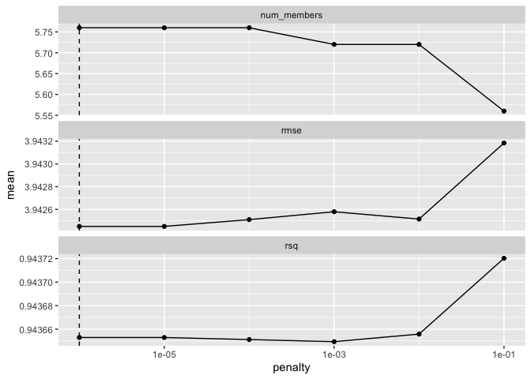
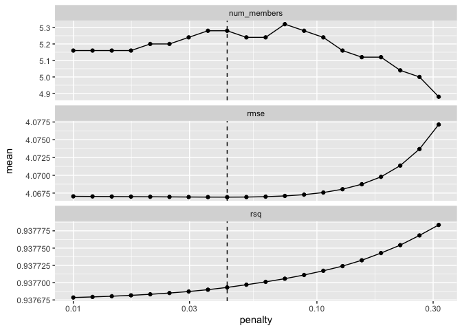
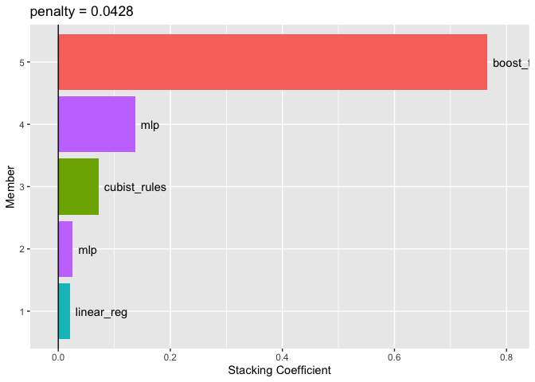

## 20.1 Creating a training set


```r
library(tidymodels)
```

```
## ── Attaching packages ────────────────────────────────────── tidymodels 1.1.1 ──
```

```
## ✔ broom        1.0.5      ✔ recipes      1.0.10
## ✔ dials        1.2.0      ✔ rsample      1.2.0 
## ✔ dplyr        1.1.4      ✔ tibble       3.2.1 
## ✔ ggplot2      3.4.4      ✔ tidyr        1.3.0 
## ✔ infer        1.0.5      ✔ tune         1.2.1 
## ✔ modeldata    1.2.0      ✔ workflows    1.1.4 
## ✔ parsnip      1.2.1      ✔ workflowsets 1.0.1 
## ✔ purrr        1.0.2      ✔ yardstick    1.3.1
```

```
## ── Conflicts ───────────────────────────────────────── tidymodels_conflicts() ──
## ✖ purrr::discard() masks scales::discard()
## ✖ dplyr::filter()  masks stats::filter()
## ✖ dplyr::lag()     masks stats::lag()
## ✖ recipes::step()  masks stats::step()
## • Dig deeper into tidy modeling with R at https://www.tmwr.org
```

```r
library(stacks)
library(rules)
```

```
## 
## Attaching package: 'rules'
```

```
## The following object is masked from 'package:dials':
## 
##     max_rules
```

```r
tidymodels_prefer()

load("Chapter_15_race_results.Rdata")

concrete_stack <- 
  stacks() %>% 
  add_candidates(race_results)

concrete_stack
```

```
## # A data stack with 12 model definitions and 20 candidate members:
## #   MARS: 1 model configuration
## #   CART: 1 model configuration
## #   CART_bagged: 1 model configuration
## #   RF: 1 model configuration
## #   boosting: 1 model configuration
## #   Cubist: 1 model configuration
## #   SVM_radial: 1 model configuration
## #   SVM_poly: 1 model configuration
## #   KNN: 3 model configurations
## #   neural_network: 3 model configurations
## #   full_quad_linear_reg: 5 model configurations
## #   full_quad_KNN: 1 model configuration
## # Outcome: compressive_strength (numeric)
```

## 20.2 Blending the predictions

_The training set predictions and the corresponding observed outcome data are used to create a meta-learning model where the assessment set predictions are the predictors of the observed outcome data. _ 

WHAT?

In any case we are blending the predictions from different models, using some kind of penalized regression, like lasso.


```r
set.seed(2001)
ens <- blend_predictions(concrete_stack)
summary(ens)
```

```
##               Length Class  Mode     
## model_defs    12     -none- list     
## coefs          6     _elnet list     
## penalty        3     -none- list     
## metrics        8     tbl_df list     
## equations      1     -none- list     
## cols_map      12     -none- list     
## model_metrics 12     -none- list     
## train          9     tbl_df list     
## mode           1     -none- character
## outcome        1     -none- character
## data_stack    21     tbl_df list     
## splits         3     tbl_df list
```


```r
autoplot(ens)
```

<!-- -->

Try a broader range of penalities 

```r
set.seed(2002)
ens <- blend_predictions(concrete_stack, penalty = 10^seq(-2, -0.5, length = 20))
```


```r
autoplot(ens)
```

<!-- -->


```r
ens
```

```
## ── A stacked ensemble model ─────────────────────────────────────
## 
## 
## Out of 20 possible candidate members, the ensemble retained 5.
## 
## Penalty: 0.0428133239871939.
## 
## Mixture: 1.
## 
## 
## The 5 highest weighted members are:
```

```
## # A tibble: 5 × 3
##   member                    type         weight
##   <chr>                     <chr>         <dbl>
## 1 boosting_1_04             boost_tree   0.766 
## 2 neural_network_1_12       mlp          0.137 
## 3 Cubist_1_25               cubist_rules 0.0719
## 4 neural_network_1_17       mlp          0.0259
## 5 full_quad_linear_reg_1_16 linear_reg   0.0209
```

```
## 
## Members have not yet been fitted with `fit_members()`.
```


```r
autoplot(ens, "weights") +
  geom_text(aes(x = weight + 0.01, label = model), hjust = 0) + 
  theme(legend.position = "none") +
  lims(x = c(-0.01, 0.8))
```

<!-- -->

```r
summary(ens)
```

```
##               Length Class  Mode     
## model_defs    12     -none- list     
## coefs          6     _elnet list     
## penalty        3     -none- list     
## metrics        8     tbl_df list     
## equations      1     -none- list     
## cols_map      12     -none- list     
## model_metrics 12     -none- list     
## train          9     tbl_df list     
## mode           1     -none- character
## outcome        1     -none- character
## data_stack    21     tbl_df list     
## splits         3     tbl_df list
```


```r
ens$equations
```

```
## $numeric
## $.pred
## -0.755941083168597 + (boosting_1_04 * 0.765764445917128) + (Cubist_1_25 * 
##     0.0718716992490044) + (neural_network_1_12 * 0.137217583241533) + 
##     (neural_network_1_17 * 0.0259075095082824) + (full_quad_linear_reg_1_16 * 
##     0.0209255935279415)
## 
## attr(,"class")
## [1] "elnet_numeric"
```

## 20.3 Fit the member models

so far have been tested on CV sets.  Now fit on whole training set.


```r
ens <- fit_members(ens)
```


## 20.4 Test Set Predictions


```r
reg_metrics <- metric_set(rmse, rsq)
ens_test_pred <- 
  predict(ens, concrete_test) %>% 
  bind_cols(concrete_test)

ens_test_pred %>% 
  reg_metrics(compressive_strength, .pred)
```

```
## # A tibble: 2 × 3
##   .metric .estimator .estimate
##   <chr>   <chr>          <dbl>
## 1 rmse    standard       3.37 
## 2 rsq     standard       0.956
```

Compare to best single model:


```r
best_results <- 
   race_results %>% 
   extract_workflow_set_result("boosting") %>% 
   select_best(metric = "rmse")
best_results
```

```
## # A tibble: 1 × 7
##   trees min_n tree_depth learn_rate loss_reduction sample_size .config          
##   <int> <int>      <int>      <dbl>          <dbl>       <dbl> <chr>            
## 1  1800    25          4      0.109       9.84e-10       0.850 Preprocessor1_Mo…
```

```r
boosting_test_results <- 
   race_results %>% 
   extract_workflow("boosting") %>% 
   finalize_workflow(best_results) %>% 
   last_fit(split = concrete_split)

collect_metrics(boosting_test_results)
```

```
## # A tibble: 2 × 4
##   .metric .estimator .estimate .config             
##   <chr>   <chr>          <dbl> <chr>               
## 1 rmse    standard       3.50  Preprocessor1_Model1
## 2 rsq     standard       0.952 Preprocessor1_Model1
```
So the blended model is ever so slightly better...
