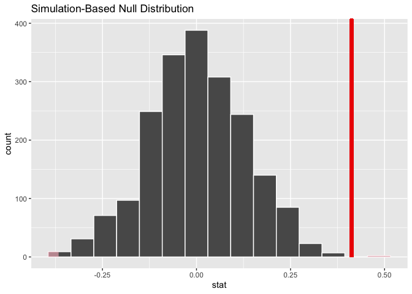

## 21.1 INFERENCE FOR COUNT DATA


```r
library(tidymodels)
```

```
## ── Attaching packages ────────────────────────────────────── tidymodels 1.1.1 ──
```

```
## ✔ broom        1.0.5      ✔ recipes      1.0.10
## ✔ dials        1.2.0      ✔ rsample      1.2.0 
## ✔ dplyr        1.1.4      ✔ tibble       3.2.1 
## ✔ ggplot2      3.4.4      ✔ tidyr        1.3.0 
## ✔ infer        1.0.5      ✔ tune         1.2.1 
## ✔ modeldata    1.2.0      ✔ workflows    1.1.4 
## ✔ parsnip      1.2.1      ✔ workflowsets 1.0.1 
## ✔ purrr        1.0.2      ✔ yardstick    1.3.1
```

```
## ── Conflicts ───────────────────────────────────────── tidymodels_conflicts() ──
## ✖ purrr::discard() masks scales::discard()
## ✖ dplyr::filter()  masks stats::filter()
## ✖ dplyr::lag()     masks stats::lag()
## ✖ recipes::step()  masks stats::step()
## • Learn how to get started at https://www.tidymodels.org/start/
```

```r
tidymodels_prefer()

data("bioChemists", package = "pscl")

ggplot(bioChemists, aes(x = art)) + 
  geom_histogram(binwidth = 1, color = "white") + 
  labs(x = "Number of articles within 3y of graduation")
```

<!-- -->

## 21.2 COMPARISONS WITH TWO-SAMPLE TESTS


```r
bioChemists %>% 
  group_by(fem) %>% 
  summarize(counts = sum(art), n = length(art))
```

```
## # A tibble: 2 × 3
##   fem   counts     n
##   <fct>  <int> <int>
## 1 Men      930   494
## 2 Women    619   421
```


```r
poisson.test(c(930, 619)) %>% 
  tidy()
```

```
## # A tibble: 1 × 8
##   estimate statistic  p.value parameter conf.low conf.high method    alternative
##      <dbl>     <dbl>    <dbl>     <dbl>    <dbl>     <dbl> <chr>     <chr>      
## 1     1.50       930 2.73e-15      774.     1.36      1.67 Comparis… two.sided
```


```r
library(infer)

observed <- 
  bioChemists %>%
  specify(art ~ fem) %>%
  calculate(stat = "diff in means", order = c("Men", "Women"))
observed
```

```
## Response: art (numeric)
## Explanatory: fem (factor)
## # A tibble: 1 × 1
##    stat
##   <dbl>
## 1 0.412
```


```r
set.seed(2101)
bootstrapped <- 
  bioChemists %>%
  specify(art ~ fem)  %>%
  generate(reps = 2000, type = "bootstrap") %>%
  calculate(stat = "diff in means", order = c("Men", "Women"))
bootstrapped
```

```
## Response: art (numeric)
## Explanatory: fem (factor)
## # A tibble: 2,000 × 2
##    replicate  stat
##        <int> <dbl>
##  1         1 0.467
##  2         2 0.107
##  3         3 0.467
##  4         4 0.308
##  5         5 0.369
##  6         6 0.428
##  7         7 0.272
##  8         8 0.587
##  9         9 0.468
## 10        10 0.432
## # ℹ 1,990 more rows
```


```r
percentile_ci <- get_ci(bootstrapped)
percentile_ci
```

```
## # A tibble: 1 × 2
##   lower_ci upper_ci
##      <dbl>    <dbl>
## 1    0.158    0.653
```


```r
visualize(bootstrapped) +
    shade_confidence_interval(endpoints = percentile_ci)
```

<!-- -->


```r
set.seed(2102)
permuted <- 
  bioChemists %>%
  specify(art ~ fem)  %>%
  hypothesize(null = "independence") %>%
  generate(reps = 2000, type = "permute") %>%
  calculate(stat = "diff in means", order = c("Men", "Women"))
permuted
```

```
## Response: art (numeric)
## Explanatory: fem (factor)
## Null Hypothesis: independence
## # A tibble: 2,000 × 2
##    replicate     stat
##        <int>    <dbl>
##  1         1  0.201  
##  2         2 -0.133  
##  3         3  0.109  
##  4         4 -0.195  
##  5         5 -0.00128
##  6         6 -0.102  
##  7         7 -0.102  
##  8         8 -0.0497 
##  9         9  0.0119 
## 10        10 -0.146  
## # ℹ 1,990 more rows
```


```r
visualize(permuted) +
    shade_p_value(obs_stat = observed, direction = "two-sided")
```

<!-- -->


```r
permuted %>%
  get_p_value(obs_stat = observed, direction = "two-sided")
```

```
## # A tibble: 1 × 1
##   p_value
##     <dbl>
## 1   0.002
```


## 21.3 LOG-LINEAR MODELS


```r
library(poissonreg)

# default engine is 'glm'
log_lin_spec <- poisson_reg()

log_lin_fit <- 
  log_lin_spec %>% 
  fit(art ~ ., data = bioChemists)
log_lin_fit
```

```
## parsnip model object
## 
## 
## Call:  stats::glm(formula = art ~ ., family = stats::poisson, data = data)
## 
## Coefficients:
## (Intercept)     femWomen   marMarried         kid5          phd         ment  
##     0.30462     -0.22459      0.15524     -0.18488      0.01282      0.02554  
## 
## Degrees of Freedom: 914 Total (i.e. Null);  909 Residual
## Null Deviance:	    1817 
## Residual Deviance: 1634 	AIC: 3314
```


```r
tidy(log_lin_fit, conf.int = TRUE, conf.level = 0.90)
```

```
## # A tibble: 6 × 7
##   term        estimate std.error statistic  p.value conf.low conf.high
##   <chr>          <dbl>     <dbl>     <dbl>    <dbl>    <dbl>     <dbl>
## 1 (Intercept)   0.305    0.103       2.96  3.10e- 3   0.134     0.473 
## 2 femWomen     -0.225    0.0546     -4.11  3.92e- 5  -0.315    -0.135 
## 3 marMarried    0.155    0.0614      2.53  1.14e- 2   0.0545    0.256 
## 4 kid5         -0.185    0.0401     -4.61  4.08e- 6  -0.251    -0.119 
## 5 phd           0.0128   0.0264      0.486 6.27e- 1  -0.0305    0.0563
## 6 ment          0.0255   0.00201    12.7   3.89e-37   0.0222    0.0288
```


```r
set.seed(2103)
glm_boot <- 
  reg_intervals(art ~ ., data = bioChemists, model_fn = "glm", family = poisson)
glm_boot
```

```
## # A tibble: 5 × 6
##   term          .lower .estimate  .upper .alpha .method  
##   <chr>          <dbl>     <dbl>   <dbl>  <dbl> <chr>    
## 1 femWomen   -0.358      -0.226  -0.0856   0.05 student-t
## 2 kid5       -0.298      -0.184  -0.0789   0.05 student-t
## 3 marMarried  0.000264    0.155   0.317    0.05 student-t
## 4 ment        0.0182      0.0256  0.0322   0.05 student-t
## 5 phd        -0.0707      0.0130  0.102    0.05 student-t
```

Likelihood ratio test of nested model:


```r
log_lin_reduced <- 
  log_lin_spec %>% 
  fit(art ~ ment + kid5 + fem + mar, data = bioChemists)

anova(
  extract_fit_engine(log_lin_reduced),
  extract_fit_engine(log_lin_fit),
  test = "LRT"
) %>%
  tidy()
```

```
## # A tibble: 2 × 6
##   term                      df.residual residual.deviance    df deviance p.value
##   <chr>                           <dbl>             <dbl> <dbl>    <dbl>   <dbl>
## 1 art ~ ment + kid5 + fem …         910             1635.    NA   NA      NA    
## 2 art ~ fem + mar + kid5 +…         909             1634.     1    0.236   0.627
```

## 21.4 a more complex model

Zero inflated Poisson


```r
zero_inflated_spec <- poisson_reg() %>% set_engine("zeroinfl")

zero_inflated_fit <- 
  zero_inflated_spec %>% 
  fit(art ~ fem + mar + kid5 + ment | fem + mar + kid5 + phd + ment,
      data = bioChemists)

zero_inflated_fit
```

```
## parsnip model object
## 
## 
## Call:
## pscl::zeroinfl(formula = art ~ fem + mar + kid5 + ment | fem + mar + 
##     kid5 + phd + ment, data = data)
## 
## Count model coefficients (poisson with log link):
## (Intercept)     femWomen   marMarried         kid5         ment  
##     0.62116     -0.20907      0.10505     -0.14281      0.01798  
## 
## Zero-inflation model coefficients (binomial with logit link):
## (Intercept)     femWomen   marMarried         kid5          phd         ment  
##    -0.60865      0.10931     -0.35292      0.21946      0.01236     -0.13509
```

Can we use LRT to compare to the regular Poisson model? No (But is it possible to roll our own based on number of paprameters?)


```r
anova(
  extract_fit_engine(zero_inflated_fit),
  extract_fit_engine(log_lin_reduced),
  test = "LRT"
) %>%
  tidy()
#> Error in UseMethod("anova"): no applicable method for 'anova' applied to an object of class "zeroinfl"
```


Can use AIC instead


```r
zero_inflated_fit %>% extract_fit_engine() %>% AIC()
```

```
## [1] 3231.585
```

```r
#> [1] 3232
log_lin_reduced   %>% extract_fit_engine() %>% AIC()
```

```
## [1] 3312.349
```

```r
#> [1] 3312
```

But how significant is this difference?  Let's bootstrap it:


```r
zip_form <- art ~ fem + mar + kid5 + ment | fem + mar + kid5 + phd + ment
glm_form <- art ~ fem + mar + kid5 + ment

set.seed(2104)

system.time({
   bootstrap_models <-
  bootstraps(bioChemists, times = 2000, apparent = TRUE) %>% # creates 2000 bootstrap samples
  mutate( # note: analysis just converts the bootstrap split into a dataframe
    glm = map(splits, ~ fit(log_lin_spec,       glm_form, data = analysis(.x))),
    zip = map(splits, ~ fit(zero_inflated_spec, zip_form, data = analysis(.x)))
  )
   
})
```

```
##    user  system elapsed 
##  55.086   1.756  56.998
```

```r
bootstrap_models
```

```
## # Bootstrap sampling with apparent sample 
## # A tibble: 2,001 × 4
##    splits            id            glm      zip     
##    <list>            <chr>         <list>   <list>  
##  1 <split [915/355]> Bootstrap0001 <fit[+]> <fit[+]>
##  2 <split [915/333]> Bootstrap0002 <fit[+]> <fit[+]>
##  3 <split [915/337]> Bootstrap0003 <fit[+]> <fit[+]>
##  4 <split [915/344]> Bootstrap0004 <fit[+]> <fit[+]>
##  5 <split [915/351]> Bootstrap0005 <fit[+]> <fit[+]>
##  6 <split [915/354]> Bootstrap0006 <fit[+]> <fit[+]>
##  7 <split [915/326]> Bootstrap0007 <fit[+]> <fit[+]>
##  8 <split [915/336]> Bootstrap0008 <fit[+]> <fit[+]>
##  9 <split [915/338]> Bootstrap0009 <fit[+]> <fit[+]>
## 10 <split [915/349]> Bootstrap0010 <fit[+]> <fit[+]>
## # ℹ 1,991 more rows
```

Try it withh [furr](https://furrr.futureverse.org/)

```r
library(furrr)

plan(multisession)
set.seed(2104)

system.time({
   bootstrap_models2 <-
  bootstraps(bioChemists, times = 2000, apparent = TRUE) %>% # creates 2000 bootstrap samples
  mutate( # note: analysis just converts the bootstrap split into a dataframe
    glm = future_map(splits, ~ fit(log_lin_spec,       glm_form, data = analysis(.x))),
    zip = future_map(splits, ~ fit(zero_inflated_spec, zip_form, data = analysis(.x)))
  )
   
})

bootstrap_models2

# Error in `mutate()`:
# ℹ In argument: `glm = future_map(splits, ~fit(log_lin_spec, glm_form, data
#   = analysis(.x)))`.
# Caused by error:
# ℹ In index: 1.
# Caused by error in `UseMethod()`:
# ! no applicable method for 'fit' applied to an object of class "c('poisson_reg', 'model_spec')"
# Backtrace:
#   1. parallel (local) workRSOCK()
#  26. base::eval(...)
#  27. base::eval(...)
#  30. purrr (local) `<fn>`(.x = `<list>`, .f = `<fn>`)
#  31. purrr:::map_("list", .x, .f, ..., .progress = .progress)
#  35. .f(.x[[i]], ...)
#  36. ...furrr_fn(...)
#  37. generics::fit(log_lin_spec, glm_form, data = analysis(.x))
```


get the bootstrap confidence intervals for the coefficients:


```r
bootstrap_models <-
  bootstrap_models %>%
  mutate(zero_coefs  = map(zip, ~ tidy(.x, type = "zero")))

# One example:
bootstrap_models$zero_coefs[[1]]
```

```
## # A tibble: 6 × 6
##   term        type  estimate std.error statistic   p.value
##   <chr>       <chr>    <dbl>     <dbl>     <dbl>     <dbl>
## 1 (Intercept) zero   -0.128     0.497     -0.257 0.797    
## 2 femWomen    zero   -0.0764    0.319     -0.240 0.811    
## 3 marMarried  zero   -0.112     0.365     -0.307 0.759    
## 4 kid5        zero    0.270     0.186      1.45  0.147    
## 5 phd         zero   -0.178     0.132     -1.35  0.177    
## 6 ment        zero   -0.123     0.0315    -3.91  0.0000935
```

plot it

```r
bootstrap_models %>% 
  unnest(zero_coefs) %>% 
  ggplot(aes(x = estimate)) +
  geom_histogram(bins = 25, color = "white") + 
  facet_wrap(~ term, scales = "free_x") + 
  geom_vline(xintercept = 0, lty = 2, color = "gray70")
```

<!-- -->


```r
bootstrap_models %>% int_pctl(zero_coefs)
```

```
## # A tibble: 6 × 6
##   term        .lower .estimate  .upper .alpha .method   
##   <chr>        <dbl>     <dbl>   <dbl>  <dbl> <chr>     
## 1 (Intercept) -1.75    -0.621   0.423    0.05 percentile
## 2 femWomen    -0.521    0.115   0.818    0.05 percentile
## 3 kid5        -0.327    0.218   0.677    0.05 percentile
## 4 marMarried  -1.20    -0.381   0.362    0.05 percentile
## 5 ment        -0.401   -0.162  -0.0513   0.05 percentile
## 6 phd         -0.276    0.0220  0.327    0.05 percentile
```

```r
bootstrap_models %>% int_t(zero_coefs)
```

```
## # A tibble: 6 × 6
##   term        .lower .estimate  .upper .alpha .method  
##   <chr>        <dbl>     <dbl>   <dbl>  <dbl> <chr>    
## 1 (Intercept) -1.61    -0.621   0.321    0.05 student-t
## 2 femWomen    -0.482    0.115   0.671    0.05 student-t
## 3 kid5        -0.211    0.218   0.599    0.05 student-t
## 4 marMarried  -0.988   -0.381   0.290    0.05 student-t
## 5 ment        -0.324   -0.162  -0.0275   0.05 student-t
## 6 phd         -0.274    0.0220  0.291    0.05 student-t
```

