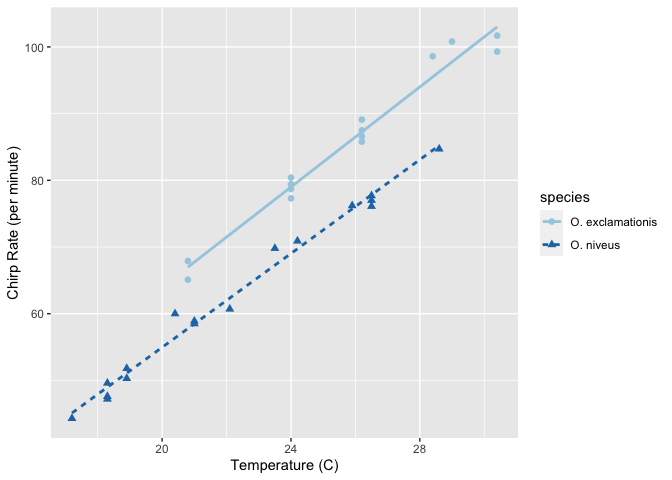
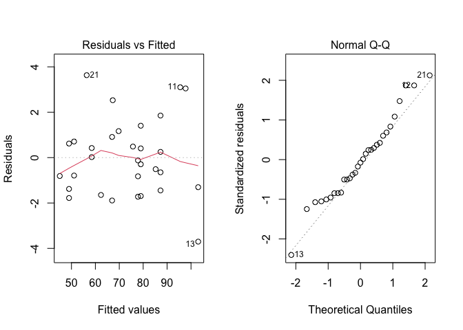
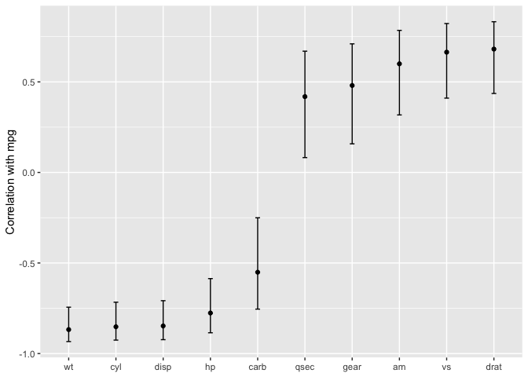

```r
library(tidyverse)
```

```
## ── Attaching core tidyverse packages ──────────────────────── tidyverse 2.0.0 ──
## ✔ dplyr     1.1.0     ✔ readr     2.1.4
## ✔ forcats   1.0.0     ✔ stringr   1.5.0
## ✔ ggplot2   3.4.1     ✔ tibble    3.1.8
## ✔ lubridate 1.9.2     ✔ tidyr     1.3.0
## ✔ purrr     1.0.1     
## ── Conflicts ────────────────────────────────────────── tidyverse_conflicts() ──
## ✖ dplyr::filter() masks stats::filter()
## ✖ dplyr::lag()    masks stats::lag()
## ℹ Use the ]8;;http://conflicted.r-lib.org/conflicted package]8;; to force all conflicts to become errors
```

```r
library(tidymodels)
```

```
## ── Attaching packages ────────────────────────────────────── tidymodels 1.0.0 ──
## ✔ broom        1.0.3     ✔ rsample      1.1.1
## ✔ dials        1.1.0     ✔ tune         1.0.1
## ✔ infer        1.0.4     ✔ workflows    1.1.2
## ✔ modeldata    1.1.0     ✔ workflowsets 1.0.0
## ✔ parsnip      1.0.3     ✔ yardstick    1.1.0
## ✔ recipes      1.0.4     
## ── Conflicts ───────────────────────────────────────── tidymodels_conflicts() ──
## ✖ scales::discard() masks purrr::discard()
## ✖ dplyr::filter()   masks stats::filter()
## ✖ recipes::fixed()  masks stringr::fixed()
## ✖ dplyr::lag()      masks stats::lag()
## ✖ yardstick::spec() masks readr::spec()
## ✖ recipes::step()   masks stats::step()
## • Search for functions across packages at https://www.tidymodels.org/find/
```

# Chapter 1

## 1.1 Software for modeling

Pit of success- software should be cause customers to fall into winning practices 

Should promote good scientific methodology; prevent users from making mistakes.  Make it easy to do the right thing.

## 1.2 Type of models

### Descriptive models

Describe, illustrate, or visually emphasize some trend or artifact in the data.

### Inferential models

produce a decision for a research question, test a hypothesis.

### Predictive models

make a prediction for new data

estimation instead of inference

mechanistic models: derivewd using first principles about what factors affect the outcome

emprically driven models: just get the result, e.g. k nearest neighbors.  machine learning.

## 1.4 Some terminology

* unsupervised: clustering, etc, without an outcome variable
* supervised: outcome variable.  regression, neural networks, etc
  * Regression: predict an outcome
  * Classification: predic an outcome that is an ordered or unordered set of qualitative values
  
outcome variables
  
predictor variables

quantitative and qualitative

## 1.5 Data analysis process

* Clean
* EDA
* Feature engineering (PCA, ratios, transformations)
* Model tuning and selection
* Model evaluation

# 2 A tidyverse primer

## 2.1 Tidyverse principles

* Design for humans
* Reuse existing data structures
* Design for the pipe and functional programming


```r
library(lubridate)

url <- "https://data.cityofchicago.org/api/views/5neh-572f/rows.csv?accessType=DOWNLOAD&bom=true&format=true"

all_stations <- 
  # Step 1: Read in the data.
  read_csv(url) %>% 
  # Step 2: filter columns and rename stationname
  dplyr::select(station = stationname, date, rides) %>% 
  # Step 3: Convert the character date field to a date encoding.
  # Also, put the data in units of 1K rides
  mutate(date = mdy(date), rides = rides / 1000) %>% 
  # Step 4: Summarize the multiple records using the maximum.
  group_by(date, station) %>% 
  summarize(rides = max(rides), .groups = "drop")
```

```
## Rows: 1171469 Columns: 5
## ── Column specification ────────────────────────────────────────────────────────
## Delimiter: ","
## chr (3): stationname, date, daytype
## dbl (1): station_id
## num (1): rides
## 
## ℹ Use `spec()` to retrieve the full column specification for this data.
## ℹ Specify the column types or set `show_col_types = FALSE` to quiet this message.
```

# 3 R Modeling Fundamentals

## 3.1 Example


```r
data(crickets, package = "modeldata")
names(crickets)
```

```
## [1] "species" "temp"    "rate"
```

```r
# Plot the temperature on the x-axis, the chirp rate on the y-axis. The plot
# elements will be colored differently for each species:
ggplot(crickets, 
       aes(x = temp, y = rate, color = species, pch = species, lty = species)) + 
  # Plot points for each data point and color by species
  geom_point(size = 2) + 
  # Show a simple linear model fit created separately for each species:
  geom_smooth(method = lm, se = FALSE, alpha = 0.5) + 
  scale_color_brewer(palette = "Paired") +
  labs(x = "Temperature (C)", y = "Chirp Rate (per minute)")
```

```
## `geom_smooth()` using formula = 'y ~ x'
```

<!-- -->

Fit it


```r
interaction_fit <-  lm(rate ~ (temp + species)^2, data = crickets) 

# To print a short summary of the model:
interaction_fit
```

```
## 
## Call:
## lm(formula = rate ~ (temp + species)^2, data = crickets)
## 
## Coefficients:
##           (Intercept)                   temp       speciesO. niveus  
##               -11.041                  3.751                 -4.348  
## temp:speciesO. niveus  
##                -0.234
```

```r
summary(interaction_fit)
```

```
## 
## Call:
## lm(formula = rate ~ (temp + species)^2, data = crickets)
## 
## Residuals:
##     Min      1Q  Median      3Q     Max 
## -3.7031 -1.3417 -0.1235  0.8100  3.6330 
## 
## Coefficients:
##                       Estimate Std. Error t value Pr(>|t|)    
## (Intercept)           -11.0408     4.1515  -2.659    0.013 *  
## temp                    3.7514     0.1601  23.429   <2e-16 ***
## speciesO. niveus       -4.3484     4.9617  -0.876    0.389    
## temp:speciesO. niveus  -0.2340     0.2009  -1.165    0.254    
## ---
## Signif. codes:  0 '***' 0.001 '**' 0.01 '*' 0.05 '.' 0.1 ' ' 1
## 
## Residual standard error: 1.775 on 27 degrees of freedom
## Multiple R-squared:  0.9901,	Adjusted R-squared:  0.989 
## F-statistic: 898.9 on 3 and 27 DF,  p-value: < 2.2e-16
```


```r
# Place two plots next to one another:
par(mfrow = c(1, 2))

# Show residuals vs predicted values:
plot(interaction_fit, which = 1)

# A normal quantile plot on the residuals:
plot(interaction_fit, which = 2)
```

<!-- -->

Test the interaction term:


```r
# Fit a reduced model:
main_effect_fit <-  lm(rate ~ temp + species, data = crickets) 

# Compare the two:
anova(main_effect_fit, interaction_fit)
```

```
## Analysis of Variance Table
## 
## Model 1: rate ~ temp + species
## Model 2: rate ~ (temp + species)^2
##   Res.Df    RSS Df Sum of Sq     F Pr(>F)
## 1     28 89.350                          
## 2     27 85.074  1    4.2758 1.357 0.2542
```

```r
summary(main_effect_fit)
```

```
## 
## Call:
## lm(formula = rate ~ temp + species, data = crickets)
## 
## Residuals:
##     Min      1Q  Median      3Q     Max 
## -3.0128 -1.1296 -0.3912  0.9650  3.7800 
## 
## Coefficients:
##                   Estimate Std. Error t value Pr(>|t|)    
## (Intercept)       -7.21091    2.55094  -2.827  0.00858 ** 
## temp               3.60275    0.09729  37.032  < 2e-16 ***
## speciesO. niveus -10.06529    0.73526 -13.689 6.27e-14 ***
## ---
## Signif. codes:  0 '***' 0.001 '**' 0.01 '*' 0.05 '.' 0.1 ' ' 1
## 
## Residual standard error: 1.786 on 28 degrees of freedom
## Multiple R-squared:  0.9896,	Adjusted R-squared:  0.9888 
## F-statistic:  1331 on 2 and 28 DF,  p-value: < 2.2e-16
```

predict


```r
new_values <- data.frame(species = "O. exclamationis", temp = 15:20)
predict(main_effect_fit, new_values)
```

```
##        1        2        3        4        5        6 
## 46.83039 50.43314 54.03589 57.63865 61.24140 64.84415
```


## 3.3


```r
corr_res <- map(mtcars %>% select(-mpg), cor.test, y = mtcars$mpg)

# The first of ten results in the vector: 
corr_res[[1]]
```

```
## 
## 	Pearson's product-moment correlation
## 
## data:  .x[[i]] and mtcars$mpg
## t = -8.9197, df = 30, p-value = 6.113e-10
## alternative hypothesis: true correlation is not equal to 0
## 95 percent confidence interval:
##  -0.9257694 -0.7163171
## sample estimates:
##       cor 
## -0.852162
```


```r
library(broom)

tidy(corr_res[[1]])
```

```
## # A tibble: 1 × 8
##   estimate statistic  p.value parameter conf.low conf.high method        alter…¹
##      <dbl>     <dbl>    <dbl>     <int>    <dbl>     <dbl> <chr>         <chr>  
## 1   -0.852     -8.92 6.11e-10        30   -0.926    -0.716 Pearson's pr… two.si…
## # … with abbreviated variable name ¹​alternative
```


```r
corr_res %>% 
  # Convert each to a tidy format; `map_dfr()` stacks the data frames 
  map_dfr(tidy, .id = "predictor") %>% 
  ggplot(aes(x = fct_reorder(predictor, estimate))) + 
  geom_point(aes(y = estimate)) + 
  geom_errorbar(aes(ymin = conf.low, ymax = conf.high), width = .1) +
  labs(x = NULL, y = "Correlation with mpg")
```

<!-- -->

## 3.4 Combining base models and the tidyverse

separate models for each species

```r
split_by_species <- 
  crickets %>% 
  group_nest(species) 
split_by_species
```

```
## # A tibble: 2 × 2
##   species                        data
##   <fct>            <list<tibble[,2]>>
## 1 O. exclamationis           [14 × 2]
## 2 O. niveus                  [17 × 2]
```


```r
model_by_species <- 
  split_by_species %>% 
  mutate(model = map(data, ~ lm(rate ~ temp, data = .x)))
model_by_species
```

```
## # A tibble: 2 × 3
##   species                        data model 
##   <fct>            <list<tibble[,2]>> <list>
## 1 O. exclamationis           [14 × 2] <lm>  
## 2 O. niveus                  [17 × 2] <lm>
```


```r
model_by_species %>% 
  mutate(coef = map(model, tidy)) %>% 
  select(species, coef) %>% 
  unnest(cols = c(coef))
```

```
## # A tibble: 4 × 6
##   species          term        estimate std.error statistic  p.value
##   <fct>            <chr>          <dbl>     <dbl>     <dbl>    <dbl>
## 1 O. exclamationis (Intercept)   -11.0      4.77      -2.32 3.90e- 2
## 2 O. exclamationis temp            3.75     0.184     20.4  1.10e-10
## 3 O. niveus        (Intercept)   -15.4      2.35      -6.56 9.07e- 6
## 4 O. niveus        temp            3.52     0.105     33.6  1.57e-15
```


