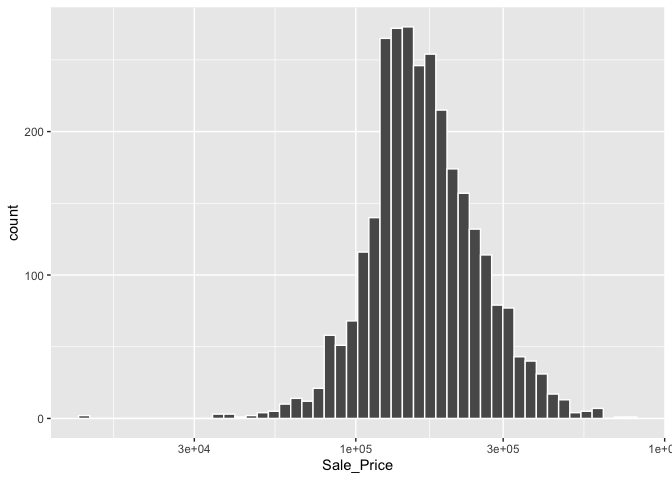

```r
library(tidymodels)
```

```
## ── Attaching packages ────────────────────────────────────── tidymodels 1.0.0 ──
```

```
## ✔ broom        1.0.3     ✔ recipes      1.0.4
## ✔ dials        1.1.0     ✔ rsample      1.1.1
## ✔ dplyr        1.1.0     ✔ tibble       3.1.8
## ✔ ggplot2      3.4.1     ✔ tidyr        1.3.0
## ✔ infer        1.0.4     ✔ tune         1.0.1
## ✔ modeldata    1.1.0     ✔ workflows    1.1.2
## ✔ parsnip      1.0.3     ✔ workflowsets 1.0.0
## ✔ purrr        1.0.1     ✔ yardstick    1.1.0
```

```
## ── Conflicts ───────────────────────────────────────── tidymodels_conflicts() ──
## ✖ purrr::discard() masks scales::discard()
## ✖ dplyr::filter()  masks stats::filter()
## ✖ dplyr::lag()     masks stats::lag()
## ✖ recipes::step()  masks stats::step()
## • Learn how to get started at https://www.tidymodels.org/start/
```

```r
tidymodels_prefer()
```


# Chapter 4 Ames Housing Data


```r
data(ames)

ames
```

```
## # A tibble: 2,930 × 74
##    MS_Sub…¹ MS_Zo…² Lot_F…³ Lot_A…⁴ Street Alley Lot_S…⁵ Land_…⁶ Utili…⁷ Lot_C…⁸
##  * <fct>    <fct>     <dbl>   <int> <fct>  <fct> <fct>   <fct>   <fct>   <fct>  
##  1 One_Sto… Reside…     141   31770 Pave   No_A… Slight… Lvl     AllPub  Corner 
##  2 One_Sto… Reside…      80   11622 Pave   No_A… Regular Lvl     AllPub  Inside 
##  3 One_Sto… Reside…      81   14267 Pave   No_A… Slight… Lvl     AllPub  Corner 
##  4 One_Sto… Reside…      93   11160 Pave   No_A… Regular Lvl     AllPub  Corner 
##  5 Two_Sto… Reside…      74   13830 Pave   No_A… Slight… Lvl     AllPub  Inside 
##  6 Two_Sto… Reside…      78    9978 Pave   No_A… Slight… Lvl     AllPub  Inside 
##  7 One_Sto… Reside…      41    4920 Pave   No_A… Regular Lvl     AllPub  Inside 
##  8 One_Sto… Reside…      43    5005 Pave   No_A… Slight… HLS     AllPub  Inside 
##  9 One_Sto… Reside…      39    5389 Pave   No_A… Slight… Lvl     AllPub  Inside 
## 10 Two_Sto… Reside…      60    7500 Pave   No_A… Regular Lvl     AllPub  Inside 
## # … with 2,920 more rows, 64 more variables: Land_Slope <fct>,
## #   Neighborhood <fct>, Condition_1 <fct>, Condition_2 <fct>, Bldg_Type <fct>,
## #   House_Style <fct>, Overall_Cond <fct>, Year_Built <int>,
## #   Year_Remod_Add <int>, Roof_Style <fct>, Roof_Matl <fct>,
## #   Exterior_1st <fct>, Exterior_2nd <fct>, Mas_Vnr_Type <fct>,
## #   Mas_Vnr_Area <dbl>, Exter_Cond <fct>, Foundation <fct>, Bsmt_Cond <fct>,
## #   Bsmt_Exposure <fct>, BsmtFin_Type_1 <fct>, BsmtFin_SF_1 <dbl>, …
```


```r
ggplot(ames, aes(x = Sale_Price)) + 
  geom_histogram(bins = 50, col= "white")
```

<!-- -->


```r
ggplot(ames, aes(x = Sale_Price)) + 
  geom_histogram(bins = 50, col= "white") +
  scale_x_log10()
```

<!-- -->


```r
ames <- ames %>% mutate(Sale_Price = log10(Sale_Price))
```

## trying to make the street maps view

following [Josh McCrain's tutorial](https://joshuamccrain.com/tutorials/maps/streets_tutorial.html) and [ggplot tutor](https://ggplot2tutor.com/tutorials/streetmaps)


```r
remotes::install_github("ropensci/osmdata")
```

# Chapter 5 Spending our Data

## 5.1 Common Methods for Splitting Data

Training and test

Can you `initial split` to accomplish this:


```r
# Save the split information for an 80/20 split of the data
ames_split <- initial_split(ames, prop = 0.80)
ames_split # this just has the indexes
```

```
## <Training/Testing/Total>
## <2344/586/2930>
```

```r
# once this is established, then use it:
ames_train <- training(ames_split)
ames_test  <-  testing(ames_split)

dim(ames_train)
```

```
## [1] 2344   74
```

By default `initial_split` splits randomly, but sometimes you may want to do something different:

* stratified sampling.  Can base either on categories of data, or bins of a variable.

No real downside, maybe should just do this by default


```r
set.seed(502)
ames_split <- initial_split(ames, prop = 0.80, strata = Sale_Price)
ames_train <- training(ames_split)
ames_test  <-  testing(ames_split)

dim(ames_train)
```

```
## [1] 2342   74
```

## 5.2 What about a validation set?

most commonly used in deep-learining models


```r
set.seed(52)
# To put 60% into training, 20% in validation, and 20% in testing:
ames_val_split <- initial_validation_split(ames, prop = c(0.6, 0.2))
ames_val_split
```

## 5.3 Multi-level data

Need to consider the experimental unit.

Note: could nest and then use the functions from rsample

# 6 Fitting Models with Parsnip

workflow:

1. Specify the type fo model based on its mathematical structure
2. Specify the engine for fitting the model.
3. When required, declare the mdoe of the model.  (e.g. regression vs classification)

Can build these specidications without referencing the data:


```r
linear_reg() %>% set_engine("lm")
```

```
## Linear Regression Model Specification (regression)
## 
## Computational engine: lm
```

```r
linear_reg() %>% set_engine("glmnet") 
```

```
## Linear Regression Model Specification (regression)
## 
## Computational engine: glmnet
```

```r
linear_reg() %>% set_engine("stan")
```

```
## Linear Regression Model Specification (regression)
## 
## Computational engine: stan
```

can use `translate` to see what parsnip is doing

example lm fit using formula and x_y interfaces

```r
lm_model <- 
  linear_reg() %>% 
  set_engine("lm")

lm_form_fit <- 
  lm_model %>% 
  # Recall that Sale_Price has been pre-logged
  fit(Sale_Price ~ Longitude + Latitude, data = ames_train)

lm_xy_fit <- 
  lm_model %>% 
  fit_xy(
    x = ames_train %>% select(Longitude, Latitude),
    y = ames_train %>% pull(Sale_Price)
  )

lm_form_fit
```

```
## parsnip model object
## 
## 
## Call:
## stats::lm(formula = Sale_Price ~ Longitude + Latitude, data = data)
## 
## Coefficients:
## (Intercept)    Longitude     Latitude  
##    -302.974       -2.075        2.710
```

```r
lm_xy_fit
```

```
## parsnip model object
## 
## 
## Call:
## stats::lm(formula = ..y ~ ., data = data)
## 
## Coefficients:
## (Intercept)    Longitude     Latitude  
##    -302.974       -2.075        2.710
```

## 6.2 Use the Model Results


```r
lm_form_fit %>% extract_fit_engine()
```

```
## 
## Call:
## stats::lm(formula = Sale_Price ~ Longitude + Latitude, data = data)
## 
## Coefficients:
## (Intercept)    Longitude     Latitude  
##    -302.974       -2.075        2.710
```
Normal methods can be applied:


```r
lm_form_fit %>% extract_fit_engine() %>% vcov()
```

```
##             (Intercept)     Longitude      Latitude
## (Intercept)  207.311311  1.5746587743 -1.4239709610
## Longitude      1.574659  0.0165462548 -0.0005999802
## Latitude      -1.423971 -0.0005999802  0.0325397353
```
built-in summary methods can be painful.  broom::tidy returns results in an easy to deal with, and consistently named data frame:


```r
tidy(lm_form_fit)
```

```
## # A tibble: 3 × 5
##   term        estimate std.error statistic  p.value
##   <chr>          <dbl>     <dbl>     <dbl>    <dbl>
## 1 (Intercept)  -303.      14.4       -21.0 3.64e-90
## 2 Longitude      -2.07     0.129     -16.1 1.40e-55
## 3 Latitude        2.71     0.180      15.0 9.29e-49
```

## 6.3 Make Predictions

If we use Parsnip, the following rules will always apply:

1. Results will be a tibble
2. The column names are always predictable
3. There are always as many rows in the tibble as there are in the input data set.


```r
ames_test_small <- ames_test %>% slice(1:5)
predict(lm_form_fit, new_data = ames_test_small)
```

```
## # A tibble: 5 × 1
##   .pred
##   <dbl>
## 1  5.22
## 2  5.21
## 3  5.28
## 4  5.27
## 5  5.28
```

Easy to combine with true values:


```r
ames_test_small %>% 
  select(Sale_Price) %>% 
  bind_cols(predict(lm_form_fit, ames_test_small)) %>% 
  # Add 95% prediction intervals to the results:
  bind_cols(predict(lm_form_fit, ames_test_small, type = "pred_int")) 
```

```
## # A tibble: 5 × 4
##   Sale_Price .pred .pred_lower .pred_upper
##        <dbl> <dbl>       <dbl>       <dbl>
## 1       5.02  5.22        4.91        5.54
## 2       5.39  5.21        4.90        5.53
## 3       5.28  5.28        4.97        5.60
## 4       5.28  5.27        4.96        5.59
## 5       5.28  5.28        4.97        5.60
```

Exercise ideas:

1. map neighborhoods
2. rsample a repeated-measures study
3. fit an lm to the tomato dataset, but using parsnip tools


