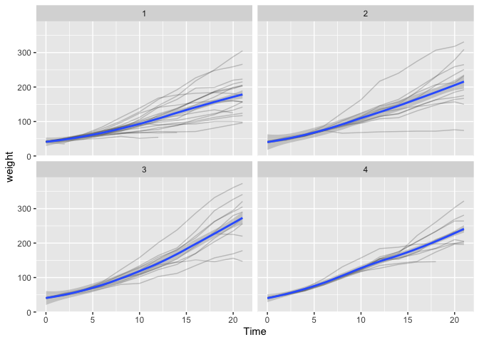
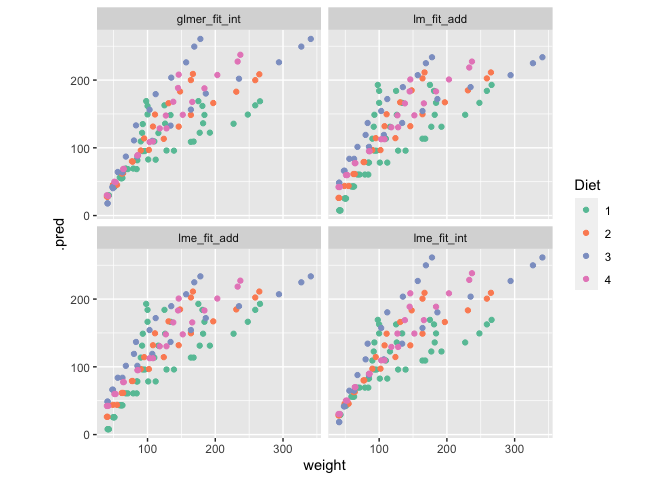
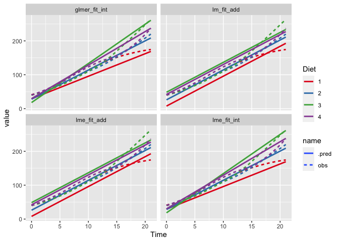

```r
install.packages("multilevelmod")
```


```r
library(tidymodels)
```

```
## ── Attaching packages ────────────────────────────────────── tidymodels 1.0.0 ──
```

```
## ✔ broom        1.0.3     ✔ recipes      1.0.4
## ✔ dials        1.1.0     ✔ rsample      1.1.1
## ✔ dplyr        1.1.0     ✔ tibble       3.1.8
## ✔ ggplot2      3.4.1     ✔ tidyr        1.3.0
## ✔ infer        1.0.4     ✔ tune         1.0.1
## ✔ modeldata    1.1.0     ✔ workflows    1.1.2
## ✔ parsnip      1.0.3     ✔ workflowsets 1.0.0
## ✔ purrr        1.0.1     ✔ yardstick    1.1.0
```

```
## ── Conflicts ───────────────────────────────────────── tidymodels_conflicts() ──
## ✖ purrr::discard() masks scales::discard()
## ✖ dplyr::filter()  masks stats::filter()
## ✖ dplyr::lag()     masks stats::lag()
## ✖ recipes::step()  masks stats::step()
## • Search for functions across packages at https://www.tidymodels.org/find/
```

```r
library(multilevelmod)
library(broom.mixed)
library(lmerTest)
```

```
## Loading required package: lme4
```

```
## Loading required package: Matrix
```

```
## 
## Attaching package: 'Matrix'
```

```
## The following objects are masked from 'package:tidyr':
## 
##     expand, pack, unpack
```

```
## 
## Attaching package: 'lmerTest'
```

```
## The following object is masked from 'package:lme4':
## 
##     lmer
```

```
## The following object is masked from 'package:recipes':
## 
##     step
```

```
## The following object is masked from 'package:stats':
## 
##     step
```

```r
tidymodels_prefer()
```

## 1  Use rsample to create training and test sets from ChickWeight.  Think about how you want this to be split.   message me if you are stuck.


```r
data("ChickWeight")
skimr::skim(ChickWeight)
```


Table: Data summary

|                         |            |
|:------------------------|:-----------|
|Name                     |ChickWeight |
|Number of rows           |578         |
|Number of columns        |4           |
|_______________________  |            |
|Column type frequency:   |            |
|factor                   |2           |
|numeric                  |2           |
|________________________ |            |
|Group variables          |None        |


**Variable type: factor**

|skim_variable | n_missing| complete_rate|ordered | n_unique|top_counts                     |
|:-------------|---------:|-------------:|:-------|--------:|:------------------------------|
|Chick         |         0|             1|TRUE    |       50|13: 12, 9: 12, 20: 12, 10: 12  |
|Diet          |         0|             1|FALSE   |        4|1: 220, 2: 120, 3: 120, 4: 118 |


**Variable type: numeric**

|skim_variable | n_missing| complete_rate|   mean|    sd| p0| p25| p50|    p75| p100|hist  |
|:-------------|---------:|-------------:|------:|-----:|--:|---:|---:|------:|----:|:-----|
|weight        |         0|             1| 121.82| 71.07| 35|  63| 103| 163.75|  373|▇▅▂▁▁ |
|Time          |         0|             1|  10.72|  6.76|  0|   4|  10|  16.00|   21|▇▅▅▅▇ |

plot it

```r
ChickWeight %>%
  ggplot(aes(x=Time, y=weight)) +
  geom_line(aes(group=Chick), alpha=.2) +
  geom_smooth() +
  facet_wrap(~Diet)
```

```
## `geom_smooth()` using method = 'loess' and formula = 'y ~ x'
```

<!-- -->


Seems to me that our test set should consist of unobserved chickens, stratified across the diets.


```r
chickwt.gr <- ChickWeight %>% group_by(Chick, Diet) %>% nest()

chick.split <- chickwt.gr %>%
  rsample::initial_split(prop = .8, strata = Diet)

chick.split
```

```
## <Training/Testing/Total>
## <40/10/50>
```


```r
chick.train <- training(chick.split) %>% unnest(cols = data)
chick.test <- testing(chick.split) %>% unnest(cols = data)
chick.train
```

```
## # A tibble: 461 × 4
## # Groups:   Chick, Diet [40]
##    Chick Diet  weight  Time
##    <ord> <fct>  <dbl> <dbl>
##  1 1     1         42     0
##  2 1     1         51     2
##  3 1     1         59     4
##  4 1     1         64     6
##  5 1     1         76     8
##  6 1     1         93    10
##  7 1     1        106    12
##  8 1     1        125    14
##  9 1     1        149    16
## 10 1     1        171    18
## # … with 451 more rows
```

```r
chick.test
```

```
## # A tibble: 117 × 4
## # Groups:   Chick, Diet [10]
##    Chick Diet  weight  Time
##    <ord> <fct>  <dbl> <dbl>
##  1 8     1         42     0
##  2 8     1         50     2
##  3 8     1         61     4
##  4 8     1         71     6
##  5 8     1         84     8
##  6 8     1         93    10
##  7 8     1        110    12
##  8 8     1        116    14
##  9 8     1        126    16
## 10 8     1        134    18
## # … with 107 more rows
```


```r
ChickWeight %>% group_by(Diet) %>% summarize(chicks = length(unique(Chick)))
```

```
## # A tibble: 4 × 2
##   Diet  chicks
##   <fct>  <int>
## 1 1         20
## 2 2         10
## 3 3         10
## 4 4         10
```

```r
chick.train %>% group_by(Diet) %>% summarize(chicks = length(unique(Chick)))
```

```
## # A tibble: 4 × 2
##   Diet  chicks
##   <fct>  <int>
## 1 1         16
## 2 2          8
## 3 3          8
## 4 4          8
```

```r
chick.test %>% group_by(Diet) %>% summarize(chicks = length(unique(Chick)))
```

```
## # A tibble: 4 × 2
##   Diet  chicks
##   <fct>  <int>
## 1 1          4
## 2 2          2
## 3 3          2
## 4 4          2
```

## 2. Fit an lm to the ChickWeight (training) data set, modeling weight as a function of diet and time (and their interaction?),  using parsnip tools.  This really should be a mixed-effects model, so see if you can do that instead (e.g. with lme4 or stan as the engine).

### lm

Basic set-up

```r
lm_model <- linear_reg() %>%
  set_engine("lm") # not necessary, this is the default
```


```r
lm_fit_add <- lm_model %>%
  fit(weight ~ Time + Diet, data=chick.train)

lm_fit_add
```

```
## parsnip model object
## 
## 
## Call:
## stats::lm(formula = weight ~ Time + Diet, data = data)
## 
## Coefficients:
## (Intercept)         Time        Diet2        Diet3        Diet4  
##       7.612        8.821       18.447       40.864       34.499
```

Use mixed-effects


```r
lme_model <- linear_reg(engine = "lmer")

lme_fit_add <- lme_model %>% fit(weight ~ Time + Diet + (1|Chick), data=chick.train)

lme_fit_add
```

```
## parsnip model object
## 
## Linear mixed model fit by REML ['lmerMod']
## Formula: weight ~ Time + Diet + (1 | Chick)
##    Data: data
## REML criterion at convergence: 4449.638
## Random effects:
##  Groups   Name        Std.Dev.
##  Chick    (Intercept) 22.37   
##  Residual             28.40   
## Number of obs: 461, groups:  Chick, 40
## Fixed Effects:
## (Intercept)         Time        Diet2        Diet3        Diet4  
##       7.973        8.806       18.251       40.667       34.303
```

```r
glance(lme_fit_add)
```

```
## # A tibble: 1 × 7
##    nobs sigma logLik   AIC   BIC REMLcrit df.residual
##   <int> <dbl>  <dbl> <dbl> <dbl>    <dbl>       <int>
## 1   461  28.4 -2225. 4464. 4493.    4450.         454
```

```r
tidy(lme_fit_add)
```

```
## # A tibble: 7 × 6
##   effect   group    term            estimate std.error statistic
##   <chr>    <chr>    <chr>              <dbl>     <dbl>     <dbl>
## 1 fixed    <NA>     (Intercept)         7.97     6.36       1.25
## 2 fixed    <NA>     Time                8.81     0.197     44.7 
## 3 fixed    <NA>     Diet2              18.3     10.4        1.76
## 4 fixed    <NA>     Diet3              40.7     10.4        3.92
## 5 fixed    <NA>     Diet4              34.3     10.4        3.31
## 6 ran_pars Chick    sd__(Intercept)    22.4     NA         NA   
## 7 ran_pars Residual sd__Observation    28.4     NA         NA
```

```r
lme_fit_add %>% extract_fit_engine() %>% summary
```

```
## Linear mixed model fit by REML ['lmerMod']
## Formula: weight ~ Time + Diet + (1 | Chick)
##    Data: data
## 
## REML criterion at convergence: 4449.6
## 
## Scaled residuals: 
##     Min      1Q  Median      3Q     Max 
## -3.0871 -0.5553 -0.1113  0.4968  3.4070 
## 
## Random effects:
##  Groups   Name        Variance Std.Dev.
##  Chick    (Intercept) 500.4    22.37   
##  Residual             806.8    28.40   
## Number of obs: 461, groups:  Chick, 40
## 
## Fixed effects:
##             Estimate Std. Error t value
## (Intercept)    7.973      6.364   1.253
## Time           8.806      0.197  44.697
## Diet2         18.251     10.374   1.759
## Diet3         40.667     10.374   3.920
## Diet4         34.303     10.374   3.307
## 
## Correlation of Fixed Effects:
##       (Intr) Time   Diet2  Diet3 
## Time  -0.309                     
## Diet2 -0.549 -0.018              
## Diet3 -0.549 -0.018  0.341       
## Diet4 -0.549 -0.018  0.341  0.341
```

```r
lme_fit_add %>% extract_fit_engine() %>% anova()
```

```
## Analysis of Variance Table
##      npar  Sum Sq Mean Sq   F value
## Time    1 1619606 1619606 2007.4605
## Diet    3   15949    5316    6.5897
```
But...


```r
lmerTest::lmer(weight ~ Time + Diet + (1|Chick), data=chick.train) %>% summary()
```

```
## Linear mixed model fit by REML. t-tests use Satterthwaite's method [
## lmerModLmerTest]
## Formula: weight ~ Time + Diet + (1 | Chick)
##    Data: chick.train
## 
## REML criterion at convergence: 4449.6
## 
## Scaled residuals: 
##     Min      1Q  Median      3Q     Max 
## -3.0871 -0.5553 -0.1113  0.4968  3.4070 
## 
## Random effects:
##  Groups   Name        Variance Std.Dev.
##  Chick    (Intercept) 500.4    22.37   
##  Residual             806.8    28.40   
## Number of obs: 461, groups:  Chick, 40
## 
## Fixed effects:
##             Estimate Std. Error      df t value Pr(>|t|)    
## (Intercept)    7.973      6.364  45.813   1.253 0.216625    
## Time           8.806      0.197 424.209  44.697  < 2e-16 ***
## Diet2         18.251     10.374  36.185   1.759 0.086989 .  
## Diet3         40.667     10.374  36.185   3.920 0.000378 ***
## Diet4         34.303     10.374  36.185   3.307 0.002140 ** 
## ---
## Signif. codes:  0 '***' 0.001 '**' 0.01 '*' 0.05 '.' 0.1 ' ' 1
## 
## Correlation of Fixed Effects:
##       (Intr) Time   Diet2  Diet3 
## Time  -0.309                     
## Diet2 -0.549 -0.018              
## Diet3 -0.549 -0.018  0.341       
## Diet4 -0.549 -0.018  0.341  0.341
```


```r
lme_fit_int <- lme_model %>%
  fit(weight ~ Time*Diet + (1|Chick), data=chick.train)

bind_rows(glance(lme_fit_add), glance(lme_fit_int))
```

```
## # A tibble: 2 × 7
##    nobs sigma logLik   AIC   BIC REMLcrit df.residual
##   <int> <dbl>  <dbl> <dbl> <dbl>    <dbl>       <int>
## 1   461  28.4 -2225. 4464. 4493.    4450.         454
## 2   461  25.2 -2173. 4366. 4408.    4346.         451
```


```r
glmer_model <- linear_reg(engine = "stan_glmer")

glmer_fit_int <- glmer_model %>% fit(weight ~ Time*Diet + (1|Chick), data=chick.train)

glance(glmer_fit_int)
```

```
## # A tibble: 1 × 4
##   algorithm   pss  nobs sigma
##   <chr>     <dbl> <int> <dbl>
## 1 sampling   4000   461  25.2
```

```r
glmer_fit_int %>% extract_fit_engine() %>% summary()
```

```
## 
## Model Info:
##  function:     stan_glmer
##  family:       gaussian [identity]
##  formula:      weight ~ Time * Diet + (1 | Chick)
##  algorithm:    sampling
##  sample:       4000 (posterior sample size)
##  priors:       see help('prior_summary')
##  observations: 461
##  groups:       Chick (40)
## 
## Estimates:
##                                        mean   sd    10%   50%   90%
## (Intercept)                           29.6    7.1  20.8  29.3  38.9
## Time                                   6.7    0.3   6.3   6.7   7.0
## Diet2                                 -1.2   12.0 -16.4  -1.0  13.9
## Diet3                                -11.0   11.8 -26.1 -11.2   4.3
## Diet4                                  0.6   11.5 -14.0   0.7  15.4
## Time:Diet2                             1.9    0.5   1.3   1.9   2.6
## Time:Diet3                             4.9    0.5   4.3   4.9   5.5
## Time:Diet4                             3.2    0.5   2.6   3.2   3.8
## b[(Intercept) Chick:18]                0.4   14.5 -18.1   0.6  18.8
## b[(Intercept) Chick:16]              -16.9   10.3 -29.9 -16.8  -3.8
## b[(Intercept) Chick:15]              -14.0   10.0 -27.2 -13.9  -1.2
## b[(Intercept) Chick:13]              -31.3    9.1 -43.3 -31.3 -19.7
## b[(Intercept) Chick:20]              -21.7    9.2 -33.3 -21.5 -10.1
## b[(Intercept) Chick:10]              -17.5    9.2 -29.2 -17.3  -6.0
## b[(Intercept) Chick:17]               -8.9    9.1 -20.6  -8.7   2.7
## b[(Intercept) Chick:19]              -14.1    9.3 -25.8 -14.2  -2.4
## b[(Intercept) Chick:4]                -2.5    9.0 -14.2  -2.4   8.8
## b[(Intercept) Chick:6]                10.2    9.3  -1.6  10.1  22.2
## b[(Intercept) Chick:3]                12.1    9.2   0.4  11.8  23.9
## b[(Intercept) Chick:1]                 8.5    9.1  -3.2   8.4  20.0
## b[(Intercept) Chick:12]               10.6    9.2  -1.2  10.7  22.1
## b[(Intercept) Chick:2]                16.2    9.3   4.3  16.2  28.2
## b[(Intercept) Chick:5]                22.1    9.3  10.3  22.0  34.1
## b[(Intercept) Chick:7]                43.3    9.2  31.7  43.2  55.1
## b[(Intercept) Chick:24]              -50.9   10.4 -64.5 -50.8 -37.7
## b[(Intercept) Chick:30]              -17.1   10.5 -30.8 -17.0  -3.6
## b[(Intercept) Chick:23]              -10.0   10.5 -23.4  -9.7   2.9
## b[(Intercept) Chick:27]              -10.9   10.2 -23.8 -10.7   2.3
## b[(Intercept) Chick:28]                7.0   10.4  -6.4   6.9  20.6
## b[(Intercept) Chick:26]                7.8   10.5  -5.9   8.0  20.8
## b[(Intercept) Chick:29]               17.7   10.3   4.4  17.7  30.7
## b[(Intercept) Chick:21]               56.4   10.6  42.8  56.3  69.9
## b[(Intercept) Chick:33]              -31.9   10.6 -45.6 -31.6 -18.2
## b[(Intercept) Chick:36]               -9.1   10.4 -22.2  -9.0   4.2
## b[(Intercept) Chick:31]              -14.5   10.4 -27.7 -14.5  -1.1
## b[(Intercept) Chick:39]               -9.5   10.6 -23.0  -9.5   3.7
## b[(Intercept) Chick:38]               -2.3   10.7 -15.5  -2.6  11.6
## b[(Intercept) Chick:32]               11.6   10.7  -2.0  11.6  25.1
## b[(Intercept) Chick:40]               11.7   10.7  -2.0  11.7  25.3
## b[(Intercept) Chick:35]               44.0   10.8  30.5  43.8  57.7
## b[(Intercept) Chick:45]              -16.9   10.4 -29.9 -17.1  -3.7
## b[(Intercept) Chick:43]                4.2   10.5  -9.1   4.2  17.7
## b[(Intercept) Chick:41]               -9.1   10.4 -22.2  -9.2   4.4
## b[(Intercept) Chick:47]               -9.4   10.5 -22.8  -9.4   4.0
## b[(Intercept) Chick:46]               -3.8   10.5 -17.4  -3.8   9.7
## b[(Intercept) Chick:50]                8.4   10.4  -4.9   8.5  21.7
## b[(Intercept) Chick:42]                9.9   10.6  -3.8  10.2  23.3
## b[(Intercept) Chick:48]               17.7   10.5   4.2  17.7  31.1
## sigma                                 25.3    0.9  24.2  25.2  26.4
## Sigma[Chick:(Intercept),(Intercept)] 548.5  147.4 379.7 529.6 735.3
## 
## Fit Diagnostics:
##            mean   sd    10%   50%   90%
## mean_PPD 121.8    1.7 119.7 121.8 124.0
## 
## The mean_ppd is the sample average posterior predictive distribution of the outcome variable (for details see help('summary.stanreg')).
## 
## MCMC diagnostics
##                                      mcse Rhat n_eff
## (Intercept)                          0.2  1.0   924 
## Time                                 0.0  1.0  2617 
## Diet2                                0.4  1.0  1044 
## Diet3                                0.4  1.0  1096 
## Diet4                                0.3  1.0  1257 
## Time:Diet2                           0.0  1.0  3297 
## Time:Diet3                           0.0  1.0  3076 
## Time:Diet4                           0.0  1.0  3446 
## b[(Intercept) Chick:18]              0.2  1.0  3900 
## b[(Intercept) Chick:16]              0.2  1.0  2113 
## b[(Intercept) Chick:15]              0.2  1.0  1908 
## b[(Intercept) Chick:13]              0.2  1.0  1591 
## b[(Intercept) Chick:20]              0.2  1.0  1604 
## b[(Intercept) Chick:10]              0.2  1.0  1619 
## b[(Intercept) Chick:17]              0.2  1.0  1593 
## b[(Intercept) Chick:19]              0.2  1.0  1548 
## b[(Intercept) Chick:4]               0.2  1.0  1482 
## b[(Intercept) Chick:6]               0.2  1.0  1615 
## b[(Intercept) Chick:3]               0.2  1.0  1558 
## b[(Intercept) Chick:1]               0.2  1.0  1659 
## b[(Intercept) Chick:12]              0.2  1.0  1552 
## b[(Intercept) Chick:2]               0.2  1.0  1655 
## b[(Intercept) Chick:5]               0.2  1.0  1658 
## b[(Intercept) Chick:7]               0.2  1.0  1677 
## b[(Intercept) Chick:24]              0.3  1.0  1690 
## b[(Intercept) Chick:30]              0.2  1.0  1818 
## b[(Intercept) Chick:23]              0.2  1.0  1820 
## b[(Intercept) Chick:27]              0.2  1.0  1753 
## b[(Intercept) Chick:28]              0.2  1.0  1814 
## b[(Intercept) Chick:26]              0.3  1.0  1721 
## b[(Intercept) Chick:29]              0.2  1.0  1805 
## b[(Intercept) Chick:21]              0.2  1.0  1827 
## b[(Intercept) Chick:33]              0.3  1.0  1580 
## b[(Intercept) Chick:36]              0.3  1.0  1437 
## b[(Intercept) Chick:31]              0.3  1.0  1560 
## b[(Intercept) Chick:39]              0.3  1.0  1582 
## b[(Intercept) Chick:38]              0.3  1.0  1528 
## b[(Intercept) Chick:32]              0.3  1.0  1601 
## b[(Intercept) Chick:40]              0.3  1.0  1548 
## b[(Intercept) Chick:35]              0.3  1.0  1515 
## b[(Intercept) Chick:45]              0.3  1.0  1723 
## b[(Intercept) Chick:43]              0.3  1.0  1642 
## b[(Intercept) Chick:41]              0.3  1.0  1672 
## b[(Intercept) Chick:47]              0.3  1.0  1657 
## b[(Intercept) Chick:46]              0.3  1.0  1656 
## b[(Intercept) Chick:50]              0.2  1.0  1751 
## b[(Intercept) Chick:42]              0.3  1.0  1724 
## b[(Intercept) Chick:48]              0.3  1.0  1701 
## sigma                                0.0  1.0  4696 
## Sigma[Chick:(Intercept),(Intercept)] 4.3  1.0  1163 
## mean_PPD                             0.0  1.0  3779 
## log-posterior                        0.2  1.0   974 
## 
## For each parameter, mcse is Monte Carlo standard error, n_eff is a crude measure of effective sample size, and Rhat is the potential scale reduction factor on split chains (at convergence Rhat=1).
```


## 3. Use your model to predict weight in your test set chicks. (using parsnip tools)
plot predicted vs observed in your test data set.


```r
fits <- tibble(name=ls(.GlobalEnv, pattern=".*_fit.*"),
               fit = map(name, get))
fits
```

```
## # A tibble: 4 × 2
##   name          fit     
##   <chr>         <list>  
## 1 glmer_fit_int <fit[+]>
## 2 lm_fit_add    <fit[+]>
## 3 lme_fit_add   <fit[+]>
## 4 lme_fit_int   <fit[+]>
```

Frustrations: inconsistency in conf.int predictions, and can't predice from lme_fit


```r
fits <- fits %>% mutate(pred=map(fit, predict, new_data=chick.test),
                        pred=map(pred, bind_cols, chick.test)) # add observed
```


```r
fits %>% select(-fit) %>% unnest(pred)
```

```
## # A tibble: 468 × 6
##    name          .pred Chick Diet  weight  Time
##    <chr>         <dbl> <ord> <fct>  <dbl> <dbl>
##  1 glmer_fit_int  29.2 8     1         42     0
##  2 glmer_fit_int  42.6 8     1         50     2
##  3 glmer_fit_int  55.0 8     1         61     4
##  4 glmer_fit_int  68.6 8     1         71     6
##  5 glmer_fit_int  82.4 8     1         84     8
##  6 glmer_fit_int  95.1 8     1         93    10
##  7 glmer_fit_int 109.  8     1        110    12
##  8 glmer_fit_int 122.  8     1        116    14
##  9 glmer_fit_int 136.  8     1        126    16
## 10 glmer_fit_int 148.  8     1        134    18
## # … with 458 more rows
```


```r
fits %>% select(-fit) %>% unnest(pred) %>%
  ggplot(aes(x=weight, y=.pred, color=Diet)) +
  scale_color_brewer(type = "qual", palette = "Set2") +
  geom_point() +
  facet_wrap(~name) +
  coord_equal()
```

<!-- -->


```r
fits %>% select(-fit) %>% unnest(pred) %>% 
  rename(obs = weight, model=name) %>%
  pivot_longer(cols=c(obs, .pred)) %>%
  ggplot(aes(x=Time, y=value, color=Diet, lty=name)) +
  scale_color_brewer(type = "qual", palette = "Set1") +
  geom_smooth(se = FALSE) +
  facet_wrap(~model)
```

```
## `geom_smooth()` using method = 'loess' and formula = 'y ~ x'
```

<!-- -->

