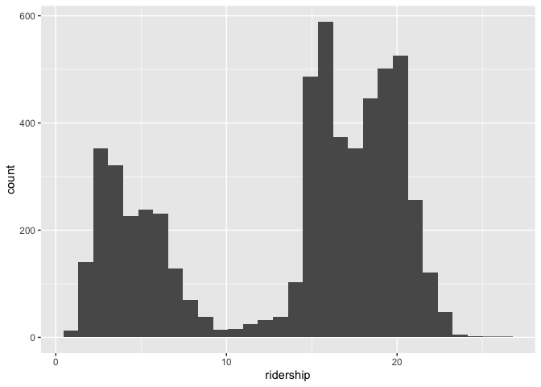

```r
library(tidyverse)
```

```
## ── Attaching core tidyverse packages ──────────────────────── tidyverse 2.0.0 ──
## ✔ dplyr     1.1.4     ✔ readr     2.1.5
## ✔ forcats   1.0.0     ✔ stringr   1.5.1
## ✔ ggplot2   3.4.4     ✔ tibble    3.2.1
## ✔ lubridate 1.9.3     ✔ tidyr     1.3.0
## ✔ purrr     1.0.2     
## ── Conflicts ────────────────────────────────────────── tidyverse_conflicts() ──
## ✖ dplyr::filter() masks stats::filter()
## ✖ dplyr::lag()    masks stats::lag()
## ℹ Use the conflicted package (<http://conflicted.r-lib.org/>) to force all conflicts to become errors
```

```r
library(tidymodels)
```

```
## ── Attaching packages ────────────────────────────────────── tidymodels 1.1.1 ──
## ✔ broom        1.0.5     ✔ rsample      1.2.0
## ✔ dials        1.2.0     ✔ tune         1.1.2
## ✔ infer        1.0.5     ✔ workflows    1.1.3
## ✔ modeldata    1.2.0     ✔ workflowsets 1.0.1
## ✔ parsnip      1.1.1     ✔ yardstick    1.2.0
## ✔ recipes      1.0.9     
## ── Conflicts ───────────────────────────────────────── tidymodels_conflicts() ──
## ✖ scales::discard() masks purrr::discard()
## ✖ dplyr::filter()   masks stats::filter()
## ✖ recipes::fixed()  masks stringr::fixed()
## ✖ dplyr::lag()      masks stats::lag()
## ✖ yardstick::spec() masks readr::spec()
## ✖ recipes::step()   masks stats::step()
## • Search for functions across packages at https://www.tidymodels.org/find/
```

```r
tidymodels_prefer()
library(workflowsets)
```

Things to practice:

* create a workflow
* use the workflow for different formulas (or models?)
* recipes with data transformations 
* recipes with PCA


```r
library(modeldata)
data("Chicago")
Chicago
```

```
## # A tibble: 5,698 × 50
##    ridership Austin Quincy_Wells Belmont Archer_35th Oak_Park Western Clark_Lake
##        <dbl>  <dbl>        <dbl>   <dbl>       <dbl>    <dbl>   <dbl>      <dbl>
##  1     15.7   1.46         8.37     4.60       2.01     1.42    3.32       15.6 
##  2     15.8   1.50         8.35     4.72       2.09     1.43    3.34       15.7 
##  3     15.9   1.52         8.36     4.68       2.11     1.49    3.36       15.6 
##  4     15.9   1.49         7.85     4.77       2.17     1.44    3.36       15.7 
##  5     15.4   1.50         7.62     4.72       2.06     1.42    3.27       15.6 
##  6      2.42  0.693        0.911    2.27       0.624    0.426   1.11        2.41
##  7      1.47  0.408        0.414    1.63       0.378    0.225   0.567       1.37
##  8     15.5   0.987        4.81     3.52       1.34     0.879   1.94        9.02
##  9     15.9   1.55         8.23     4.71       2.22     1.46    3.46       16.0 
## 10     15.9   1.59         8.25     4.77       2.23     1.48    3.51       15.8 
## # ℹ 5,688 more rows
## # ℹ 42 more variables: Clinton <dbl>, Merchandise_Mart <dbl>,
## #   Irving_Park <dbl>, Washington_Wells <dbl>, Harlem <dbl>, Monroe <dbl>,
## #   Polk <dbl>, Ashland <dbl>, Kedzie <dbl>, Addison <dbl>,
## #   Jefferson_Park <dbl>, Montrose <dbl>, California <dbl>, temp_min <dbl>,
## #   temp <dbl>, temp_max <dbl>, temp_change <dbl>, dew <dbl>, humidity <dbl>,
## #   pressure <dbl>, pressure_change <dbl>, wind <dbl>, wind_max <dbl>, …
```


```r
Chicago <- Chicago %>%
  mutate(weekend = timeDate::isBizday(timeDate::as.timeDate(date)))
```


```r
Chicago %>% ggplot(aes(x=ridership)) + geom_histogram()
```

```
## `stat_bin()` using `bins = 30`. Pick better value with `binwidth`.
```

<!-- -->


```r
Chicago %>% ggplot(aes(y=ridership, x=temp_max, color=as.logical(weekend))) +
 # geom_point() +
    geom_smooth() + scale_x_log10()
```

```
## `geom_smooth()` using method = 'gam' and formula = 'y ~ s(x, bs = "cs")'
```

<!-- -->


```r
lm(ridership ~ temp_max + weekend, data=Chicago) %>% summary
```

```
## 
## Call:
## lm(formula = ridership ~ temp_max + weekend, data = Chicago)
## 
## Residuals:
##      Min       1Q   Median       3Q      Max 
## -15.9276  -1.6062   0.2336   1.9580   9.0777 
## 
## Coefficients:
##              Estimate Std. Error t value Pr(>|t|)    
## (Intercept)  2.259430   0.133601   16.91   <2e-16 ***
## temp_max     0.035541   0.001862   19.08   <2e-16 ***
## weekendTRUE 12.904628   0.085672  150.63   <2e-16 ***
## ---
## Signif. codes:  0 '***' 0.001 '**' 0.01 '*' 0.05 '.' 0.1 ' ' 1
## 
## Residual standard error: 2.921 on 5695 degrees of freedom
## Multiple R-squared:  0.8019,	Adjusted R-squared:  0.8018 
## F-statistic: 1.153e+04 on 2 and 5695 DF,  p-value: < 2.2e-16
```


```r
lm(ridership ~ sqrt(temp_max) + weekend, data=Chicago) %>% summary
```

```
## 
## Call:
## lm(formula = ridership ~ sqrt(temp_max) + weekend, data = Chicago)
## 
## Residuals:
##      Min       1Q   Median       3Q      Max 
## -15.8893  -1.6236   0.2425   1.9492   9.0959 
## 
## Coefficients:
##                Estimate Std. Error t value Pr(>|t|)    
## (Intercept)     0.40909    0.21772   1.879   0.0603 .  
## sqrt(temp_max)  0.52280    0.02689  19.445   <2e-16 ***
## weekendTRUE    12.91015    0.08557 150.865   <2e-16 ***
## ---
## Signif. codes:  0 '***' 0.001 '**' 0.01 '*' 0.05 '.' 0.1 ' ' 1
## 
## Residual standard error: 2.918 on 5695 degrees of freedom
## Multiple R-squared:  0.8023,	Adjusted R-squared:  0.8023 
## F-statistic: 1.156e+04 on 2 and 5695 DF,  p-value: < 2.2e-16
```


```r
set.seed(010324)
Chicago_split <- initial_split(Chicago, prop = 0.8, strata = ridership)
c_train <- training(Chicago_split)
c_test <- testing(Chicago_split)
```


```r
colnames(Chicago) %>% sort()
```

```
##  [1] "Addison"          "Archer_35th"      "Ashland"          "Austin"          
##  [5] "Bears_Away"       "Bears_Home"       "Belmont"          "Blackhawks_Away" 
##  [9] "Blackhawks_Home"  "Bulls_Away"       "Bulls_Home"       "California"      
## [13] "Clark_Lake"       "Clinton"          "Cubs_Away"        "Cubs_Home"       
## [17] "date"             "dew"              "gust"             "gust_max"        
## [21] "Harlem"           "humidity"         "Irving_Park"      "Jefferson_Park"  
## [25] "Kedzie"           "Merchandise_Mart" "Monroe"           "Montrose"        
## [29] "Oak_Park"         "percip"           "percip_max"       "Polk"            
## [33] "pressure"         "pressure_change"  "Quincy_Wells"     "ridership"       
## [37] "temp"             "temp_change"      "temp_max"         "temp_min"        
## [41] "Washington_Wells" "weather_cloud"    "weather_rain"     "weather_snow"    
## [45] "weather_storm"    "weekend"          "Western"          "WhiteSox_Away"   
## [49] "WhiteSox_Home"    "wind"             "wind_max"
```


```r
weather <- list(
  temp_min = ridership ~ temp_min + weekend,
  temp = ridership ~ temp + weekend,
  temp_max = ridership ~ temp_max + weekend,
  temp_change = ridership ~ temp_change + weekend,
  percip = ridership ~ percip + weekend,
  percip_max = ridership ~ percip_max + weekend
)
```


```r
weather_models <- workflow_set(preproc = weather,
                               models = list(lm = linear_reg())
)

weather_models <- weather_models %>%
  mutate(fit = map(info, ~ fit(.x$workflow[[1]], c_train)))
```


```r
weather_models %>%
  mutate(tidy=map(fit, tidy)) %>%
  select(wflow_id, tidy) %>%
  unnest(tidy) %>%
  filter(str_detect(term, "temp|percip"))
```

```
## # A tibble: 6 × 6
##   wflow_id       term        estimate std.error statistic  p.value
##   <chr>          <chr>          <dbl>     <dbl>     <dbl>    <dbl>
## 1 temp_min_lm    temp_min      0.0392   0.00223    17.6   7.95e-67
## 2 temp_lm        temp          0.0383   0.00217    17.7   9.99e-68
## 3 temp_max_lm    temp_max      0.0360   0.00205    17.5   1.95e-66
## 4 temp_change_lm temp_change   0.0313   0.00710     4.41  1.06e- 5
## 5 percip_lm      percip       -7.58    12.6        -0.601 5.48e- 1
## 6 percip_max_lm  percip_max    1.11     0.346       3.21  1.32e- 3
```

```r
weather_models %>%
  mutate(glance=map(fit, glance)) %>%
  select(wflow_id, glance) %>%
  unnest(glance) %>% 
  arrange(desc(logLik))
```

```
## # A tibble: 6 × 13
##   wflow_id  r.squared adj.r.squared sigma statistic p.value    df  logLik    AIC
##   <chr>         <dbl>         <dbl> <dbl>     <dbl>   <dbl> <dbl>   <dbl>  <dbl>
## 1 temp_lm       0.806         0.806  2.89     9464.       0     2 -11294. 22595.
## 2 temp_min…     0.806         0.806  2.89     9453.       0     2 -11296. 22599.
## 3 temp_max…     0.806         0.806  2.89     9449.       0     2 -11297. 22601.
## 4 temp_cha…     0.794         0.794  2.98     8757.       0     2 -11435. 22878.
## 5 percip_m…     0.793         0.793  2.98     8735.       0     2 -11440. 22887.
## 6 percip_lm     0.793         0.793  2.98     8711.       0     2 -11445. 22897.
## # ℹ 4 more variables: BIC <dbl>, deviance <dbl>, df.residual <int>, nobs <int>
```


```r
c_recipe <-  recipe(formula = ridership ~ . , data=c_train) %>%
  update_role(date, new_role = "date") %>%
  add_role(matches("Home|Away$"), new_role="sports") %>%
  add_role(matches("^[A-Z]", ignore.case=FALSE), -has_role("sports"), new_role="station") %>%
  add_role(matches("^[a-z]", ignore.case=FALSE), -date, -weekend, -ridership, new_role="weather") %>%
  step_normalize(has_role("weather"), has_role("station")) %>%
  step_pca(has_role("station"), threshold = 0.75, prefix = "S_PC", id="station_pca")  %>%
  step_pca(has_role("weather"), threshold = 0.75, prefix = "W_PC", id = "weather_pca") 


tidy(c_recipe)
```

```
## # A tibble: 3 × 6
##   number operation type      trained skip  id             
##    <int> <chr>     <chr>     <lgl>   <lgl> <chr>          
## 1      1 step      normalize FALSE   FALSE normalize_atjOK
## 2      2 step      pca       FALSE   FALSE station_pca    
## 3      3 step      pca       FALSE   FALSE weather_pca
```

```r
c_recipe %>% prep()
```

```
## 
```

```
## ── Recipe ──────────────────────────────────────────────────────────────────────
```

```
## 
```

```
## ── Inputs
```

```
## Number of variables by role
```

```
## outcome:    1
## predictor: 49
## station:   20
## weather:   18
## sports:    10
## date:       1
```

```
## 
```

```
## ── Training information
```

```
## Training data contained 4557 data points and no incomplete rows.
```

```
## 
```

```
## ── Operations
```

```
## • Centering and scaling for: temp_min, temp, temp_max, ... | Trained
```

```
## • PCA extraction with: Austin, Quincy_Wells, Belmont, ... | Trained
```

```
## • PCA extraction with: temp_min, temp, temp_max, temp_change, ... | Trained
```

```r
c_recipe %>% prep() %>% bake(c_train[1:10,])
```

```
## # A tibble: 10 × 20
##    Blackhawks_Away Blackhawks_Home Bulls_Away Bulls_Home Bears_Away Bears_Home
##              <dbl>           <dbl>      <dbl>      <dbl>      <dbl>      <dbl>
##  1               0               0          0          1          0          0
##  2               0               0          0          0          0          0
##  3               0               0          0          0          0          0
##  4               0               0          0          0          0          0
##  5               0               0          0          1          0          0
##  6               0               0          0          0          0          0
##  7               0               0          0          1          0          0
##  8               0               0          0          0          0          0
##  9               0               0          0          0          0          0
## 10               0               0          0          0          0          0
## # ℹ 14 more variables: WhiteSox_Away <dbl>, WhiteSox_Home <dbl>,
## #   Cubs_Away <dbl>, Cubs_Home <dbl>, date <date>, weekend <lgl>,
## #   ridership <dbl>, S_PC1 <dbl>, W_PC1 <dbl>, W_PC2 <dbl>, W_PC3 <dbl>,
## #   W_PC4 <dbl>, W_PC5 <dbl>, W_PC6 <dbl>
```


```r
lm_wflow <- workflow() %>%
  add_model(linear_reg(engine = "lm")) %>%
  add_recipe(c_recipe) 


lm_fit <- fit(lm_wflow, c_train)

tidy(lm_fit) %>% arrange(p.value)
```

```
## # A tibble: 19 × 5
##    term            estimate std.error statistic    p.value
##    <chr>              <dbl>     <dbl>     <dbl>      <dbl>
##  1 (Intercept)       7.62      0.161    47.3     0        
##  2 weekendTRUE       8.24      0.190    43.3     0        
##  3 S_PC1             0.552     0.0197   28.0     1.15e-159
##  4 W_PC1             0.298     0.0271   11.0     1.10e- 27
##  5 Bulls_Home        0.520     0.133     3.90    9.73e-  5
##  6 Blackhawks_Home   0.434     0.136     3.19    1.43e-  3
##  7 Blackhawks_Away   0.284     0.133     2.14    3.25e-  2
##  8 W_PC5            -0.0500    0.0385   -1.30    1.94e-  1
##  9 W_PC6             0.0373    0.0404    0.925   3.55e-  1
## 10 W_PC4             0.0265    0.0313    0.846   3.98e-  1
## 11 Bears_Away       -0.175     0.262    -0.666   5.05e-  1
## 12 W_PC2            -0.0125    0.0211   -0.592   5.54e-  1
## 13 W_PC3             0.0108    0.0272    0.396   6.92e-  1
## 14 WhiteSox_Away    -0.0440    0.114    -0.384   7.01e-  1
## 15 Bulls_Away        0.0213    0.133     0.160   8.73e-  1
## 16 Bears_Home        0.0185    0.243     0.0762  9.39e-  1
## 17 WhiteSox_Home    NA        NA        NA      NA        
## 18 Cubs_Away        NA        NA        NA      NA        
## 19 Cubs_Home        NA        NA        NA      NA
```


```r
predicted <- lm_fit %>% predict(c_test)
```

```
## Warning in predict.lm(object = object$fit, newdata = new_data, type =
## "response", : prediction from rank-deficient fit; consider predict(.,
## rankdeficient="NA")
```

```r
plot(c_test$ridership, predicted$.pred)
```

<!-- -->

```r
cor.test(c_test$ridership, predicted$.pred)
```

```
## 
## 	Pearson's product-moment correlation
## 
## data:  c_test$ridership and predicted$.pred
## t = 71.591, df = 1139, p-value < 2.2e-16
## alternative hypothesis: true correlation is not equal to 0
## 95 percent confidence interval:
##  0.8933932 0.9145559
## sample estimates:
##     cor 
## 0.90453
```

