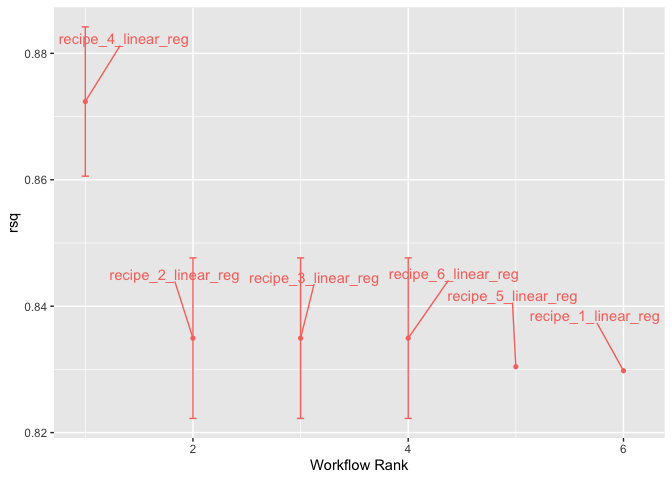
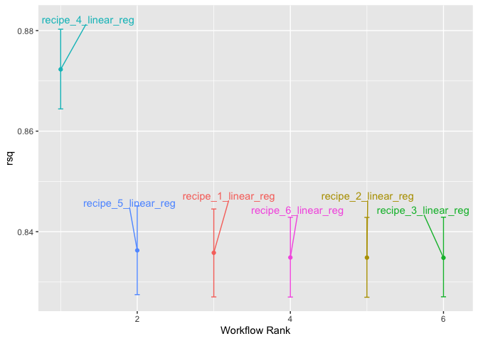

For 2/12:
Return to the Chicago data and Q4 from the previous Chicago assignment.

For Q4 we were predicting ridership from weather PCs, station PCs, and remaining predictors.

Use Cross-fold validation and the model selection techniques shown in chapter 12 to compare models with:

1. All PCs and remaining predictors (same as Q4)
1a. optional: compare random forest and lm for this full data set
2. The PCs + the weekend variable (no sports team data)
3. 1 weather PC, 1 station PC, + the weekend variable
4. 1 weather PC + the weekend variable
5. 1 station PC + the weekend variable
6. the weekend variable only


```r
library(tidyverse)
```

```
## ── Attaching core tidyverse packages ──────────────────────── tidyverse 2.0.0 ──
## ✔ dplyr     1.1.4     ✔ readr     2.1.5
## ✔ forcats   1.0.0     ✔ stringr   1.5.1
## ✔ ggplot2   3.4.4     ✔ tibble    3.2.1
## ✔ lubridate 1.9.3     ✔ tidyr     1.3.0
## ✔ purrr     1.0.2     
## ── Conflicts ────────────────────────────────────────── tidyverse_conflicts() ──
## ✖ dplyr::filter() masks stats::filter()
## ✖ dplyr::lag()    masks stats::lag()
## ℹ Use the conflicted package (<http://conflicted.r-lib.org/>) to force all conflicts to become errors
```

```r
library(tidymodels)
```

```
## ── Attaching packages ────────────────────────────────────── tidymodels 1.1.1 ──
## ✔ broom        1.0.5     ✔ rsample      1.2.0
## ✔ dials        1.2.0     ✔ tune         1.1.2
## ✔ infer        1.0.5     ✔ workflows    1.1.3
## ✔ modeldata    1.2.0     ✔ workflowsets 1.0.1
## ✔ parsnip      1.1.1     ✔ yardstick    1.2.0
## ✔ recipes      1.0.9     
## ── Conflicts ───────────────────────────────────────── tidymodels_conflicts() ──
## ✖ scales::discard() masks purrr::discard()
## ✖ dplyr::filter()   masks stats::filter()
## ✖ recipes::fixed()  masks stringr::fixed()
## ✖ dplyr::lag()      masks stats::lag()
## ✖ yardstick::spec() masks readr::spec()
## ✖ recipes::step()   masks stats::step()
## • Learn how to get started at https://www.tidymodels.org/start/
```

```r
tidymodels_prefer()
library(workflowsets)
```


```r
library(modeldata)
data("Chicago")
Chicago <- Chicago %>%
  mutate(weekend = timeDate::isBizday(timeDate::as.timeDate(date)))
Chicago
```

```
## # A tibble: 5,698 × 51
##    ridership Austin Quincy_Wells Belmont Archer_35th Oak_Park Western Clark_Lake
##        <dbl>  <dbl>        <dbl>   <dbl>       <dbl>    <dbl>   <dbl>      <dbl>
##  1     15.7   1.46         8.37     4.60       2.01     1.42    3.32       15.6 
##  2     15.8   1.50         8.35     4.72       2.09     1.43    3.34       15.7 
##  3     15.9   1.52         8.36     4.68       2.11     1.49    3.36       15.6 
##  4     15.9   1.49         7.85     4.77       2.17     1.44    3.36       15.7 
##  5     15.4   1.50         7.62     4.72       2.06     1.42    3.27       15.6 
##  6      2.42  0.693        0.911    2.27       0.624    0.426   1.11        2.41
##  7      1.47  0.408        0.414    1.63       0.378    0.225   0.567       1.37
##  8     15.5   0.987        4.81     3.52       1.34     0.879   1.94        9.02
##  9     15.9   1.55         8.23     4.71       2.22     1.46    3.46       16.0 
## 10     15.9   1.59         8.25     4.77       2.23     1.48    3.51       15.8 
## # ℹ 5,688 more rows
## # ℹ 43 more variables: Clinton <dbl>, Merchandise_Mart <dbl>,
## #   Irving_Park <dbl>, Washington_Wells <dbl>, Harlem <dbl>, Monroe <dbl>,
## #   Polk <dbl>, Ashland <dbl>, Kedzie <dbl>, Addison <dbl>,
## #   Jefferson_Park <dbl>, Montrose <dbl>, California <dbl>, temp_min <dbl>,
## #   temp <dbl>, temp_max <dbl>, temp_change <dbl>, dew <dbl>, humidity <dbl>,
## #   pressure <dbl>, pressure_change <dbl>, wind <dbl>, wind_max <dbl>, …
```


```r
set.seed(010324)
Chicago_split <- initial_split(Chicago, prop = 0.8, strata = ridership)
c_train <- training(Chicago_split)
c_test <- testing(Chicago_split)
```


```r
full_recipe <-  recipe(formula = ridership ~ . , data=c_train) %>%
  update_role(date, new_role = "date") %>%
  add_role(matches("Home|Away$"), new_role="sports") %>%
  add_role(matches("^[A-Z]", ignore.case=FALSE), -has_role("sports"), new_role="station") %>%
  add_role(matches("^[a-z]", ignore.case=FALSE), -date, -weekend, -ridership, new_role="weather") %>%
  step_normalize(has_role("weather"), has_role("station")) %>%
  step_pca(has_role("station"), threshold = 0.75, prefix = "S_PC", id="station_pca")  %>%
  step_pca(has_role("weather"), threshold = 0.75, prefix = "W_PC", id = "weather_pca") 


tidy(full_recipe)
```

```
## # A tibble: 3 × 6
##   number operation type      trained skip  id             
##    <int> <chr>     <chr>     <lgl>   <lgl> <chr>          
## 1      1 step      normalize FALSE   FALSE normalize_atjOK
## 2      2 step      pca       FALSE   FALSE station_pca    
## 3      3 step      pca       FALSE   FALSE weather_pca
```

```r
full_recipe %>% prep()
```

```
## 
```

```
## ── Recipe ──────────────────────────────────────────────────────────────────────
```

```
## 
```

```
## ── Inputs
```

```
## Number of variables by role
```

```
## outcome:    1
## predictor: 49
## station:   20
## weather:   18
## sports:    10
## date:       1
```

```
## 
```

```
## ── Training information
```

```
## Training data contained 4557 data points and no incomplete rows.
```

```
## 
```

```
## ── Operations
```

```
## • Centering and scaling for: temp_min, temp, temp_max, ... | Trained
```

```
## • PCA extraction with: Austin, Quincy_Wells, Belmont, ... | Trained
```

```
## • PCA extraction with: temp_min, temp, temp_max, temp_change, ... | Trained
```

```r
full_recipe %>% prep() %>% bake(c_train[1:10,])
```

```
## # A tibble: 10 × 20
##    Blackhawks_Away Blackhawks_Home Bulls_Away Bulls_Home Bears_Away Bears_Home
##              <dbl>           <dbl>      <dbl>      <dbl>      <dbl>      <dbl>
##  1               0               0          0          1          0          0
##  2               0               0          0          0          0          0
##  3               0               0          0          0          0          0
##  4               0               0          0          0          0          0
##  5               0               0          0          1          0          0
##  6               0               0          0          0          0          0
##  7               0               0          0          1          0          0
##  8               0               0          0          0          0          0
##  9               0               0          0          0          0          0
## 10               0               0          0          0          0          0
## # ℹ 14 more variables: WhiteSox_Away <dbl>, WhiteSox_Home <dbl>,
## #   Cubs_Away <dbl>, Cubs_Home <dbl>, date <date>, weekend <lgl>,
## #   ridership <dbl>, S_PC1 <dbl>, W_PC1 <dbl>, W_PC2 <dbl>, W_PC3 <dbl>,
## #   W_PC4 <dbl>, W_PC5 <dbl>, W_PC6 <dbl>
```

2. The PCs + the weekend variable (no sports team data)
3. 1 weather PC, 1 station PC, + the weekend variable
4. 1 weather PC + the weekend variable
5. 1 station PC + the weekend variable
6. the weekend variable only

```r
nosports_recipe <- full_recipe %>%
  remove_role(has_role("sports"), old_role = "predictor")

prep(nosports_recipe)
```

```
## 
```

```
## ── Recipe ──────────────────────────────────────────────────────────────────────
```

```
## 
```

```
## ── Inputs
```

```
## Number of variables by role
```

```
## outcome:    1
## predictor: 39
## station:   20
## weather:   18
## sports:    10
## date:       1
```

```
## 
```

```
## ── Training information
```

```
## Training data contained 4557 data points and no incomplete rows.
```

```
## 
```

```
## ── Operations
```

```
## • Centering and scaling for: temp_min, temp, temp_max, ... | Trained
```

```
## • PCA extraction with: Austin, Quincy_Wells, Belmont, ... | Trained
```

```
## • PCA extraction with: temp_min, temp, temp_max, temp_change, ... | Trained
```
3. 1 weather PC, 1 station PC, + the weekend variable

```r
recipe3 <- nosports_recipe
recipe3$steps[[2]] <- update(recipe3$steps[[2]], num_comp=1)
recipe3$steps[[3]] <- update(recipe3$steps[[3]], num_comp=1)

prep(recipe3)
```

```
## 
```

```
## ── Recipe ──────────────────────────────────────────────────────────────────────
```

```
## 
```

```
## ── Inputs
```

```
## Number of variables by role
```

```
## outcome:    1
## predictor: 39
## station:   20
## weather:   18
## sports:    10
## date:       1
```

```
## 
```

```
## ── Training information
```

```
## Training data contained 4557 data points and no incomplete rows.
```

```
## 
```

```
## ── Operations
```

```
## • Centering and scaling for: temp_min, temp, temp_max, ... | Trained
```

```
## • PCA extraction with: Austin, Quincy_Wells, Belmont, ... | Trained
```

```
## • PCA extraction with: temp_min, temp, temp_max, temp_change, ... | Trained
```

4. 1 weather PC + the weekend variable

```r
recipe4 <- recipe3
tidy(recipe4)
```

```
## # A tibble: 3 × 6
##   number operation type      trained skip  id             
##    <int> <chr>     <chr>     <lgl>   <lgl> <chr>          
## 1      1 step      normalize FALSE   FALSE normalize_atjOK
## 2      2 step      pca       FALSE   FALSE station_pca    
## 3      3 step      pca       FALSE   FALSE weather_pca
```

```r
recipe4$steps <- recipe4$steps[-2]
tidy(recipe4)
```

```
## # A tibble: 2 × 6
##   number operation type      trained skip  id             
##    <int> <chr>     <chr>     <lgl>   <lgl> <chr>          
## 1      1 step      normalize FALSE   FALSE normalize_atjOK
## 2      2 step      pca       FALSE   FALSE weather_pca
```

```r
prep(recipe4)
```

```
## 
```

```
## ── Recipe ──────────────────────────────────────────────────────────────────────
```

```
## 
```

```
## ── Inputs
```

```
## Number of variables by role
```

```
## outcome:    1
## predictor: 39
## station:   20
## weather:   18
## sports:    10
## date:       1
```

```
## 
```

```
## ── Training information
```

```
## Training data contained 4557 data points and no incomplete rows.
```

```
## 
```

```
## ── Operations
```

```
## • Centering and scaling for: temp_min, temp, temp_max, ... | Trained
```

```
## • PCA extraction with: temp_min, temp, temp_max, temp_change, ... | Trained
```

5. 1 station PC + the weekend variable

```r
recipe5 <- recipe3
tidy(recipe5)
```

```
## # A tibble: 3 × 6
##   number operation type      trained skip  id             
##    <int> <chr>     <chr>     <lgl>   <lgl> <chr>          
## 1      1 step      normalize FALSE   FALSE normalize_atjOK
## 2      2 step      pca       FALSE   FALSE station_pca    
## 3      3 step      pca       FALSE   FALSE weather_pca
```

```r
recipe5$steps <- recipe5$steps[-3]
tidy(recipe5)
```

```
## # A tibble: 2 × 6
##   number operation type      trained skip  id             
##    <int> <chr>     <chr>     <lgl>   <lgl> <chr>          
## 1      1 step      normalize FALSE   FALSE normalize_atjOK
## 2      2 step      pca       FALSE   FALSE station_pca
```

```r
prep(recipe5)
```

```
## 
```

```
## ── Recipe ──────────────────────────────────────────────────────────────────────
```

```
## 
```

```
## ── Inputs
```

```
## Number of variables by role
```

```
## outcome:    1
## predictor: 39
## station:   20
## weather:   18
## sports:    10
## date:       1
```

```
## 
```

```
## ── Training information
```

```
## Training data contained 4557 data points and no incomplete rows.
```

```
## 
```

```
## ── Operations
```

```
## • Centering and scaling for: temp_min, temp, temp_max, ... | Trained
```

```
## • PCA extraction with: Austin, Quincy_Wells, Belmont, ... | Trained
```

```r
prep(recipe5)
```

```
## 
```

```
## ── Recipe ──────────────────────────────────────────────────────────────────────
```

```
## 
```

```
## ── Inputs
```

```
## Number of variables by role
```

```
## outcome:    1
## predictor: 39
## station:   20
## weather:   18
## sports:    10
## date:       1
```

```
## 
```

```
## ── Training information
```

```
## Training data contained 4557 data points and no incomplete rows.
```

```
## 
```

```
## ── Operations
```

```
## • Centering and scaling for: temp_min, temp, temp_max, ... | Trained
```

```
## • PCA extraction with: Austin, Quincy_Wells, Belmont, ... | Trained
```

6. the weekend variable only

```r
recipe6 <- full_recipe %>%
  remove_role(-weekend, old_role = "predictor")
```

```
## Warning: Column `date` does not have role "predictor".
```

```
## Warning: Column `ridership` does not have role "predictor".
```

```r
prep(recipe6)
```

```
## 
```

```
## ── Recipe ──────────────────────────────────────────────────────────────────────
```

```
## 
```

```
## ── Inputs
```

```
## Number of variables by role
```

```
## outcome:    1
## predictor:  1
## station:   20
## weather:   18
## sports:    10
## date:       1
```

```
## 
```

```
## ── Training information
```

```
## Training data contained 4557 data points and no incomplete rows.
```

```
## 
```

```
## ── Operations
```

```
## • Centering and scaling for: temp_min, temp, temp_max, ... | Trained
```

```
## • PCA extraction with: Austin, Quincy_Wells, Belmont, ... | Trained
```

```
## • PCA extraction with: temp_min, temp, temp_max, temp_change, ... | Trained
```


```r
reg_model <- linear_reg(engine = "lm")
rf_model <- 
  rand_forest(trees = 1000) %>% 
  set_engine("ranger") %>% 
  set_mode("regression")

wflwset <- workflow_set(preproc = list(full_recipe, nosports_recipe, recipe3, recipe4, recipe5, recipe6),
                        models = list(reg_model),
                        cross = TRUE)

wflwset
```

```
## # A workflow set/tibble: 6 × 4
##   wflow_id            info             option    result    
##   <chr>               <list>           <list>    <list>    
## 1 recipe_1_linear_reg <tibble [1 × 4]> <opts[0]> <list [0]>
## 2 recipe_2_linear_reg <tibble [1 × 4]> <opts[0]> <list [0]>
## 3 recipe_3_linear_reg <tibble [1 × 4]> <opts[0]> <list [0]>
## 4 recipe_4_linear_reg <tibble [1 × 4]> <opts[0]> <list [0]>
## 5 recipe_5_linear_reg <tibble [1 × 4]> <opts[0]> <list [0]>
## 6 recipe_6_linear_reg <tibble [1 × 4]> <opts[0]> <list [0]>
```


```r
set.seed(123)
Chicago_folds <- vfold_cv(c_train, v = 10, strata = ridership)
keep_pred <- control_resamples(save_pred = TRUE, save_workflow = TRUE)


wflwset <- wflwset %>%
  workflow_map("fit_resamples", 
               # Options to `workflow_map()`: 
               seed = 1101, verbose = TRUE,
               # Options to `fit_resamples()`: 
               resamples = Chicago_folds, control = keep_pred)
```

```
## i 1 of 6 resampling: recipe_1_linear_reg
```

```
## → A | warning: prediction from rank-deficient fit; consider predict(., rankdeficient="NA")
```

```
## 
There were issues with some computations   A: x1

There were issues with some computations   A: x1
## → B | error:   Cannot find current progress bar for `<environment: 0x138e997c0>`
```

```
## Warning: More than one set of outcomes were used when tuning. This should never
## happen. Review how the outcome is specified in your model.
```

```
## ✔ 1 of 6 resampling: recipe_1_linear_reg (826ms)
## i 2 of 6 resampling: recipe_2_linear_reg
## ✔ 2 of 6 resampling: recipe_2_linear_reg (622ms)
## i 3 of 6 resampling: recipe_3_linear_reg
## ✔ 3 of 6 resampling: recipe_3_linear_reg (489ms)
## i 4 of 6 resampling: recipe_4_linear_reg
## ✔ 4 of 6 resampling: recipe_4_linear_reg (444ms)
## i 5 of 6 resampling: recipe_5_linear_reg
## → A | warning: prediction from rank-deficient fit; consider predict(., rankdeficient="NA")
## 
There were issues with some computations   A: x1

There were issues with some computations   A: x1
## → B | error:   Cannot find current progress bar for `<environment: 0x13b07e828>`
```

```
## Warning: More than one set of outcomes were used when tuning. This should never
## happen. Review how the outcome is specified in your model.
```

```
## ✔ 5 of 6 resampling: recipe_5_linear_reg (545ms)
## i 6 of 6 resampling: recipe_6_linear_reg
## ✔ 6 of 6 resampling: recipe_6_linear_reg (503ms)
```


```r
collect_metrics(wflwset) %>% filter(.metric=="rsq")  %>%
  arrange(desc(mean))
```

```
## # A tibble: 6 × 9
##   wflow_id         .config preproc model .metric .estimator  mean     n  std_err
##   <chr>            <chr>   <chr>   <chr> <chr>   <chr>      <dbl> <int>    <dbl>
## 1 recipe_4_linear… Prepro… recipe  line… rsq     standard   0.872    10  0.00718
## 2 recipe_2_linear… Prepro… recipe  line… rsq     standard   0.835    10  0.00772
## 3 recipe_3_linear… Prepro… recipe  line… rsq     standard   0.835    10  0.00772
## 4 recipe_6_linear… Prepro… recipe  line… rsq     standard   0.835    10  0.00772
## 5 recipe_5_linear… Prepro… recipe  line… rsq     standard   0.830     1 NA      
## 6 recipe_1_linear… Prepro… recipe  line… rsq     standard   0.830     1 NA
```


```r
autoplot(wflwset, metric="rsq") +
  ggrepel::geom_text_repel(aes(label = wflow_id), nudge_x = 1/8, nudge_y = 1/100) +
  theme(legend.position = "none")
```

<!-- -->


```r
library(tidyposterior)
library(rstanarm)
```

```
## Loading required package: Rcpp
```

```
## 
## Attaching package: 'Rcpp'
```

```
## The following object is masked from 'package:rsample':
## 
##     populate
```

```
## This is rstanarm version 2.26.1
```

```
## - See https://mc-stan.org/rstanarm/articles/priors for changes to default priors!
```

```
## - Default priors may change, so it's safest to specify priors, even if equivalent to the defaults.
```

```
## - For execution on a local, multicore CPU with excess RAM we recommend calling
```

```
##   options(mc.cores = parallel::detectCores())
```

```r
# The rstanarm package creates copious amounts of output; those results
# are not shown here but are worth inspecting for potential issues. The
# option `refresh = 0` can be used to eliminate the logging. 
rsq_anova <-
  perf_mod(
    wflwset,
    metric = "rsq",
    prior_intercept = rstanarm::student_t(df = 1),
    chains = 4,
    iter = 5000,
    seed = 1102
  )
```

```
## 
## SAMPLING FOR MODEL 'continuous' NOW (CHAIN 1).
## Chain 1: 
## Chain 1: Gradient evaluation took 4.1e-05 seconds
## Chain 1: 1000 transitions using 10 leapfrog steps per transition would take 0.41 seconds.
## Chain 1: Adjust your expectations accordingly!
## Chain 1: 
## Chain 1: 
## Chain 1: Iteration:    1 / 5000 [  0%]  (Warmup)
## Chain 1: Iteration:  500 / 5000 [ 10%]  (Warmup)
## Chain 1: Iteration: 1000 / 5000 [ 20%]  (Warmup)
## Chain 1: Iteration: 1500 / 5000 [ 30%]  (Warmup)
## Chain 1: Iteration: 2000 / 5000 [ 40%]  (Warmup)
## Chain 1: Iteration: 2500 / 5000 [ 50%]  (Warmup)
## Chain 1: Iteration: 2501 / 5000 [ 50%]  (Sampling)
## Chain 1: Iteration: 3000 / 5000 [ 60%]  (Sampling)
## Chain 1: Iteration: 3500 / 5000 [ 70%]  (Sampling)
## Chain 1: Iteration: 4000 / 5000 [ 80%]  (Sampling)
## Chain 1: Iteration: 4500 / 5000 [ 90%]  (Sampling)
## Chain 1: Iteration: 5000 / 5000 [100%]  (Sampling)
## Chain 1: 
## Chain 1:  Elapsed Time: 3.04 seconds (Warm-up)
## Chain 1:                1.598 seconds (Sampling)
## Chain 1:                4.638 seconds (Total)
## Chain 1: 
## 
## SAMPLING FOR MODEL 'continuous' NOW (CHAIN 2).
## Chain 2: 
## Chain 2: Gradient evaluation took 1.2e-05 seconds
## Chain 2: 1000 transitions using 10 leapfrog steps per transition would take 0.12 seconds.
## Chain 2: Adjust your expectations accordingly!
## Chain 2: 
## Chain 2: 
## Chain 2: Iteration:    1 / 5000 [  0%]  (Warmup)
## Chain 2: Iteration:  500 / 5000 [ 10%]  (Warmup)
## Chain 2: Iteration: 1000 / 5000 [ 20%]  (Warmup)
## Chain 2: Iteration: 1500 / 5000 [ 30%]  (Warmup)
## Chain 2: Iteration: 2000 / 5000 [ 40%]  (Warmup)
## Chain 2: Iteration: 2500 / 5000 [ 50%]  (Warmup)
## Chain 2: Iteration: 2501 / 5000 [ 50%]  (Sampling)
## Chain 2: Iteration: 3000 / 5000 [ 60%]  (Sampling)
## Chain 2: Iteration: 3500 / 5000 [ 70%]  (Sampling)
## Chain 2: Iteration: 4000 / 5000 [ 80%]  (Sampling)
## Chain 2: Iteration: 4500 / 5000 [ 90%]  (Sampling)
## Chain 2: Iteration: 5000 / 5000 [100%]  (Sampling)
## Chain 2: 
## Chain 2:  Elapsed Time: 2.709 seconds (Warm-up)
## Chain 2:                1.746 seconds (Sampling)
## Chain 2:                4.455 seconds (Total)
## Chain 2: 
## 
## SAMPLING FOR MODEL 'continuous' NOW (CHAIN 3).
## Chain 3: 
## Chain 3: Gradient evaluation took 1.6e-05 seconds
## Chain 3: 1000 transitions using 10 leapfrog steps per transition would take 0.16 seconds.
## Chain 3: Adjust your expectations accordingly!
## Chain 3: 
## Chain 3: 
## Chain 3: Iteration:    1 / 5000 [  0%]  (Warmup)
## Chain 3: Iteration:  500 / 5000 [ 10%]  (Warmup)
## Chain 3: Iteration: 1000 / 5000 [ 20%]  (Warmup)
## Chain 3: Iteration: 1500 / 5000 [ 30%]  (Warmup)
## Chain 3: Iteration: 2000 / 5000 [ 40%]  (Warmup)
## Chain 3: Iteration: 2500 / 5000 [ 50%]  (Warmup)
## Chain 3: Iteration: 2501 / 5000 [ 50%]  (Sampling)
## Chain 3: Iteration: 3000 / 5000 [ 60%]  (Sampling)
## Chain 3: Iteration: 3500 / 5000 [ 70%]  (Sampling)
## Chain 3: Iteration: 4000 / 5000 [ 80%]  (Sampling)
## Chain 3: Iteration: 4500 / 5000 [ 90%]  (Sampling)
## Chain 3: Iteration: 5000 / 5000 [100%]  (Sampling)
## Chain 3: 
## Chain 3:  Elapsed Time: 2.958 seconds (Warm-up)
## Chain 3:                1.996 seconds (Sampling)
## Chain 3:                4.954 seconds (Total)
## Chain 3: 
## 
## SAMPLING FOR MODEL 'continuous' NOW (CHAIN 4).
## Chain 4: 
## Chain 4: Gradient evaluation took 1.4e-05 seconds
## Chain 4: 1000 transitions using 10 leapfrog steps per transition would take 0.14 seconds.
## Chain 4: Adjust your expectations accordingly!
## Chain 4: 
## Chain 4: 
## Chain 4: Iteration:    1 / 5000 [  0%]  (Warmup)
## Chain 4: Iteration:  500 / 5000 [ 10%]  (Warmup)
## Chain 4: Iteration: 1000 / 5000 [ 20%]  (Warmup)
## Chain 4: Iteration: 1500 / 5000 [ 30%]  (Warmup)
## Chain 4: Iteration: 2000 / 5000 [ 40%]  (Warmup)
## Chain 4: Iteration: 2500 / 5000 [ 50%]  (Warmup)
## Chain 4: Iteration: 2501 / 5000 [ 50%]  (Sampling)
## Chain 4: Iteration: 3000 / 5000 [ 60%]  (Sampling)
## Chain 4: Iteration: 3500 / 5000 [ 70%]  (Sampling)
## Chain 4: Iteration: 4000 / 5000 [ 80%]  (Sampling)
## Chain 4: Iteration: 4500 / 5000 [ 90%]  (Sampling)
## Chain 4: Iteration: 5000 / 5000 [100%]  (Sampling)
## Chain 4: 
## Chain 4:  Elapsed Time: 3.496 seconds (Warm-up)
## Chain 4:                1.587 seconds (Sampling)
## Chain 4:                5.083 seconds (Total)
## Chain 4:
```


```r
model_post <- 
  rsq_anova %>% 
  # Take a random sample from the posterior distribution
  # so set the seed again to be reproducible. 
  tidy(seed = 1103) 

glimpse(model_post)
```

```
## Rows: 60,000
## Columns: 2
## $ model     <chr> "recipe_1_linear_reg", "recipe_2_linear_reg", "recipe_3_line…
## $ posterior <dbl> 0.8339547, 0.8357898, 0.8373114, 0.8736206, 0.8331735, 0.835…
```


```r
autoplot(rsq_anova) +
  ggrepel::geom_text_repel(aes(label = workflow), nudge_x = 1/8, nudge_y = 1/100) +
  theme(legend.position = "none")
```

<!-- -->

