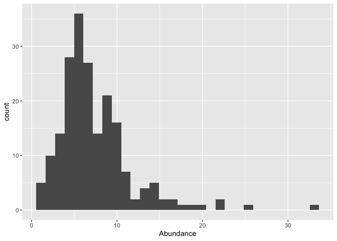
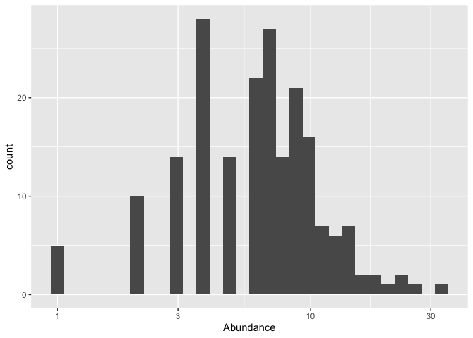
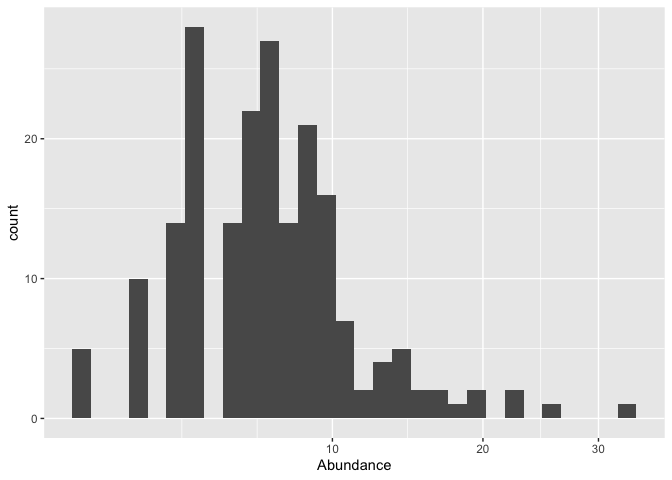
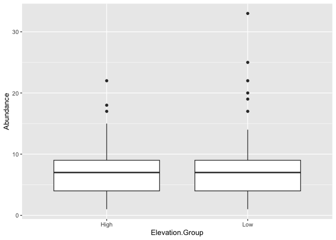
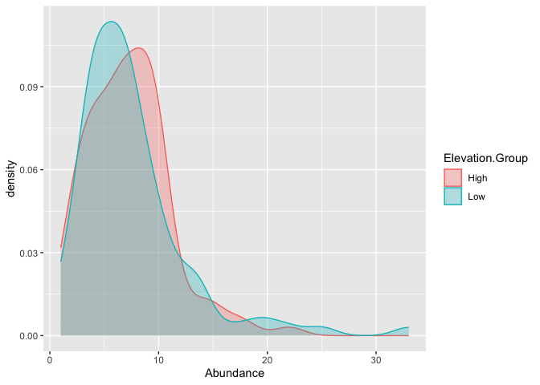
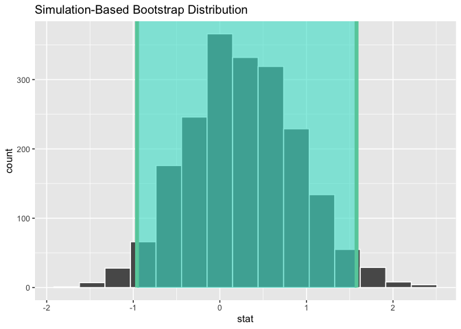
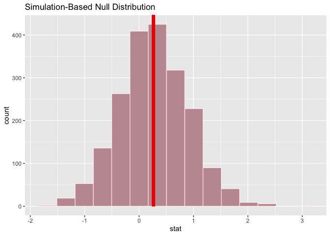
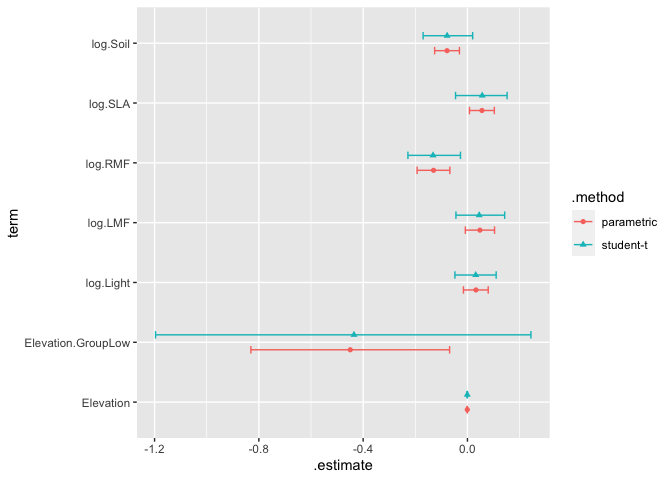
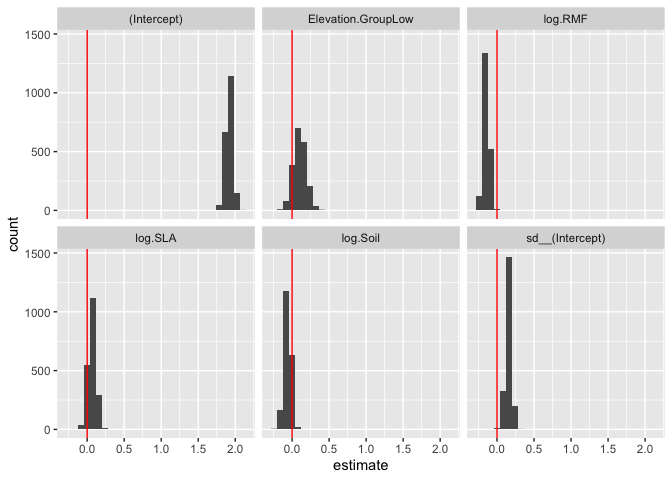

This exercise is designed to test skills learned in Chapter 21: Inferential Analysis from Tidy Modeling in R

This data comes from a tropical rainforest seedling community in Xishuangbanna, China. Originally, the data included trait data measured on individual seedlings and plot-level environmental data and was used to make inferences about how interactions among traits explain patterns of relative growth rate of seedlings across light and soil nutrient gradients. The publication can be found [here](https://esajournals.onlinelibrary.wiley.com/doi/abs/10.1002/ecy.3007). For this exercise, I have adapted the data as well as "made-up" some new variables to better match the chapter data. All the continuous variables have been centered and scaled.

The data include

-   Plot - 1 x 1 meter plots randomly distributed in the forest to capture the seedling community
-   Elevation - Elevation of the plot in meters
-   Elevation.Group - Elevation classified as Low or High
-   Abundance - total number of individual seedlings in each plot
-   log.SLA - mean specific leaf area of all individuals in the plot, ratio of leaf area to leaf dry mass, high values indicate lighter leaves that photosynthesize more quickly.
-   log.LMF - mean leaf mass fraction of all individuals in the plot, total leaf dry mass divided by whole plant dry mass, represents biomass allocation to leaves
-   log.RMF - mean root mass fraction of all individuals in the plot, total root dry mass divided by whole plant dry mass, represents biomass allocation to roots
-   log.Soil - scores from the first axis of PCA, higher values mean more nutrient rich soil
-   log.Light - percent canopy openness above the plot, higher values mean more open canopy and access to light
-   n.Species - number of species in each plot

The goal of this exercise is to try to explain differences in abundance among the plots.


```r
library(tidyverse)
```

```
## ── Attaching core tidyverse packages ──────────────────────── tidyverse 2.0.0 ──
## ✔ dplyr     1.1.4     ✔ readr     2.1.5
## ✔ forcats   1.0.0     ✔ stringr   1.5.1
## ✔ ggplot2   3.4.4     ✔ tibble    3.2.1
## ✔ lubridate 1.9.3     ✔ tidyr     1.3.0
## ✔ purrr     1.0.2     
## ── Conflicts ────────────────────────────────────────── tidyverse_conflicts() ──
## ✖ dplyr::filter() masks stats::filter()
## ✖ dplyr::lag()    masks stats::lag()
## ℹ Use the conflicted package (<http://conflicted.r-lib.org/>) to force all conflicts to become errors
```

```r
library(tidymodels)
```

```
## ── Attaching packages ────────────────────────────────────── tidymodels 1.1.1 ──
## ✔ broom        1.0.5      ✔ rsample      1.2.0 
## ✔ dials        1.2.0      ✔ tune         1.2.1 
## ✔ infer        1.0.5      ✔ workflows    1.1.4 
## ✔ modeldata    1.2.0      ✔ workflowsets 1.0.1 
## ✔ parsnip      1.2.1      ✔ yardstick    1.3.1 
## ✔ recipes      1.0.10     
## ── Conflicts ───────────────────────────────────────── tidymodels_conflicts() ──
## ✖ scales::discard() masks purrr::discard()
## ✖ dplyr::filter()   masks stats::filter()
## ✖ recipes::fixed()  masks stringr::fixed()
## ✖ dplyr::lag()      masks stats::lag()
## ✖ yardstick::spec() masks readr::spec()
## ✖ recipes::step()   masks stats::step()
## • Learn how to get started at https://www.tidymodels.org/start/
```

```r
tidymodels_prefer()
library(infer)
library(poissonreg)
library(multilevelmod)
library(broom.mixed)
```

## Exercise 1

Visualize the distribution of seedling abundance data. What do you notice about the distribution?


```r
dat <- read_csv("final.data.csv")
```

```
## Rows: 200 Columns: 10
## ── Column specification ────────────────────────────────────────────────────────
## Delimiter: ","
## chr (1): Elevation.Group
## dbl (9): Plot, Elevation, Abundance, n.Species, log.SLA, log.LMF, log.RMF, l...
## 
## ℹ Use `spec()` to retrieve the full column specification for this data.
## ℹ Specify the column types or set `show_col_types = FALSE` to quiet this message.
```

```r
summary(dat)
```

```
##       Plot          Elevation    Elevation.Group      Abundance     
##  Min.   :  1.00   Min.   : 100   Length:200         Min.   : 1.000  
##  1st Qu.: 50.75   1st Qu.: 275   Class :character   1st Qu.: 4.000  
##  Median : 99.50   Median : 400   Mode  :character   Median : 7.000  
##  Mean   :100.29   Mean   : 697                      Mean   : 7.385  
##  3rd Qu.:150.25   3rd Qu.:1125                      3rd Qu.: 9.000  
##  Max.   :200.00   Max.   :1300                      Max.   :33.000  
##    n.Species      log.SLA           log.LMF            log.RMF       
##  Min.   :1.0   Min.   :-2.7304   Min.   :-3.17879   Min.   :-1.9475  
##  1st Qu.:3.0   1st Qu.:-0.6733   1st Qu.:-0.58894   1st Qu.:-0.6215  
##  Median :4.0   Median :-0.1318   Median : 0.02369   Median :-0.1263  
##  Mean   :4.4   Mean   : 0.0000   Mean   : 0.00000   Mean   : 0.0000  
##  3rd Qu.:6.0   3rd Qu.: 0.5286   3rd Qu.: 0.70942   3rd Qu.: 0.4863  
##  Max.   :9.0   Max.   : 3.8965   Max.   : 2.43655   Max.   : 3.9056  
##     log.Soil         log.Light      
##  Min.   :-2.6475   Min.   :-1.5219  
##  1st Qu.:-0.6437   1st Qu.:-0.7385  
##  Median : 0.0609   Median :-0.2089  
##  Mean   : 0.0000   Mean   : 0.0000  
##  3rd Qu.: 0.6898   3rd Qu.: 0.5193  
##  Max.   : 2.6147   Max.   : 5.4216
```

```r
glimpse(dat)
```

```
## Rows: 200
## Columns: 10
## $ Plot            <dbl> 1, 10, 100, 101, 102, 103, 104, 105, 106, 107, 108, 10…
## $ Elevation       <dbl> 100, 100, 400, 1000, 1000, 1000, 1000, 1000, 1000, 100…
## $ Elevation.Group <chr> "Low", "Low", "Low", "High", "High", "High", "High", "…
## $ Abundance       <dbl> 7, 7, 13, 2, 10, 15, 22, 12, 10, 9, 14, 4, 4, 6, 3, 10…
## $ n.Species       <dbl> 7, 5, 4, 1, 4, 6, 8, 6, 5, 6, 6, 4, 4, 3, 3, 7, 5, 5, …
## $ log.SLA         <dbl> -0.61169333, -0.55208932, -0.65518621, -1.38052594, 1.…
## $ log.LMF         <dbl> -1.011630967, -0.587209151, 0.448063427, -2.401020177,…
## $ log.RMF         <dbl> 0.1196850, 1.2755846, 0.1691089, 3.7882477, -0.2525634…
## $ log.Soil        <dbl> 0.20433620, 0.62612973, 1.40806125, 1.26272034, 1.8784…
## $ log.Light       <dbl> 0.09632394, -0.60243708, 0.37582836, 1.63359821, 0.118…
```


```r
skimr::skim(dat)
```


Table: Data summary

|                         |     |
|:------------------------|:----|
|Name                     |dat  |
|Number of rows           |200  |
|Number of columns        |10   |
|_______________________  |     |
|Column type frequency:   |     |
|character                |1    |
|numeric                  |9    |
|________________________ |     |
|Group variables          |None |


**Variable type: character**

|skim_variable   | n_missing| complete_rate| min| max| empty| n_unique| whitespace|
|:---------------|---------:|-------------:|---:|---:|-----:|--------:|----------:|
|Elevation.Group |         0|             1|   3|   4|     0|        2|          0|


**Variable type: numeric**

|skim_variable | n_missing| complete_rate|   mean|     sd|     p0|    p25|    p50|     p75|    p100|hist  |
|:-------------|---------:|-------------:|------:|------:|------:|------:|------:|-------:|-------:|:-----|
|Plot          |         0|             1| 100.29|  57.90|   1.00|  50.75|  99.50|  150.25|  200.00|▇▇▇▇▇ |
|Elevation     |         0|             1| 697.00| 464.83| 100.00| 275.00| 400.00| 1125.00| 1300.00|▇▃▁▂▇ |
|Abundance     |         0|             1|   7.39|   4.46|   1.00|   4.00|   7.00|    9.00|   33.00|▇▅▁▁▁ |
|n.Species     |         0|             1|   4.40|   1.78|   1.00|   3.00|   4.00|    6.00|    9.00|▃▇▃▆▁ |
|log.SLA       |         0|             1|   0.00|   1.00|  -2.73|  -0.67|  -0.13|    0.53|    3.90|▁▇▆▂▁ |
|log.LMF       |         0|             1|   0.00|   1.00|  -3.18|  -0.59|   0.02|    0.71|    2.44|▁▃▇▇▂ |
|log.RMF       |         0|             1|   0.00|   1.00|  -1.95|  -0.62|  -0.13|    0.49|    3.91|▂▇▃▁▁ |
|log.Soil      |         0|             1|   0.00|   1.00|  -2.65|  -0.64|   0.06|    0.69|    2.61|▂▅▇▆▁ |
|log.Light     |         0|             1|   0.00|   1.00|  -1.52|  -0.74|  -0.21|    0.52|    5.42|▇▆▁▁▁ |


```r
dat %>% ggplot(aes(x=Abundance)) + geom_histogram()
```

```
## `stat_bin()` using `bins = 30`. Pick better value with `binwidth`.
```

<!-- -->
long right tail! (i.e. right skewed)


```r
dat %>% ggplot(aes(x=Abundance)) + geom_histogram() + scale_x_log10()
```

```
## `stat_bin()` using `bins = 30`. Pick better value with `binwidth`.
```

<!-- -->

```r
dat %>% ggplot(aes(x=Abundance)) + geom_histogram() + scale_x_sqrt()
```

```
## `stat_bin()` using `bins = 30`. Pick better value with `binwidth`.
```

<!-- -->


## Exercise 2

Our first hypothesis is that there is a difference in abundance between Low and High elevation groups. Show how you would summarize the data to test this hypothesis and then analyse the data to test the hypothesis. Hint: This data was collected over the same 1 year period for all of the plots across all elevations. Was the hypothesis supported?


```r
dat %>%
  ggplot(aes(y=Abundance, x=Elevation.Group)) +
  geom_boxplot()
```

<!-- -->

```r
dat %>%
  ggplot(aes(x=Abundance, color=Elevation.Group, fill = Elevation.Group)) +
  geom_density(alpha=.3)
```

<!-- -->


```r
dat %>%
  summarise(n=n(), .by = Elevation.Group)
```

```
## # A tibble: 2 × 2
##   Elevation.Group     n
##   <chr>           <int>
## 1 Low               101
## 2 High               99
```

Is this the correct way?  


```r
elev.sums <- dat %>% 
  summarize(sum.abundance=sum(Abundance), .by = Elevation.Group) %>% 
  pull(sum.abundance)
elev.plots <- dat %>% 
  summarise(n=n(), .by = Elevation.Group) %>%
  pull(n)

poisson.test(elev.sums, elev.plots) 
```

```
## 
## 	Comparison of Poisson rates
## 
## data:  elev.sums time base: elev.plots
## count1 = 759, expected count1 = 745.88, p-value = 0.4988
## alternative hypothesis: true rate ratio is not equal to 1
## 95 percent confidence interval:
##  0.934421 1.149085
## sample estimates:
## rate ratio 
##    1.03617
```

## Exercise 3

Let's test the hypothesis under fewer distributional assumptions than the Poisson distribution. 

1. Use the `infer` package to perform a more powerful hypothesis test of the difference in abundance means between the elevation groups. 


```r
observed <- 
  dat %>%
  specify(Abundance ~ Elevation.Group) %>%
  calculate(stat = "diff in means", order = c("Low", "High"))
observed
```

```
## Response: Abundance (numeric)
## Explanatory: Elevation.Group (factor)
## # A tibble: 1 × 1
##    stat
##   <dbl>
## 1 0.262
```

2. Compute a confidence interval around the mean


```r
set.seed(2101)
bootstrapped <- 
  dat %>%
  specify(Abundance ~ Elevation.Group) %>%
  generate(reps = 2000, type = "bootstrap") %>%
  calculate(stat = "diff in means", order = c("Low", "High"))
bootstrapped
```

```
## Response: Abundance (numeric)
## Explanatory: Elevation.Group (factor)
## # A tibble: 2,000 × 2
##    replicate   stat
##        <int>  <dbl>
##  1         1  0.937
##  2         2  0.180
##  3         3 -0.446
##  4         4 -0.327
##  5         5  0.575
##  6         6  0.369
##  7         7 -0.97 
##  8         8  1.12 
##  9         9  1.25 
## 10        10  0.277
## # ℹ 1,990 more rows
```


```r
percentile_ci <- get_ci(bootstrapped)
percentile_ci
```

```
## # A tibble: 1 × 2
##   lower_ci upper_ci
##      <dbl>    <dbl>
## 1   -0.957     1.58
```


3. Visualize the bootstrap data with confidence intervals


```r
visualize(bootstrapped) +
    shade_confidence_interval(endpoints = percentile_ci)
```

<!-- -->

4. Calculate a p-value


```r
set.seed(2401)
permuted <- 
  dat %>%
  specify(Abundance ~ Elevation.Group) %>%
  hypothesize(null = "independence") %>%
  generate(reps = 2000, type = "bootstrap") %>%
  calculate(stat = "diff in means", order = c("Low", "High"))
permuted
```

```
## Response: Abundance (numeric)
## Explanatory: Elevation.Group (factor)
## Null Hypothesis: independence
## # A tibble: 2,000 × 2
##    replicate     stat
##        <int>    <dbl>
##  1         1 -0.00111
##  2         2  0.994  
##  3         3 -0.610  
##  4         4 -0.907  
##  5         5  0.416  
##  6         6  0.0536 
##  7         7  0.156  
##  8         8  1.33   
##  9         9 -0.108  
## 10        10  0.188  
## # ℹ 1,990 more rows
```

```r
permuted %>%
  get_p_value(obs_stat = observed, direction = "two-sided")
```

```
## # A tibble: 1 × 1
##   p_value
##     <dbl>
## 1   0.995
```


5. Visualize the permuted p-values with the observed value


```r
visualize(permuted) +
    shade_p_value(obs_stat = observed, direction = "two-sided")
```

<!-- -->


## Exercise 4

The two-sample tests performed above are suboptimal because they do not account for other factors that might explain abundance. We will now move to generalized linear models (glm). 

1. Fit a model of Abundance that includes all predictors in the data frame except Plot and n.Species. Which predictors are significant?


```r
log_lin_spec <- poisson_reg()

log_lin_fit <- 
  log_lin_spec %>% 
  fit(Abundance ~ . - Plot - n.Species, data = dat)
log_lin_fit
```

```
## parsnip model object
## 
## 
## Call:  stats::glm(formula = Abundance ~ . - Plot - n.Species, family = stats::poisson, 
##     data = data)
## 
## Coefficients:
##        (Intercept)           Elevation  Elevation.GroupLow             log.SLA  
##          2.6243977          -0.0005987          -0.4494514           0.0556996  
##            log.LMF             log.RMF            log.Soil           log.Light  
##          0.0478620          -0.1299099          -0.0782649           0.0325981  
## 
## Degrees of Freedom: 199 Total (i.e. Null);  192 Residual
## Null Deviance:	    470.6 
## Residual Deviance: 415.4 	AIC: 1171
```


```r
tidy(log_lin_fit)
```

```
## # A tibble: 8 × 5
##   term                estimate std.error statistic  p.value
##   <chr>                  <dbl>     <dbl>     <dbl>    <dbl>
## 1 (Intercept)         2.62      0.293         8.94 3.82e-19
## 2 Elevation          -0.000599  0.000257     -2.33 2.00e- 2
## 3 Elevation.GroupLow -0.449     0.232        -1.94 5.24e- 2
## 4 log.SLA             0.0557    0.0290        1.92 5.45e- 2
## 5 log.LMF             0.0479    0.0340        1.41 1.60e- 1
## 6 log.RMF            -0.130     0.0382       -3.40 6.68e- 4
## 7 log.Soil           -0.0783    0.0289       -2.71 6.80e- 3
## 8 log.Light           0.0326    0.0289        1.13 2.60e- 1
```


2. Conduct a rough test of the model assumptions

We do this by fitting a boot strap model and comparing the confidence intervals


```r
set.seed(2103)
glm_boot <- 
  reg_intervals(Abundance ~ . - Plot - n.Species, data = dat, model_fn = "glm", family = poisson)
glm_boot #90% confidence intervals??
```

```
## # A tibble: 7 × 6
##   term                 .lower .estimate     .upper .alpha .method  
##   <chr>                 <dbl>     <dbl>      <dbl>  <dbl> <chr>    
## 1 Elevation          -0.00139 -0.000586  0.0000874   0.05 student-t
## 2 Elevation.GroupLow -1.20    -0.435     0.244       0.05 student-t
## 3 log.LMF            -0.0441   0.0452    0.143       0.05 student-t
## 4 log.Light          -0.0480   0.0318    0.110       0.05 student-t
## 5 log.RMF            -0.228   -0.132    -0.0267      0.05 student-t
## 6 log.SLA            -0.0455   0.0566    0.152       0.05 student-t
## 7 log.Soil           -0.170   -0.0779    0.0201      0.05 student-t
```

Get Confidence Intervals from the glm fit...


```r
glm_param <- log_lin_fit %>% tidy(conf.int = TRUE, conf.level = 0.90) %>%
  mutate(.method = "parametric") %>%
  rename(.lower = conf.low, .upper = conf.high, .estimate=estimate) %>%
  filter(term != "(Intercept)")

glm_param
```

```
## # A tibble: 7 × 8
##   term           .estimate std.error statistic p.value   .lower   .upper .method
##   <chr>              <dbl>     <dbl>     <dbl>   <dbl>    <dbl>    <dbl> <chr>  
## 1 Elevation      -0.000599  0.000257     -2.33 2.00e-2 -0.00102 -1.76e-4 parame…
## 2 Elevation.Gro… -0.449     0.232        -1.94 5.24e-2 -0.831   -6.84e-2 parame…
## 3 log.SLA         0.0557    0.0290        1.92 5.45e-2  0.00785  1.03e-1 parame…
## 4 log.LMF         0.0479    0.0340        1.41 1.60e-1 -0.00804  1.04e-1 parame…
## 5 log.RMF        -0.130     0.0382       -3.40 6.68e-4 -0.193   -6.74e-2 parame…
## 6 log.Soil       -0.0783    0.0289       -2.71 6.80e-3 -0.126   -3.07e-2 parame…
## 7 log.Light       0.0326    0.0289        1.13 2.60e-1 -0.0154   7.97e-2 parame…
```


```r
bind_rows(glm_param, glm_boot) %>%
  ggplot(aes(x=.estimate, y=term, shape=.method, color = .method)) +
  geom_point(position = position_dodge(width = 0.5)) +
  geom_errorbarh(aes(xmin=.lower, xmax = .upper), height = 0.25, position = position_dodge(width = 0.5))
```

<!-- -->


3. Determine which predictors to keep in the model. Fit the reduced model with only significant predictor(s) found in Step 2

If we believe the boot strapping we would only include log.RMF


```r
log_lin_reduced1 <- 
  log_lin_spec %>% 
  fit(Abundance ~ log.RMF + log.Soil + log.SLA + Elevation + Elevation.Group, data = dat)

log_lin_reduced2 <- 
  log_lin_spec %>% 
  fit(Abundance ~ log.RMF, data = dat)

anova(
  extract_fit_engine(log_lin_reduced2),
  extract_fit_engine(log_lin_reduced1),
  extract_fit_engine(log_lin_fit),
  test = "LRT"
) %>%
  tidy()
```

```
## # A tibble: 3 × 6
##   term                     df.residual residual.deviance    df deviance  p.value
##   <chr>                          <dbl>             <dbl> <dbl>    <dbl>    <dbl>
## 1 Abundance ~ log.RMF              198              437.    NA    NA    NA      
## 2 Abundance ~ log.RMF + l…         194              418.     4    19.2   7.17e-4
## 3 Abundance ~ (Plot + Ele…         192              415.     2     2.86  2.40e-1
```

Should we use the full model or the reduced model?

Best model is the partially reduced model; the full model is no better than the partially redice.

But what about the fact that Poisson doesn't really fit...

## Exercise 5

This data set is not zero-inflated so we will deviate from the book chapter here. Our data does, however, have groupings as part of the set-up where plots were distributed across elevations. Instead of elevation being a predictor, let's make it a random effect in the model. You will need the package `multilevelmod` for this analysis. Hint: Review the engine types to set the correct one. These can be viewed used `?poisson_reg`.

1. Fit a generalized linear mixed-effects model with Elevation as the random effect.


```r
log_lmer_spec <- log_lin_spec %>% set_engine("glmer")

log_lmer_reduced1 <- 
  log_lmer_spec %>% 
  fit(Abundance ~ log.RMF + log.Soil + log.SLA + (1|Elevation) + Elevation.Group, data = dat)
```

2. Visualize the tidy model summary. You will need the `broom.mixed` package.


```r
tidy(log_lmer_reduced1)
```

```
## # A tibble: 6 × 7
##   effect   group     term               estimate std.error statistic    p.value
##   <chr>    <chr>     <chr>                 <dbl>     <dbl>     <dbl>      <dbl>
## 1 fixed    <NA>      (Intercept)          1.92      0.0766    25.1    3.32e-139
## 2 fixed    <NA>      log.RMF             -0.145     0.0316    -4.60   4.30e-  6
## 3 fixed    <NA>      log.Soil            -0.0614    0.0304    -2.02   4.33e-  2
## 4 fixed    <NA>      log.SLA              0.0668    0.0288     2.32   2.02e-  2
## 5 fixed    <NA>      Elevation.GroupLow   0.105     0.108      0.967  3.33e-  1
## 6 ran_pars Elevation sd__(Intercept)      0.130    NA         NA     NA
```

3. Use AIC to compare the full model fit above to the new model with the random effect. Create 500 model fits and extract the AIC values. Which model was better fit? Hint: This is part of the exercises in the book chapter.


```r
bootstraps_dat <- bootstraps(dat, times = 2000, apparent = TRUE)

glm_boot <- workflow(spec = log_lin_spec) %>% 
  add_formula(Abundance ~ log.RMF + log.Soil + log.SLA + Elevation + Elevation.Group) %>%
  fit_resamples(resamples = bootstraps_dat, 
                control=control_resamples(extract = extract_fit_engine  ))

glmer_boot <- workflow() %>%
  add_variables(outcomes = Abundance, predictors = c(log.RMF, log.Soil, log.SLA, Elevation, Elevation.Group)) %>%
  add_model(log_lmer_spec, formula = Abundance ~ log.RMF + log.Soil + log.SLA + (1|Elevation) + Elevation.Group) %>%
  fit_resamples(resamples = bootstraps_dat,
                control=control_resamples(extract = extract_fit_engine)  )
```

```
## boundary (singular) fit: see help('isSingular')
## boundary (singular) fit: see help('isSingular')
```

```r
# why doesn;t this work?
#glmer_boot <- workflow(spec = log_lmer_spec) %>%
#  add_formula(Abundance ~ log.RMF + log.Soil + log.SLA + (1|Elevation) + Elevation.Group) %>%
#  fit_resamples(resamples = bootstraps_dat)
```


## Exercise 6

From the bootstrap_models generated above, extract and plot the model coefficients.


```r
boots <- bind_rows(list(glm=glm_boot, glmer=glmer_boot), .id="model")

boots <- boots %>%
  mutate(fit = map(.extracts, ~ .x$.extracts[[1]]),
         aic = map_dbl(fit, AIC)) 

boots %>% 
  summarize(mean_aic=mean(aic), sem=sd(aic)/sqrt(n()), .by = model)
```

```
## # A tibble: 2 × 3
##   model mean_aic   sem
##   <chr>    <dbl> <dbl>
## 1 glm      1156.  1.25
## 2 glmer    1141.  1.15
```


```r
boots_wide <- boots %>%
  select(id, model, aic) %>%
  pivot_wider(names_from = model, values_from = aic, names_prefix = "aic.")

mean(boots_wide$aic.glmer < boots_wide$aic.glm)
```

```
## [1] 0.9095452
```

glmer model is better


## Exercise 6
From the bootstrap_models generated above, extract and plot the model coefficients.


```r
coefs <- boots %>% filter(model=="glmer") %>%
  select(fit) %>%
  mutate(tidy=map(fit, tidy)) %>%
  unnest(tidy)

coefs
```

```
## # A tibble: 12,006 × 8
##    fit        effect   group     term    estimate std.error statistic    p.value
##    <list>     <chr>    <chr>     <chr>      <dbl>     <dbl>     <dbl>      <dbl>
##  1 <glmerMod> fixed    <NA>      (Inter…  1.92e+0    0.0766   25.1     3.32e-139
##  2 <glmerMod> fixed    <NA>      log.RMF -1.45e-1    0.0316   -4.60    4.30e-  6
##  3 <glmerMod> fixed    <NA>      log.So… -6.14e-2    0.0304   -2.02    4.33e-  2
##  4 <glmerMod> fixed    <NA>      log.SLA  6.68e-2    0.0288    2.32    2.02e-  2
##  5 <glmerMod> fixed    <NA>      Elevat…  1.05e-1    0.108     0.967   3.33e-  1
##  6 <glmerMod> ran_pars Elevation sd__(I…  1.30e-1   NA        NA      NA        
##  7 <glmerMod> fixed    <NA>      (Inter…  1.98e+0    0.0798   24.8     4.77e-136
##  8 <glmerMod> fixed    <NA>      log.RMF -1.22e-1    0.0332   -3.66    2.49e-  4
##  9 <glmerMod> fixed    <NA>      log.So…  5.86e-4    0.0308    0.0190  9.85e-  1
## 10 <glmerMod> fixed    <NA>      log.SLA -3.67e-3    0.0295   -0.124   9.01e-  1
## # ℹ 11,996 more rows
```


```r
coefs %>%
  ggplot(aes(x=estimate)) +
  geom_histogram() +
  facet_wrap(~ term) +
  geom_vline(xintercept = 0, color = "red")
```

```
## `stat_bin()` using `bins = 30`. Pick better value with `binwidth`.
```

<!-- -->

