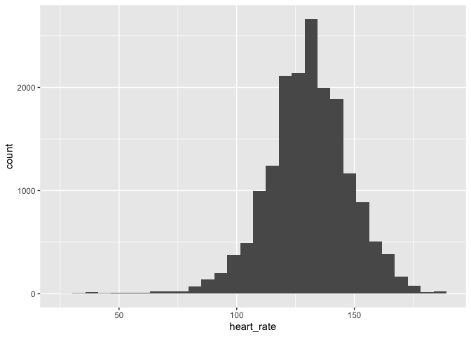
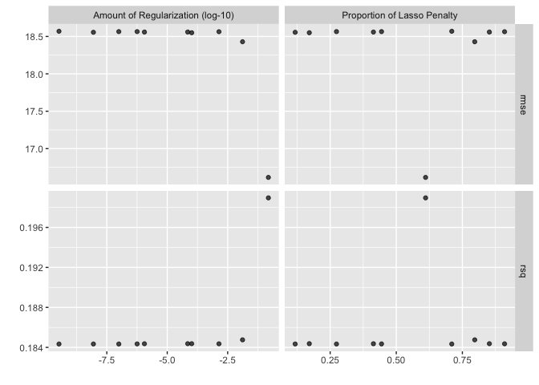
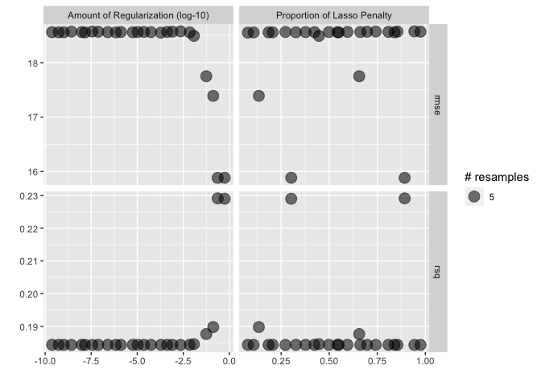
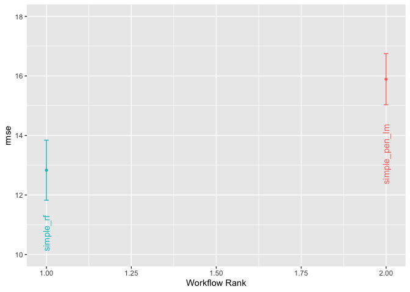
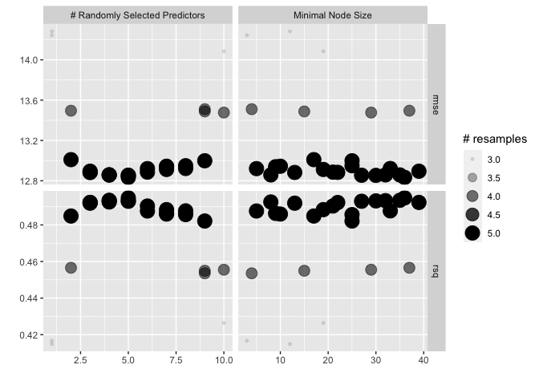
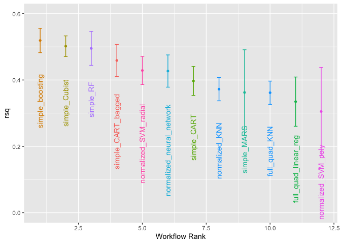
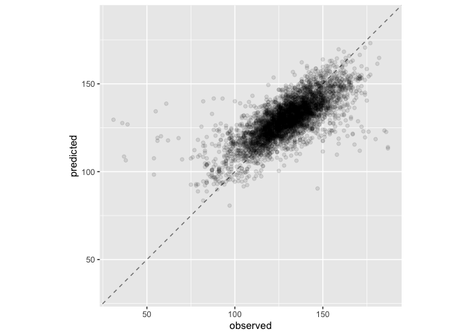

```r
library(tidyverse)
```

```
## ── Attaching core tidyverse packages ──────────────────────── tidyverse 2.0.0 ──
## ✔ dplyr     1.1.4     ✔ readr     2.1.5
## ✔ forcats   1.0.0     ✔ stringr   1.5.1
## ✔ ggplot2   3.4.4     ✔ tibble    3.2.1
## ✔ lubridate 1.9.3     ✔ tidyr     1.3.0
## ✔ purrr     1.0.2     
## ── Conflicts ────────────────────────────────────────── tidyverse_conflicts() ──
## ✖ dplyr::filter() masks stats::filter()
## ✖ dplyr::lag()    masks stats::lag()
## ℹ Use the conflicted package (<http://conflicted.r-lib.org/>) to force all conflicts to become errors
```

```r
library(GGally)
```

```
## Registered S3 method overwritten by 'GGally':
##   method from   
##   +.gg   ggplot2
```

```r
library(tidymodels)
```

```
## ── Attaching packages ────────────────────────────────────── tidymodels 1.1.1 ──
## ✔ broom        1.0.5      ✔ rsample      1.2.0 
## ✔ dials        1.2.0      ✔ tune         1.2.1 
## ✔ infer        1.0.5      ✔ workflows    1.1.4 
## ✔ modeldata    1.2.0      ✔ workflowsets 1.0.1 
## ✔ parsnip      1.2.1      ✔ yardstick    1.3.1 
## ✔ recipes      1.0.10     
## ── Conflicts ───────────────────────────────────────── tidymodels_conflicts() ──
## ✖ scales::discard() masks purrr::discard()
## ✖ dplyr::filter()   masks stats::filter()
## ✖ recipes::fixed()  masks stringr::fixed()
## ✖ dplyr::lag()      masks stats::lag()
## ✖ yardstick::spec() masks readr::spec()
## ✖ recipes::step()   masks stats::step()
## • Use suppressPackageStartupMessages() to eliminate package startup messages
```

```r
tidymodels_prefer()
library(finetune)
library(doMC)
```

```
## Loading required package: foreach
## 
## Attaching package: 'foreach'
## 
## The following objects are masked from 'package:purrr':
## 
##     accumulate, when
## 
## Loading required package: iterators
## Loading required package: parallel
```

```r
registerDoMC(cores = 7)
```

## Things to practice

* 11 resampling
* 12-14 tuning
* 15 many models
* 18 explaining models
* 19 should you trust your predictions
* 20 ensembles

## Load the data


```r
rides <- read_csv("ride_data_smaller.csv.gz")
```

```
## Rows: 17679 Columns: 14
## ── Column specification ────────────────────────────────────────────────────────
## Delimiter: ","
## chr   (1): name
## dbl  (11): distance, altitude, speed, heart_rate, cadence, temperature, mile...
## dttm  (1): timestamp
## date  (1): date
## 
## ℹ Use `spec()` to retrieve the full column specification for this data.
## ℹ Specify the column types or set `show_col_types = FALSE` to quiet this message.
```

```r
glimpse(rides)
```

```
## Rows: 17,679
## Columns: 14
## $ name           <chr> "2012-05-26T13-42-00Z-696102.fit", "2012-05-26T13-42-00…
## $ timestamp      <dttm> 2012-05-26 13:45:00, 2012-05-26 13:50:00, 2012-05-26 1…
## $ distance       <dbl> 0.3528270, 1.0155566, 1.7375589, 2.5621993, 3.4205552, …
## $ altitude       <dbl> 265.0919, 503.2808, 713.2546, 931.7585, 1088.5827, 1222…
## $ speed          <dbl> 8.283375, 6.364084, 10.815587, 8.046260, 11.142180, 7.1…
## $ heart_rate     <dbl> 137, 157, 147, 140, 146, 146, 148, 145, 124, 122, 99, 9…
## $ cadence        <dbl> 65, 58, 73, 55, 76, 63, 67, 71, 70, 86, 0, 38, 55, 71, …
## $ temperature    <dbl> 20, 16, 14, 12, 11, 11, 11, 10, 10, 11, 11, 19, 21, 23,…
## $ date           <date> 2012-05-26, 2012-05-26, 2012-05-26, 2012-05-26, 2012-0…
## $ miles_prev_14  <dbl> 111.6315, 111.6315, 111.6315, 111.6315, 111.6315, 111.6…
## $ miles_prev_28  <dbl> 111.6315, 111.6315, 111.6315, 111.6315, 111.6315, 111.6…
## $ altitude_delta <dbl> 0.56407423, 0.88582677, 0.59960177, 0.49741766, 0.55774…
## $ jm_age         <dbl> 45.1, 45.1, 45.1, 45.1, 45.1, 45.1, 45.1, 45.1, 45.1, 4…
## $ elapsed_time_m <dbl> 0.9, 6.0, 11.0, 16.0, 21.0, 26.0, 31.0, 36.0, 46.0, 51.…
```

```r
summary(rides)
```

```
##      name             timestamp                         distance        
##  Length:17679       Min.   :2012-05-26 13:45:00.00   Min.   :  0.00271  
##  Class :character   1st Qu.:2014-11-02 18:27:33.50   1st Qu.:  7.08939  
##  Mode  :character   Median :2017-04-08 15:10:04.00   Median : 14.65500  
##                     Mean   :2017-07-02 08:52:57.42   Mean   : 17.37713  
##                     3rd Qu.:2019-12-06 16:37:30.00   3rd Qu.: 23.55525  
##                     Max.   :2024-06-18 15:50:00.00   Max.   :109.92499  
##     altitude            speed         heart_rate       cadence     
##  Min.   :   0.656   Min.   : 0.00   Min.   : 30.0   Min.   :  0.0  
##  1st Qu.:  52.493   1st Qu.:14.71   1st Qu.:120.0   1st Qu.: 73.0  
##  Median :  83.333   Median :16.75   Median :131.0   Median : 81.0  
##  Mean   : 173.106   Mean   :16.18   Mean   :130.3   Mean   : 75.6  
##  3rd Qu.: 126.640   3rd Qu.:18.40   3rd Qu.:141.0   3rd Qu.: 88.0  
##  Max.   :7216.535   Max.   :40.55   Max.   :189.0   Max.   :127.0  
##   temperature         date            miles_prev_14    miles_prev_28  
##  Min.   : 0.00   Min.   :2012-05-26   Min.   :  0.00   Min.   :  0.0  
##  1st Qu.:14.00   1st Qu.:2014-11-02   1st Qu.: 69.09   1st Qu.:142.9  
##  Median :18.00   Median :2017-04-08   Median :114.80   Median :225.7  
##  Mean   :18.51   Mean   :2017-07-01   Mean   :115.77   Mean   :225.0  
##  3rd Qu.:23.00   3rd Qu.:2019-12-06   3rd Qu.:156.72   3rd Qu.:304.2  
##  Max.   :47.00   Max.   :2024-06-18   Max.   :296.53   Max.   :498.5  
##  altitude_delta           jm_age      elapsed_time_m    
##  Min.   :-30.183727   Min.   :45.10   Min.   :    0.00  
##  1st Qu.: -0.032808   1st Qu.:47.50   1st Qu.:   27.00  
##  Median :  0.000000   Median :49.90   Median :   55.00  
##  Mean   :  0.004987   Mean   :50.17   Mean   :   72.53  
##  3rd Qu.:  0.054681   3rd Qu.:52.60   3rd Qu.:   87.00  
##  Max.   : 30.839895   Max.   :57.10   Max.   :16096.10
```


```r
rides %>% ggplot(aes(x=heart_rate)) + geom_histogram()
```

```
## `stat_bin()` using `bins = 30`. Pick better value with `binwidth`.
```

<!-- -->


```r
rides %>% slice_sample(n=1000) %>% 
  select(heart_rate, everything(), -name, -timestamp) %>%
  ggpairs(progress = FALSE)
```

## Ex 1.  Training/test/cross validation split
Set.seed to 707 and make a 75/25 training/test split.  Make a v=5 cross validation set.  Should you be grouping by anything?


```r
set.seed(707)
rides_split <- group_initial_split(rides, group = name)
#rides_split <- slice_sample(rides, prop=0.1, by = name) %>% group_initial_split(group = name)
rides_train <- training(rides_split)
rides_test <- testing(rides_split)
rides_folds <- group_vfold_cv(rides_train, group = name, v=5)
```

## Ex 2. Create some recipes

Create a recipe `rec_simple` that specifies your outcome variable `heart_rate` and predictors (everthing but `name`, `date`, and `timestamp`)

Create a recipe `rec_normal` that normalizes (centers and scales) all predictors

Check to make sure your recipes are working as expected


```r
rec_simple <- recipe(heart_rate ~ ., data = rides_train) %>%
  step_rm(name, date, timestamp)

rec_simple
```

```
## 
```

```
## ── Recipe ──────────────────────────────────────────────────────────────────────
```

```
## 
```

```
## ── Inputs
```

```
## Number of variables by role
```

```
## outcome:    1
## predictor: 13
```

```
## 
```

```
## ── Operations
```

```
## • Variables removed: name, date, timestamp
```


```r
rec_normal <- rec_simple %>%
  step_normalize(all_predictors())

rec_normal
```

```
## 
```

```
## ── Recipe ──────────────────────────────────────────────────────────────────────
```

```
## 
```

```
## ── Inputs
```

```
## Number of variables by role
```

```
## outcome:    1
## predictor: 13
```

```
## 
```

```
## ── Operations
```

```
## • Variables removed: name, date, timestamp
```

```
## • Centering and scaling for: all_predictors()
```


```r
rec_simple %>% prep() %>% bake(rides_train) %>% head()
```

```
## # A tibble: 6 × 11
##   distance altitude speed cadence temperature miles_prev_14 miles_prev_28
##      <dbl>    <dbl> <dbl>   <dbl>       <dbl>         <dbl>         <dbl>
## 1     7.00     85.3  5.80      58          25          57.9          169.
## 2     7.62    314.   9.70      80          26          57.9          169.
## 3     8.43    509.   6.98      71          26          57.9          169.
## 4     9.15    701.   8.16      72          28          57.9          169.
## 5     9.73    912.   9.78      81          28          57.9          169.
## 6    11.0     913.  13.9       78          27          57.9          169.
## # ℹ 4 more variables: altitude_delta <dbl>, jm_age <dbl>, elapsed_time_m <dbl>,
## #   heart_rate <dbl>
```


```r
rec_normal %>% prep() %>% bake(rides_train) %>% summary()
```

```
##     distance          altitude           speed            cadence       
##  Min.   :-1.1616   Min.   :-0.4122   Min.   :-3.9765   Min.   :-3.4567  
##  1st Qu.:-0.6973   1st Qu.:-0.2957   1st Qu.:-0.3666   1st Qu.:-0.1534  
##  Median :-0.2018   Median :-0.2267   Median : 0.1375   Median : 0.2595  
##  Mean   : 0.0000   Mean   : 0.0000   Mean   : 0.0000   Mean   : 0.0000  
##  3rd Qu.: 0.3913   3rd Qu.:-0.1275   3rd Qu.: 0.5494   3rd Qu.: 0.5806  
##  Max.   : 5.9387   Max.   :15.4013   Max.   : 5.2656   Max.   : 2.3699  
##   temperature      miles_prev_14      miles_prev_28       altitude_delta      
##  Min.   :-2.7289   Min.   :-1.82147   Min.   :-2.104147   Min.   :-24.699660  
##  1st Qu.:-0.7252   1st Qu.:-0.72021   1st Qu.:-0.735043   1st Qu.: -0.055021  
##  Median :-0.1086   Median :-0.01862   Median :-0.009229   Median : -0.005633  
##  Mean   : 0.0000   Mean   : 0.00000   Mean   : 0.000000   Mean   :  0.000000  
##  3rd Qu.: 0.6621   3rd Qu.: 0.67554   3rd Qu.: 0.757002   3rd Qu.:  0.076681  
##  Max.   : 4.3613   Max.   : 2.82696   Max.   : 2.516224   Max.   : 25.676156  
##      jm_age        elapsed_time_m      heart_rate   
##  Min.   :-1.5105   Min.   :-0.6367   Min.   : 30.0  
##  1st Qu.:-0.8067   1st Qu.:-0.4087   1st Qu.:120.0  
##  Median :-0.1640   Median :-0.1655   Median :131.0  
##  Mean   : 0.0000   Mean   : 0.0000   Mean   :130.5  
##  3rd Qu.: 0.7846   3rd Qu.: 0.1121   3rd Qu.:142.0  
##  Max.   : 2.1618   Max.   :22.8836   Max.   :189.0
```

## Ex 3 Create two model specifications

Create a model specification `spec_lm_pen` for a penalized regression (hint see `?details_linear_reg_glmnet` for help).  Set the 2 hyperparameters for tuning.

Create a second model specification `spec_rf` for a random forest regression using ranger (see `?details_rand_forest_ranger`).  Set mtry and min_n for tuning


```r
spec_lm_pen <- linear_reg(penalty = tune(), mixture = tune(), engine = "glmnet")
```


```r
spec_rf <- rand_forest(mtry=tune(), min_n=tune(), mode = "regression", engine = "ranger")
```

## Ex 4, Workflow + grid tune

Create a workflow that includes the `rec_simple`` and the `spec_lm_pen` model specification.   (Note that while penalized regression is best with normalized predictors, it does this conversion by default, do we can just use the simple recipe for it).

Use the v-fold resampling to fit models and tune the hyper parameters using a grid search with a grid size of 10 (the default).  You'll want to set up parallel processing for this.  How long does it take?

I recommend leaving `save_pred = FALSE` and `save_workflow = FALSE` (these are the defaults).  This is contrary to some of the scripts in the book, but I think Rstudio stays happier with these settings.

Plot the results and also print a table of the best hyperparameters


```r
wf1 <- workflow(preprocessor = rec_simple, spec = spec_lm_pen)
system.time(wf1_tune <- wf1 %>% tune_grid(resamples = rides_folds))
```

```
##    user  system elapsed 
##   2.590   0.800   1.237
```


```r
show_best(wf1_tune, metric="rmse")
```

```
## # A tibble: 5 × 8
##         penalty mixture .metric .estimator  mean     n std_err .config          
##           <dbl>   <dbl> <chr>   <chr>      <dbl> <int>   <dbl> <chr>            
## 1 0.153           0.611 rmse    standard    16.6     5   0.706 Preprocessor1_Mo…
## 2 0.0130          0.797 rmse    standard    18.4     5   2.37  Preprocessor1_Mo…
## 3 0.000103        0.171 rmse    standard    18.5     5   2.49  Preprocessor1_Mo…
## 4 0.00000000881   0.118 rmse    standard    18.6     5   2.50  Preprocessor1_Mo…
## 5 0.00000114      0.414 rmse    standard    18.6     5   2.50  Preprocessor1_Mo…
```


```r
autoplot(wf1_tune)
```

<!-- -->


## Ex 5: Racing

Repeat Ex 4 but use a grid size of 25 and racing to reduced the amount of time (how much time does it take?)

I recommend leaving `save_pred = FALSE` and `save_workflow = FALSE` (these are the defaults).  This is contrary to some of the scripts in the book, but I think Rstudio stays happier with these settings.

Plot the results and also print a table of the best models


```r
race_ctrl <- control_race(save_pred = FALSE, parallel_over = "everything")
system.time(wf1_race <- wf1 %>% tune_race_anova(resamples = rides_folds, grid = 25, control=race_ctrl))
```

```
##    user  system elapsed 
##  10.716   2.354   3.630
```


```r
show_best(wf1_race, metric = "rmse")
```

```
## # A tibble: 5 × 8
##   penalty mixture .metric .estimator  mean     n std_err .config              
##     <dbl>   <dbl> <chr>   <chr>      <dbl> <int>   <dbl> <chr>                
## 1  0.233    0.892 rmse    standard    15.9     5   0.525 Preprocessor1_Model23
## 2  0.561    0.302 rmse    standard    15.9     5   0.524 Preprocessor1_Model07
## 3  0.134    0.134 rmse    standard    17.4     5   1.37  Preprocessor1_Model03
## 4  0.0561   0.656 rmse    standard    17.8     5   1.72  Preprocessor1_Model16
## 5  0.0119   0.446 rmse    standard    18.5     5   2.43  Preprocessor1_Model11
```


```r
autoplot(wf1_race)
```

<!-- -->

## Exercise 6 workflow set, tuning

Now create a workflow set that uses the `rec_simple` recipe and both two model specifications. Tune them using racing.  Plot the results and print summaries of the best.  Did the penalized regression or the random forests provide a better fit?  


```r
wfs1 <- workflow_set(preproc = list(simple=rec_simple), models = list(pen_lm=spec_lm_pen, rf=spec_rf))

system.time(wfs1_race <- wfs1 %>% workflow_map("tune_race_anova", control=race_ctrl, grid=25, resamples=rides_folds))
```

```
## i Creating pre-processing data to finalize unknown parameter: mtry
```

```
##     user   system  elapsed 
## 1517.197   79.224  364.405
```
time was 137 sec on "smaller" data set


```r
wfs1_race$result[[2]]$.metrics[[1]]
```

```
## # A tibble: 50 × 6
##     mtry min_n .metric .estimator .estimate .config              
##    <int> <int> <chr>   <chr>          <dbl> <chr>                
##  1     7    10 rmse    standard      14.1   Preprocessor1_Model01
##  2     7    10 rsq     standard       0.429 Preprocessor1_Model01
##  3     7    19 rmse    standard      14.1   Preprocessor1_Model02
##  4     7    19 rsq     standard       0.432 Preprocessor1_Model02
##  5     9    25 rmse    standard      14.1   Preprocessor1_Model03
##  6     9    25 rsq     standard       0.431 Preprocessor1_Model03
##  7     5    30 rmse    standard      14.1   Preprocessor1_Model04
##  8     5    30 rsq     standard       0.429 Preprocessor1_Model04
##  9     3    22 rmse    standard      14.2   Preprocessor1_Model05
## 10     3    22 rsq     standard       0.421 Preprocessor1_Model05
## # ℹ 40 more rows
```


```r
rank_results(wfs1_race, rank_metric = "rmse", select_best = TRUE)
```

```
## # A tibble: 4 × 9
##   wflow_id      .config    .metric   mean std_err     n preprocessor model  rank
##   <chr>         <chr>      <chr>    <dbl>   <dbl> <int> <chr>        <chr> <int>
## 1 simple_rf     Preproces… rmse    12.8    0.613      5 recipe       rand…     1
## 2 simple_rf     Preproces… rsq      0.495  0.0320     5 recipe       rand…     1
## 3 simple_pen_lm Preproces… rmse    15.9    0.523      5 recipe       line…     2
## 4 simple_pen_lm Preproces… rsq      0.228  0.0271     5 recipe       line…     2
```


```r
autoplot(
   wfs1_race,
   rank_metric = "rmse",  
   metric = "rmse",       
   select_best = TRUE    
) +
   geom_text(aes(y = mean - 1.5, label = wflow_id), angle = 90, hjust = 1) +
   lims(y = c(10, 18)) +
   theme(legend.position = "none")
```

<!-- -->
## Exercise 7
Can you figure out how to extract and plot/summarize the data for just the random forest spec?  (I want output analagous to what you did for Exercise 5)

## Exercise 8

Using the results from Exercise 6 as a starting point, use a Bayesian tune to see if you can further improve the random forest fit.

Hint: you will neeed to use `extract_parameter_set_dials(spec_rf) %>%
  finalize(rides_train)`  to create a parameter set to feed into the Bayesian tuning function


```r
wfs1_race$result[[2]] %>% autoplot()
```

<!-- -->


```r
wfs1_race$result[[1]]$.metrics[[2]]
```

```
## # A tibble: 50 × 6
##     penalty mixture .metric .estimator .estimate .config              
##       <dbl>   <dbl> <chr>   <chr>          <dbl> <chr>                
##  1 3.35e-10  0.0692 rmse    standard      16.2   Preprocessor1_Model01
##  2 3.35e-10  0.0692 rsq     standard       0.227 Preprocessor1_Model01
##  3 2.42e- 2  0.104  rmse    standard      16.2   Preprocessor1_Model02
##  4 2.42e- 2  0.104  rsq     standard       0.227 Preprocessor1_Model02
##  5 5.21e- 5  0.131  rmse    standard      16.2   Preprocessor1_Model03
##  6 5.21e- 5  0.131  rsq     standard       0.227 Preprocessor1_Model03
##  7 8.41e- 8  0.193  rmse    standard      16.2   Preprocessor1_Model04
##  8 8.41e- 8  0.193  rsq     standard       0.227 Preprocessor1_Model04
##  9 8.87e- 4  0.229  rmse    standard      16.2   Preprocessor1_Model05
## 10 8.87e- 4  0.229  rsq     standard       0.227 Preprocessor1_Model05
## # ℹ 40 more rows
```


```r
ctrl_bayes <- control_bayes(verbose = TRUE)
rf_params <- extract_parameter_set_dials(spec_rf) %>%
  finalize(rides_train)
rf_wf <- workflow(preprocessor = rec_simple, spec=spec_rf)
rf_bo <-
  rf_wf %>%
  tune_bayes(
    resamples = rides_folds,
    initial = wfs1_race$result[[2]],
    iter = 25,
    param_info = rf_params,
    control = ctrl_bayes
  )
```

```
## i Gaussian process model
```

```
## ✓ Gaussian process model
```

```
## i Generating 527 candidates
```

```
## i Predicted candidates
```

```
## i Estimating performance
```

```
## ✓ Estimating performance
```

```
## i Gaussian process model
```

```
## ✓ Gaussian process model
```

```
## i Generating 527 candidates
```

```
## i Predicted candidates
```

```
## i Estimating performance
```

```
## ✓ Estimating performance
```

```
## i Gaussian process model
```

```
## ✓ Gaussian process model
```

```
## i Generating 526 candidates
```

```
## i Predicted candidates
```

```
## i Estimating performance
```

```
## ✓ Estimating performance
```

```
## i Gaussian process model
```

```
## ✓ Gaussian process model
```

```
## i Generating 525 candidates
```

```
## i Predicted candidates
```

```
## i Estimating performance
```

```
## ✓ Estimating performance
```

```
## i Gaussian process model
```

```
## ✓ Gaussian process model
```

```
## i Generating 524 candidates
```

```
## i Predicted candidates
```

```
## i Estimating performance
```

```
## ✓ Estimating performance
```

```
## i Gaussian process model
```

```
## ✓ Gaussian process model
```

```
## i Generating 523 candidates
```

```
## i Predicted candidates
```

```
## i Estimating performance
```

```
## ✓ Estimating performance
```

```
## i Gaussian process model
```

```
## ✓ Gaussian process model
```

```
## i Generating 521 candidates
```

```
## i Predicted candidates
```

```
## i Estimating performance
```

```
## ✓ Estimating performance
```

```
## i Gaussian process model
```

```
## ✓ Gaussian process model
```

```
## i Generating 520 candidates
```

```
## i Predicted candidates
```

```
## i Estimating performance
```

```
## ✓ Estimating performance
```

```
## i Gaussian process model
```

```
## ✓ Gaussian process model
```

```
## i Generating 520 candidates
```

```
## i Predicted candidates
```

```
## i Estimating performance
```

```
## ✓ Estimating performance
```

```
## i Gaussian process model
```

```
## ✓ Gaussian process model
```

```
## i Generating 518 candidates
```

```
## i Predicted candidates
```

```
## i Estimating performance
```

```
## ✓ Estimating performance
```

```
## ! No improvement for 10 iterations; returning current results.
```


```r
show_best(rf_bo)
```

```
## Warning in show_best(rf_bo): No value of `metric` was given; "rmse" will be
## used.
```

```
## # A tibble: 5 × 9
##    mtry min_n .metric .estimator  mean     n std_err .config               .iter
##   <int> <int> <chr>   <chr>      <dbl> <int>   <dbl> <chr>                 <int>
## 1     5    36 rmse    standard    12.8     5   0.613 Preprocessor1_Model17     0
## 2     4    18 rmse    standard    12.8     5   0.607 Iter2                     2
## 3     5    40 rmse    standard    12.8     5   0.601 Iter3                     3
## 4     5    37 rmse    standard    12.8     5   0.608 Iter6                     6
## 5     5    35 rmse    standard    12.8     5   0.604 Iter8                     8
```


## Exercise 9
okay, now that we have reviewed how this works, fit as many extra models as you would like to come up with the best predictive fit that you can.  See Chapter 15 for a bunch of possibilities.  You may want to do these as a workflow set (or sets) to make comparison easier.

### An additional recipe

```r
rec_poly <- 
   rec_normal %>% 
   step_poly(all_predictors()) %>% 
   step_interact(~ all_predictors():all_predictors())
```

### Create some model specifications

```r
library(rules)
library(baguette)

spec_nnet <- 
   mlp(hidden_units = tune(), penalty = tune(), epochs = tune()) %>% 
   set_engine("nnet", MaxNWts = 2600) %>% 
   set_mode("regression")

spec_mars <- 
   mars(prod_degree = tune()) %>%  #<- use GCV to choose terms
   set_engine("earth") %>% 
   set_mode("regression")

spec_svm_r <- 
   svm_rbf(cost = tune(), rbf_sigma = tune()) %>% 
   set_engine("kernlab") %>% 
   set_mode("regression")

spec_svm_p <- 
   svm_poly(cost = tune(), degree = tune()) %>% 
   set_engine("kernlab") %>% 
   set_mode("regression")

spec_knn <- 
   nearest_neighbor(neighbors = tune(), dist_power = tune(), weight_func = tune()) %>% 
   set_engine("kknn") %>% 
   set_mode("regression")

spec_cart <- 
   decision_tree(cost_complexity = tune(), min_n = tune()) %>% 
   set_engine("rpart") %>% 
   set_mode("regression")

spec_bag_cart <- 
   bag_tree() %>% 
   set_engine("rpart", times = 50L) %>% 
   set_mode("regression")

spec_rf <- 
   rand_forest(mtry = tune(), min_n = tune(), trees = 1000) %>% 
   set_engine("ranger") %>% 
   set_mode("regression")

spec_xgb <- 
   boost_tree(tree_depth = tune(), learn_rate = tune(), loss_reduction = tune(), 
              min_n = tune(), sample_size = tune(), trees = tune()) %>% 
   set_engine("xgboost") %>% 
   set_mode("regression")

spec_cubist <- 
   cubist_rules(committees = tune(), neighbors = tune()) %>% 
   set_engine("Cubist") 
```


```r
nnet_param <- 
   spec_nnet %>% 
   extract_parameter_set_dials() %>% 
   update(hidden_units = hidden_units(c(1, 27)))
```


### combine recipes and model specifications into worflow sets


```r
normalized <- 
   workflow_set(
      preproc = list(normalized = rec_normal), 
      models = list(SVM_radial = spec_svm_r, SVM_poly = spec_svm_p, 
                    KNN = spec_knn, neural_network = spec_nnet)
   )

normalized <- 
   normalized %>% 
   option_add(param_info = nnet_param, id = "normalized_neural_network")

normalized
```

```
## # A workflow set/tibble: 4 × 4
##   wflow_id                  info             option    result    
##   <chr>                     <list>           <list>    <list>    
## 1 normalized_SVM_radial     <tibble [1 × 4]> <opts[0]> <list [0]>
## 2 normalized_SVM_poly       <tibble [1 × 4]> <opts[0]> <list [0]>
## 3 normalized_KNN            <tibble [1 × 4]> <opts[0]> <list [0]>
## 4 normalized_neural_network <tibble [1 × 4]> <opts[1]> <list [0]>
```

models using the unmodified predictors

```r
no_pre_proc <- 
   workflow_set(
      preproc = list(simple = rec_simple), 
      models = list(MARS = spec_mars, CART = spec_cart, CART_bagged = spec_bag_cart,
                    RF = spec_rf, boosting = spec_xgb, Cubist = spec_cubist)
   )
no_pre_proc
```

```
## # A workflow set/tibble: 6 × 4
##   wflow_id           info             option    result    
##   <chr>              <list>           <list>    <list>    
## 1 simple_MARS        <tibble [1 × 4]> <opts[0]> <list [0]>
## 2 simple_CART        <tibble [1 × 4]> <opts[0]> <list [0]>
## 3 simple_CART_bagged <tibble [1 × 4]> <opts[0]> <list [0]>
## 4 simple_RF          <tibble [1 × 4]> <opts[0]> <list [0]>
## 5 simple_boosting    <tibble [1 × 4]> <opts[0]> <list [0]>
## 6 simple_Cubist      <tibble [1 × 4]> <opts[0]> <list [0]>
```

models using the polynomial and interactions:

```r
with_features <- 
   workflow_set(
      preproc = list(full_quad = rec_poly), 
      models = list(linear_reg = spec_lm_pen, KNN = spec_knn)
   )
```

bring it all together

```r
all_workflows <- 
   bind_rows(no_pre_proc, normalized, with_features) %>% 
   # Make the workflow ID's a little more simple: 
   mutate(wflow_id = gsub("(simple_)|(normalized_)", "", wflow_id))
all_workflows
```

```
## # A workflow set/tibble: 12 × 4
##    wflow_id             info             option    result    
##    <chr>                <list>           <list>    <list>    
##  1 MARS                 <tibble [1 × 4]> <opts[0]> <list [0]>
##  2 CART                 <tibble [1 × 4]> <opts[0]> <list [0]>
##  3 CART_bagged          <tibble [1 × 4]> <opts[0]> <list [0]>
##  4 RF                   <tibble [1 × 4]> <opts[0]> <list [0]>
##  5 boosting             <tibble [1 × 4]> <opts[0]> <list [0]>
##  6 Cubist               <tibble [1 × 4]> <opts[0]> <list [0]>
##  7 SVM_radial           <tibble [1 × 4]> <opts[0]> <list [0]>
##  8 SVM_poly             <tibble [1 × 4]> <opts[0]> <list [0]>
##  9 KNN                  <tibble [1 × 4]> <opts[0]> <list [0]>
## 10 neural_network       <tibble [1 × 4]> <opts[1]> <list [0]>
## 11 full_quad_linear_reg <tibble [1 × 4]> <opts[0]> <list [0]>
## 12 full_quad_KNN        <tibble [1 × 4]> <opts[0]> <list [0]>
```

## fit the models, using a racing approach


```r
race_ctrl <-
   control_race(
      save_pred = FALSE,
      parallel_over = "everything",
      save_workflow = FALSE
   )
```


```r
system.time(simple_results <-
   no_pre_proc %>%
   workflow_map(
      "tune_race_anova",
      seed = 707,
      resamples = rides_folds,
      grid = 25,
      control = race_ctrl
   ))
```

```
## i Creating pre-processing data to finalize unknown parameter: mtry
```

```
##     user   system  elapsed 
## 6288.224  312.460 1590.069
```
12 minutes


```r
system.time(norm_results <-
   normalized %>%
   workflow_map(
      "tune_race_anova",
      seed = 707,
      resamples = rides_folds,
      grid = 25,
      control = race_ctrl
   ))
```

```
##      user    system   elapsed 
## 55816.232  2341.586 14523.308
```

2 hours, 15 minutes


```r
system.time(feature_results <-
   with_features %>%
   workflow_map(
      "tune_race_anova",
      seed = 707,
      resamples = rides_folds,
      grid = 25,
      control = race_ctrl
   ))
```

```
##      user    system   elapsed 
## 38048.541  1273.832  7819.660
```

80 minutes

bring the results together...


```r
all_results <- bind_rows(simple_results, norm_results, feature_results)
```


```r
all_results %>% 
   rank_results(rank_metric = "rsq") %>% 
  # filter(.metric == "rsq") %>% 
   select(wflow_id, model, .config, rsq = mean, rank)
```

```
## # A tibble: 192 × 5
##    wflow_id        model      .config                  rsq  rank
##    <chr>           <chr>      <chr>                  <dbl> <int>
##  1 simple_boosting boost_tree Preprocessor1_Model10 12.5       1
##  2 simple_boosting boost_tree Preprocessor1_Model10  0.519     1
##  3 simple_boosting boost_tree Preprocessor1_Model23 12.5       2
##  4 simple_boosting boost_tree Preprocessor1_Model23  0.518     2
##  5 simple_boosting boost_tree Preprocessor1_Model24 12.6       3
##  6 simple_boosting boost_tree Preprocessor1_Model24  0.514     3
##  7 simple_boosting boost_tree Preprocessor1_Model15 12.7       4
##  8 simple_boosting boost_tree Preprocessor1_Model15  0.512     4
##  9 simple_boosting boost_tree Preprocessor1_Model13 12.7       5
## 10 simple_boosting boost_tree Preprocessor1_Model13  0.508     5
## # ℹ 182 more rows
```


```r
autoplot(
   all_results,
   rank_metric = "rsq",  # <- how to order models
   metric = "rsq",       # <- which metric to visualize
   select_best = TRUE     # <- one point per workflow
) +
   geom_text(aes(y = mean - .1, label = wflow_id), angle = 90, hjust = 1) +
   lims(y = c(0, 0.6)) +
   theme(legend.position = "none")
```

<!-- -->


```r
save(all_results, file="TMWR_wrapup_all_race_results.Rdata")
```

## Exercise 10

get the best model, fit to the test set, check metrics, and plot observed versus predicted


```r
best_results <- 
   all_results %>% 
   extract_workflow_set_result("simple_boosting") %>% 
   select_best(metric = "rmse")
best_results
```

```
## # A tibble: 1 × 7
##   trees min_n tree_depth learn_rate loss_reduction sample_size .config          
##   <int> <int>      <int>      <dbl>          <dbl>       <dbl> <chr>            
## 1   953    16          4     0.0131       8.60e-10       0.379 Preprocessor1_Mo…
```

```r
boosting_test_results <- 
   all_results %>% 
   extract_workflow("simple_boosting") %>% 
   finalize_workflow(best_results) %>% 
   last_fit(split = rides_split)
```


```r
collect_metrics(boosting_test_results)
```

```
## # A tibble: 2 × 4
##   .metric .estimator .estimate .config             
##   <chr>   <chr>          <dbl> <chr>               
## 1 rmse    standard      11.6   Preprocessor1_Model1
## 2 rsq     standard       0.542 Preprocessor1_Model1
```


```r
boosting_test_results %>% 
   collect_predictions() %>% 
   ggplot(aes(x = heart_rate, y = .pred)) + 
   geom_abline(color = "gray50", lty = 2) + 
   geom_point(alpha = 0.1) + 
   coord_obs_pred() + 
   labs(x = "observed", y = "predicted")
```

<!-- -->


## Trying to improve with Bayes (no real improvement)

```r
boost_wflow <- workflow(preprocessor = rec_simple, spec = spec_xgb)

bayes_tune_boost <- tune_bayes(boost_wflow, resamples = rides_folds, initial=25, control=ctrl_bayes)
```

```
## 
```

```
## ❯  Generating a set of 25 initial parameter results
```

```
## ✓ Initialization complete
```

```
## 
```

```
## i Gaussian process model
```

```
## ✓ Gaussian process model
```

```
## i Generating 5000 candidates
```

```
## i Predicted candidates
```

```
## i Estimating performance
```

```
## ✓ Estimating performance
```

```
## i Gaussian process model
```

```
## ✓ Gaussian process model
```

```
## i Generating 5000 candidates
```

```
## i Predicted candidates
```

```
## i Estimating performance
```

```
## ✓ Estimating performance
```

```
## i Gaussian process model
```

```
## ✓ Gaussian process model
```

```
## i Generating 5000 candidates
```

```
## i Predicted candidates
```

```
## i Estimating performance
```

```
## ✓ Estimating performance
```

```
## i Gaussian process model
```

```
## ✓ Gaussian process model
```

```
## i Generating 5000 candidates
```

```
## i Predicted candidates
```

```
## i Estimating performance
```

```
## ✓ Estimating performance
```

```
## i Gaussian process model
```

```
## ✓ Gaussian process model
```

```
## i Generating 5000 candidates
```

```
## i Predicted candidates
```

```
## i Estimating performance
```

```
## ✓ Estimating performance
```

```
## i Gaussian process model
```

```
## ✓ Gaussian process model
```

```
## i Generating 5000 candidates
```

```
## i Predicted candidates
```

```
## i Estimating performance
```

```
## ✓ Estimating performance
```

```
## i Gaussian process model
```

```
## ✓ Gaussian process model
```

```
## i Generating 5000 candidates
```

```
## i Predicted candidates
```

```
## i Estimating performance
```

```
## ✓ Estimating performance
```

```
## i Gaussian process model
```

```
## ✓ Gaussian process model
```

```
## i Generating 5000 candidates
```

```
## i Predicted candidates
```

```
## i Estimating performance
```

```
## ✓ Estimating performance
```

```
## i Gaussian process model
```

```
## ✓ Gaussian process model
```

```
## i Generating 5000 candidates
```

```
## i Predicted candidates
```

```
## i Estimating performance
```

```
## ✓ Estimating performance
```

```
## i Gaussian process model
```

```
## ✓ Gaussian process model
```

```
## i Generating 5000 candidates
```

```
## i Predicted candidates
```

```
## i Estimating performance
```

```
## ✓ Estimating performance
```

```
## ! No improvement for 10 iterations; returning current results.
```

```r
show_best(bayes_tune_boost, metric = "rsq")
```

```
## # A tibble: 5 × 13
##   trees min_n tree_depth learn_rate loss_reduction sample_size .metric
##   <int> <int>      <int>      <dbl>          <dbl>       <dbl> <chr>  
## 1   931    14         10    0.00585      0.000364        0.405 rsq    
## 2  1464    12          3    0.0141       0.0000146       0.597 rsq    
## 3  1923    10          4    0.00993      0.00131         0.162 rsq    
## 4  1996     5          4    0.00457      1.55            0.321 rsq    
## 5  1103    21         10    0.00808      0.000336        0.100 rsq    
## # ℹ 6 more variables: .estimator <chr>, mean <dbl>, n <int>, std_err <dbl>,
## #   .config <chr>, .iter <int>
```

