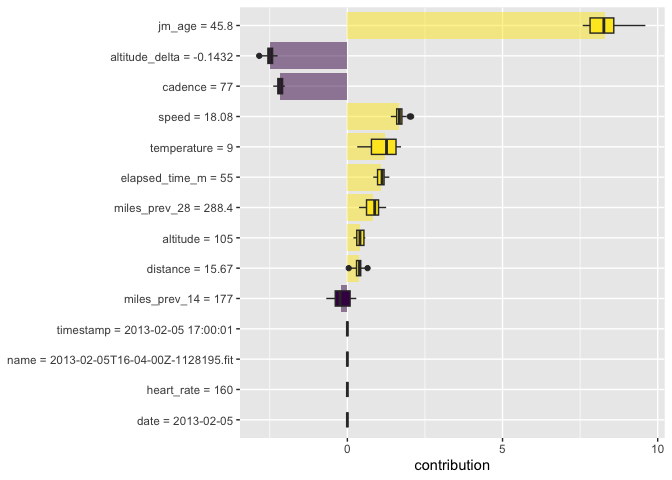
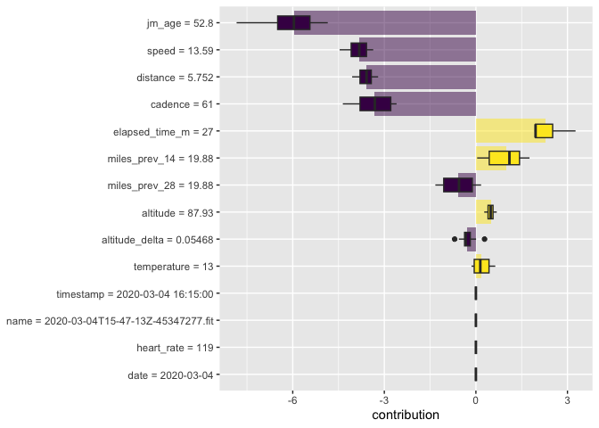
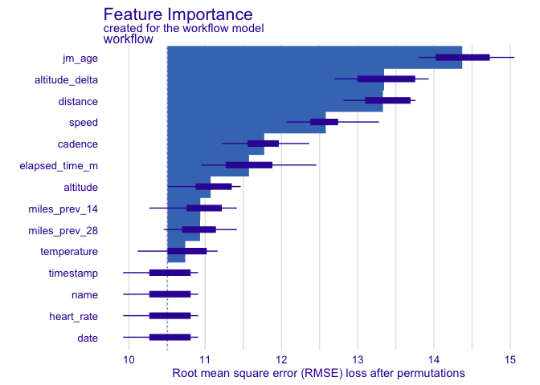
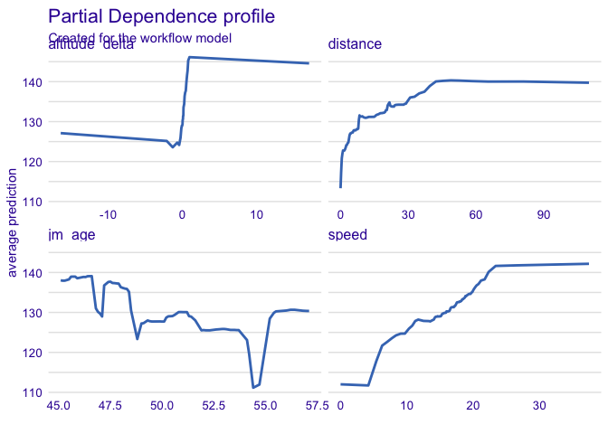

```r
library(tidyverse)
```

```
## ── Attaching core tidyverse packages ──────────────────────── tidyverse 2.0.0 ──
## ✔ dplyr     1.1.4     ✔ readr     2.1.5
## ✔ forcats   1.0.0     ✔ stringr   1.5.1
## ✔ ggplot2   3.4.4     ✔ tibble    3.2.1
## ✔ lubridate 1.9.3     ✔ tidyr     1.3.0
## ✔ purrr     1.0.2     
## ── Conflicts ────────────────────────────────────────── tidyverse_conflicts() ──
## ✖ dplyr::filter() masks stats::filter()
## ✖ dplyr::lag()    masks stats::lag()
## ℹ Use the conflicted package (<http://conflicted.r-lib.org/>) to force all conflicts to become errors
```

```r
library(GGally)
```

```
## Registered S3 method overwritten by 'GGally':
##   method from   
##   +.gg   ggplot2
```

```r
library(tidymodels)
```

```
## ── Attaching packages ────────────────────────────────────── tidymodels 1.1.1 ──
## ✔ broom        1.0.5      ✔ rsample      1.2.0 
## ✔ dials        1.2.0      ✔ tune         1.2.1 
## ✔ infer        1.0.5      ✔ workflows    1.1.4 
## ✔ modeldata    1.2.0      ✔ workflowsets 1.0.1 
## ✔ parsnip      1.2.1      ✔ yardstick    1.3.1 
## ✔ recipes      1.0.10     
## ── Conflicts ───────────────────────────────────────── tidymodels_conflicts() ──
## ✖ scales::discard() masks purrr::discard()
## ✖ dplyr::filter()   masks stats::filter()
## ✖ recipes::fixed()  masks stringr::fixed()
## ✖ dplyr::lag()      masks stats::lag()
## ✖ yardstick::spec() masks readr::spec()
## ✖ recipes::step()   masks stats::step()
## • Use suppressPackageStartupMessages() to eliminate package startup messages
```

```r
tidymodels_prefer()
library(finetune)
library(doMC)
```

```
## Loading required package: foreach
## 
## Attaching package: 'foreach'
## 
## The following objects are masked from 'package:purrr':
## 
##     accumulate, when
## 
## Loading required package: iterators
## Loading required package: parallel
```

```r
registerDoMC(cores = 8)
library(DALEXtra)
```

```
## Loading required package: DALEX
## Welcome to DALEX (version: 2.4.3).
## Find examples and detailed introduction at: http://ema.drwhy.ai/
## Additional features will be available after installation of: ggpubr.
## Use 'install_dependencies()' to get all suggested dependencies
## 
## Attaching package: 'DALEX'
## 
## The following object is masked from 'package:dplyr':
## 
##     explain
```

```r
library(forcats)
library(stacks)
```

## Things to practice

* 18 explaining models
* 19 should you trust your predictions
* 20 ensembles

## Load the data


```r
rides <- read_csv("ride_data_smaller.csv.gz")
```

```
## Rows: 17679 Columns: 14
## ── Column specification ────────────────────────────────────────────────────────
## Delimiter: ","
## chr   (1): name
## dbl  (11): distance, altitude, speed, heart_rate, cadence, temperature, mile...
## dttm  (1): timestamp
## date  (1): date
## 
## ℹ Use `spec()` to retrieve the full column specification for this data.
## ℹ Specify the column types or set `show_col_types = FALSE` to quiet this message.
```

```r
glimpse(rides)
```

```
## Rows: 17,679
## Columns: 14
## $ name           <chr> "2012-05-26T13-42-00Z-696102.fit", "2012-05-26T13-42-00…
## $ timestamp      <dttm> 2012-05-26 13:45:00, 2012-05-26 13:50:00, 2012-05-26 1…
## $ distance       <dbl> 0.3528270, 1.0155566, 1.7375589, 2.5621993, 3.4205552, …
## $ altitude       <dbl> 265.0919, 503.2808, 713.2546, 931.7585, 1088.5827, 1222…
## $ speed          <dbl> 8.283375, 6.364084, 10.815587, 8.046260, 11.142180, 7.1…
## $ heart_rate     <dbl> 137, 157, 147, 140, 146, 146, 148, 145, 124, 122, 99, 9…
## $ cadence        <dbl> 65, 58, 73, 55, 76, 63, 67, 71, 70, 86, 0, 38, 55, 71, …
## $ temperature    <dbl> 20, 16, 14, 12, 11, 11, 11, 10, 10, 11, 11, 19, 21, 23,…
## $ date           <date> 2012-05-26, 2012-05-26, 2012-05-26, 2012-05-26, 2012-0…
## $ miles_prev_14  <dbl> 111.6315, 111.6315, 111.6315, 111.6315, 111.6315, 111.6…
## $ miles_prev_28  <dbl> 111.6315, 111.6315, 111.6315, 111.6315, 111.6315, 111.6…
## $ altitude_delta <dbl> 0.56407423, 0.88582677, 0.59960177, 0.49741766, 0.55774…
## $ jm_age         <dbl> 45.1, 45.1, 45.1, 45.1, 45.1, 45.1, 45.1, 45.1, 45.1, 4…
## $ elapsed_time_m <dbl> 0.9, 6.0, 11.0, 16.0, 21.0, 26.0, 31.0, 36.0, 46.0, 51.…
```

```r
summary(rides)
```

```
##      name             timestamp                         distance        
##  Length:17679       Min.   :2012-05-26 13:45:00.00   Min.   :  0.00271  
##  Class :character   1st Qu.:2014-11-02 18:27:33.50   1st Qu.:  7.08939  
##  Mode  :character   Median :2017-04-08 15:10:04.00   Median : 14.65500  
##                     Mean   :2017-07-02 08:52:57.42   Mean   : 17.37713  
##                     3rd Qu.:2019-12-06 16:37:30.00   3rd Qu.: 23.55525  
##                     Max.   :2024-06-18 15:50:00.00   Max.   :109.92499  
##     altitude            speed         heart_rate       cadence     
##  Min.   :   0.656   Min.   : 0.00   Min.   : 30.0   Min.   :  0.0  
##  1st Qu.:  52.493   1st Qu.:14.71   1st Qu.:120.0   1st Qu.: 73.0  
##  Median :  83.333   Median :16.75   Median :131.0   Median : 81.0  
##  Mean   : 173.106   Mean   :16.18   Mean   :130.3   Mean   : 75.6  
##  3rd Qu.: 126.640   3rd Qu.:18.40   3rd Qu.:141.0   3rd Qu.: 88.0  
##  Max.   :7216.535   Max.   :40.55   Max.   :189.0   Max.   :127.0  
##   temperature         date            miles_prev_14    miles_prev_28  
##  Min.   : 0.00   Min.   :2012-05-26   Min.   :  0.00   Min.   :  0.0  
##  1st Qu.:14.00   1st Qu.:2014-11-02   1st Qu.: 69.09   1st Qu.:142.9  
##  Median :18.00   Median :2017-04-08   Median :114.80   Median :225.7  
##  Mean   :18.51   Mean   :2017-07-01   Mean   :115.77   Mean   :225.0  
##  3rd Qu.:23.00   3rd Qu.:2019-12-06   3rd Qu.:156.72   3rd Qu.:304.2  
##  Max.   :47.00   Max.   :2024-06-18   Max.   :296.53   Max.   :498.5  
##  altitude_delta           jm_age      elapsed_time_m    
##  Min.   :-30.183727   Min.   :45.10   Min.   :    0.00  
##  1st Qu.: -0.032808   1st Qu.:47.50   1st Qu.:   27.00  
##  Median :  0.000000   Median :49.90   Median :   55.00  
##  Mean   :  0.004987   Mean   :50.17   Mean   :   72.53  
##  3rd Qu.:  0.054681   3rd Qu.:52.60   3rd Qu.:   87.00  
##  Max.   : 30.839895   Max.   :57.10   Max.   :16096.10
```


```r
set.seed(707)
rides_split <- group_initial_split(rides, group = name)
#rides_split <- slice_sample(rides, prop=0.1, by = name) %>% group_initial_split(group = name)
rides_train <- training(rides_split)
rides_test <- testing(rides_split)
rides_folds <- group_vfold_cv(rides_train, group = name, v=5)
```


```r
load(file="TMWR_wrapup_all_race_results.Rdata")
load
```

```
## function (file, envir = parent.frame(), verbose = FALSE) 
## {
##     if (is.character(file)) {
##         con <- gzfile(file)
##         on.exit(close(con))
##         magic <- readChar(con, 5L, useBytes = TRUE)
##         if (!length(magic)) 
##             stop("empty (zero-byte) input file")
##         if (!grepl("RD[ABX][2-9]\n", magic)) {
##             if (grepl("RD[ABX][2-9]\r", magic)) 
##                 stop("input has been corrupted, with LF replaced by CR")
##             warning(sprintf("file %s has magic number '%s'\n", 
##                 sQuote(basename(file)), gsub("[\n\r]*", "", magic)), 
##                 "  ", "Use of save versions prior to 2 is deprecated", 
##                 domain = NA, call. = FALSE)
##             return(.Internal(load(file, envir)))
##         }
##     }
##     else if (inherits(file, "connection")) {
##         con <- if (inherits(file, "gzfile") || inherits(file, 
##             "gzcon")) 
##             file
##         else gzcon(file)
##     }
##     else stop("bad 'file' argument")
##     if (verbose) 
##         cat("Loading objects:\n")
##     .Internal(loadFromConn2(con, envir, verbose))
## }
## <bytecode: 0x11c050f60>
## <environment: namespace:base>
```

## Exercise 1

Retrieve the best model and fit it to the _rides_train_ data set.


```r
best_results <- 
   all_results %>% 
   extract_workflow_set_result("simple_boosting") %>% 
   select_best(metric = "rmse")

boosting_fit <- 
   all_results %>% 
   extract_workflow("simple_boosting") %>% 
   finalize_workflow(best_results) %>%
  fit(rides_train)
```

## Exercise 2

Find local explanations for how the model predicts the 1000th and 10000th observation in the training data set.  Plot the results.


```r
explainer_boost <- explain_tidymodels(
  boosting_fit,
  data=rides_train,
  y=rides_train$heart_rate
)
```

```
## Preparation of a new explainer is initiated
##   -> model label       :  workflow  (  default  )
##   -> data              :  13268  rows  14  cols 
##   -> data              :  tibble converted into a data.frame 
##   -> target variable   :  13268  values 
##   -> predict function  :  yhat.workflow  will be used (  default  )
##   -> predicted values  :  No value for predict function target column. (  default  )
##   -> model_info        :  package tidymodels , ver. 1.1.1 , task regression (  default  ) 
##   -> predicted values  :  numerical, min =  68.19417 , mean =  130.494 , max =  173.1846  
##   -> residual function :  difference between y and yhat (  default  )
##   -> residuals         :  numerical, min =  -86.92482 , mean =  0.005048528 , max =  67.7889  
##   A new explainer has been created!
```


```r
rides_train[1000,]
```

```
## # A tibble: 1 × 14
##   name            timestamp           distance altitude speed heart_rate cadence
##   <chr>           <dttm>                 <dbl>    <dbl> <dbl>      <dbl>   <dbl>
## 1 2013-02-05T16-… 2013-02-05 17:00:01     15.7     105.  18.1        160      77
## # ℹ 7 more variables: temperature <dbl>, date <date>, miles_prev_14 <dbl>,
## #   miles_prev_28 <dbl>, altitude_delta <dbl>, jm_age <dbl>,
## #   elapsed_time_m <dbl>
```

```r
rides_train[10000,]
```

```
## # A tibble: 1 × 14
##   name            timestamp           distance altitude speed heart_rate cadence
##   <chr>           <dttm>                 <dbl>    <dbl> <dbl>      <dbl>   <dbl>
## 1 2020-03-04T15-… 2020-03-04 16:15:00     5.75     87.9  13.6        119      61
## # ℹ 7 more variables: temperature <dbl>, date <date>, miles_prev_14 <dbl>,
## #   miles_prev_28 <dbl>, altitude_delta <dbl>, jm_age <dbl>,
## #   elapsed_time_m <dbl>
```

```r
predict_parts(explainer=explainer_boost, new_observation = rides_train[c(1000),])
```

```
##                                                   contribution
## workflow: intercept                                    130.494
## workflow: jm_age = 45.8                                  7.821
## workflow: altitude_delta = -0.14316392269148            -2.302
## workflow: cadence = 77                                  -2.470
## workflow: speed = 18.0811560486757                       2.040
## workflow: elapsed_time_m = 55                            0.884
## workflow: miles_prev_28 = 288.3654209417                 0.803
## workflow: altitude = 104.98687664042                     0.302
## workflow: temperature = 9                                1.345
## workflow: distance = 15.6672035313768                    0.438
## workflow: miles_prev_14 = 176.983503837588               0.117
## workflow: name = 2013-02-05T16-04-00Z-1128195.fit        0.000
## workflow: timestamp = 2013-02-05 17:00:01                0.000
## workflow: heart_rate = 160                               0.000
## workflow: date = 2013-02-05                              0.000
## workflow: prediction                                   139.472
```

```r
predict_parts(explainer=explainer_boost, new_observation = rides_train[c(10000),])
```

```
##                                                    contribution
## workflow: intercept                                     130.494
## workflow: jm_age = 52.8                                  -5.264
## workflow: cadence = 61                                   -2.648
## workflow: speed = 13.5916249105225                       -4.200
## workflow: distance = 5.7519212797264                     -3.222
## workflow: elapsed_time_m = 27                             2.220
## workflow: miles_prev_14 = 19.8846735067207                0.857
## workflow: altitude = 87.9265091863516                     0.307
## workflow: altitude_delta = 0.0546806649168853            -0.614
## workflow: miles_prev_28 = 19.8846735067207               -1.487
## workflow: temperature = 13                                0.446
## workflow: name = 2020-03-04T15-47-13Z-45347277.fit        0.000
## workflow: timestamp = 2020-03-04 16:15:00                 0.000
## workflow: heart_rate = 119                                0.000
## workflow: date = 2020-03-04                               0.000
## workflow: prediction                                    116.890
```


```r
predict_parts(explainer=explainer_boost, new_observation = rides_train[c(1000),],
              type="shap", B = 20) %>%
   group_by(variable) %>%
  mutate(mean_val = mean(contribution)) %>%
  ungroup() %>%
  mutate(variable = fct_reorder(variable, abs(mean_val))) %>%
  ggplot(aes(contribution, variable, fill = mean_val > 0)) +
  geom_col(data = ~distinct(., variable, mean_val), 
           aes(mean_val, variable), 
           alpha = 0.5) +
  geom_boxplot(width = 0.5) +
  theme(legend.position = "none") +
  scale_fill_viridis_d() +
  labs(y = NULL)
```

<!-- -->


```r
predict_parts(explainer=explainer_boost, new_observation = rides_train[c(10000),],
              type="shap", B = 20) %>%
   group_by(variable) %>%
  mutate(mean_val = mean(contribution)) %>%
  ungroup() %>%
  mutate(variable = fct_reorder(variable, abs(mean_val))) %>%
  ggplot(aes(contribution, variable, fill = mean_val > 0)) +
  geom_col(data = ~distinct(., variable, mean_val), 
           aes(mean_val, variable), 
           alpha = 0.5) +
  geom_boxplot(width = 0.5) +
  theme(legend.position = "none") +
  scale_fill_viridis_d() +
  labs(y = NULL)
```

<!-- -->

## Exercise 3

Determine global variable importance and plot the restuls.  Feel free to use the default plotting methods instead of the one in the book.  Explain the x-axis.


```r
set.seed(1803)
vip <- model_parts(explainer_boost, loss_function = loss_root_mean_square)
plot(vip)
```

<!-- -->

```r
str(vip)
```

```
## Classes 'model_parts', 'feature_importance_explainer' and 'data.frame':	176 obs. of  4 variables:
##  $ variable    : chr  "_full_model_" "name" "timestamp" "heart_rate" ...
##  $ permutation : num  0 0 0 0 0 0 0 0 0 0 ...
##  $ dropout_loss: num  10.5 10.5 10.5 10.5 10.5 ...
##  $ label       : chr  "workflow" "workflow" "workflow" "workflow" ...
##  - attr(*, "B")= num 10
##  - attr(*, "loss_name")= chr "Root mean square error (RMSE)"
```

## Exercise 4

Create a partial dependence profile for the four most important variables from exercise 3.  Plot (again using the default instead of the code from the book is fine).  Does this help explain why the boosting tree model is beter than linear regression?

```r
set.seed(1805)
pdp <- model_profile(explainer_boost, N = 1000, variables = c("jm_age", "speed", "distance", "altitude_delta"))
```


```r
plot(pdp)
```

<!-- -->


