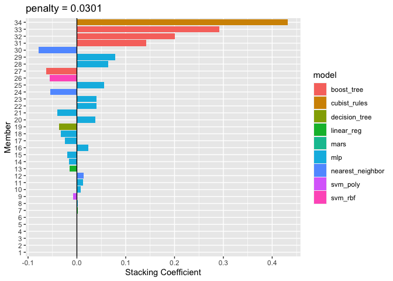

Trying to make an ensemble model


```r
library(tidyverse)
```

```
## ── Attaching core tidyverse packages ──────────────────────── tidyverse 2.0.0 ──
## ✔ dplyr     1.1.4     ✔ readr     2.1.5
## ✔ forcats   1.0.0     ✔ stringr   1.5.1
## ✔ ggplot2   3.4.4     ✔ tibble    3.2.1
## ✔ lubridate 1.9.3     ✔ tidyr     1.3.0
## ✔ purrr     1.0.2     
## ── Conflicts ────────────────────────────────────────── tidyverse_conflicts() ──
## ✖ dplyr::filter() masks stats::filter()
## ✖ dplyr::lag()    masks stats::lag()
## ℹ Use the conflicted package (<http://conflicted.r-lib.org/>) to force all conflicts to become errors
```

```r
library(tidymodels)
```

```
## ── Attaching packages ────────────────────────────────────── tidymodels 1.1.1 ──
## ✔ broom        1.0.5      ✔ rsample      1.2.0 
## ✔ dials        1.2.0      ✔ tune         1.2.1 
## ✔ infer        1.0.5      ✔ workflows    1.1.4 
## ✔ modeldata    1.2.0      ✔ workflowsets 1.0.1 
## ✔ parsnip      1.2.1      ✔ yardstick    1.3.1 
## ✔ recipes      1.0.10     
## ── Conflicts ───────────────────────────────────────── tidymodels_conflicts() ──
## ✖ scales::discard() masks purrr::discard()
## ✖ dplyr::filter()   masks stats::filter()
## ✖ recipes::fixed()  masks stringr::fixed()
## ✖ dplyr::lag()      masks stats::lag()
## ✖ yardstick::spec() masks readr::spec()
## ✖ recipes::step()   masks stats::step()
## • Search for functions across packages at https://www.tidymodels.org/find/
```

```r
tidymodels_prefer()
library(finetune)
library(recipes)
library(rules)
library(baguette)
library(doMC)
```

```
## Loading required package: foreach
## 
## Attaching package: 'foreach'
## 
## The following objects are masked from 'package:purrr':
## 
##     accumulate, when
## 
## Loading required package: iterators
## Loading required package: parallel
```

```r
registerDoMC(cores = 8)
library(stacks)
#library(future)
```


```r
load("TMWR_wrapup_all_race_results_save.Rdata")
```

## Create the training set for stacking


```r
hr_stack <- 
  stacks() %>% 
  add_candidates(all_race_results_save)

hr_stack
```

```
## # A data stack with 12 model definitions and 96 candidate members:
## #   MARS: 2 model configurations
## #   CART: 2 model configurations
## #   CART_bagged: 1 model configuration
## #   RF: 15 model configurations
## #   boosting: 6 model configurations
## #   Cubist: 1 model configuration
## #   SVM_radial: 1 model configuration
## #   SVM_poly: 22 model configurations
## #   KNN: 2 model configurations
## #   neural_network: 21 model configurations
## #   full_quad_linear_reg: 21 model configurations
## #   full_quad_KNN: 2 model configurations
## # Outcome: heart_rate (numeric)
```
## Blend the predictions

```r
set.seed(2024)
hr_ens <- blend_predictions(hr_stack, penalty = 10^seq(-4, -0.5, length = 25))
```


```r
autoplot(hr_ens)
```

<!-- -->


```r
autoplot(hr_ens, type="members")
```

<!-- -->


```r
autoplot(hr_ens, type="weights")
```

<!-- -->


```r
hr_ens
```

```
## ── A stacked ensemble model ─────────────────────────────────────
## 
## 
## Out of 96 possible candidate members, the ensemble retained 17.
## 
## Penalty: 0.00104913972913631.
## 
## Mixture: 1.
## 
## 
## The 10 highest weighted members are:
```

```
## # A tibble: 10 × 3
##    member              type          weight
##    <chr>               <chr>          <dbl>
##  1 Cubist_1_13         cubist_rules 0.401  
##  2 boosting_1_24       boost_tree   0.284  
##  3 boosting_1_23       boost_tree   0.144  
##  4 boosting_1_10       boost_tree   0.0578 
##  5 neural_network_1_12 mlp          0.0452 
##  6 neural_network_1_22 mlp          0.0365 
##  7 neural_network_1_18 mlp          0.0270 
##  8 neural_network_1_02 mlp          0.0228 
##  9 neural_network_1_15 mlp          0.0108 
## 10 neural_network_1_05 mlp          0.00838
```

```
## 
## Members have not yet been fitted with `fit_members()`.
```


```r
system.time(hr_ens <- fit_members(hr_ens))
```

```
##    user  system elapsed 
## 142.314   2.408 686.339
```

## Try it on the test set

```r
reg_metrics <- metric_set(rmse, rsq)
hr_ens_test_pred <- 
  predict(hr_ens, rides_test) %>% 
  bind_cols(rides_test)

hr_ens_test_pred %>% 
  reg_metrics(heart_rate, .pred)
```

```
## # A tibble: 2 × 3
##   .metric .estimator .estimate
##   <chr>   <chr>          <dbl>
## 1 rmse    standard      12.5  
## 2 rsq     standard       0.476
```
Compared to RMSE 11.6 and Rsq 0.54 for the boosting model on its own.

## Repeat, allowing negative

## Blend the predictions

```r
set.seed(2024)
hr_ens_2 <- blend_predictions(hr_stack, penalty = 10^seq(-4, -0.5, length = 25), non_negative = FALSE)
```


```r
autoplot(hr_ens_2)
```

<!-- -->


```r
autoplot(hr_ens_2, type="members")
```

<!-- -->


```r
autoplot(hr_ens_2, type="weights")
```

<!-- -->


```r
hr_ens_2
```

```
## ── A stacked ensemble model ─────────────────────────────────────
## 
## 
## Out of 96 possible candidate members, the ensemble retained 34.
## 
## Penalty: 0.0301416252987739.
## 
## Mixture: 1.
## 
## 
## The 10 highest weighted members are:
```

```
## # A tibble: 10 × 3
##    member              type              weight
##    <chr>               <chr>              <dbl>
##  1 Cubist_1_13         cubist_rules      0.432 
##  2 boosting_1_24       boost_tree        0.291 
##  3 boosting_1_23       boost_tree        0.201 
##  4 boosting_1_10       boost_tree        0.142 
##  5 KNN_1_11            nearest_neighbor -0.0790
##  6 neural_network_1_12 mlp               0.0786
##  7 neural_network_1_22 mlp               0.0640
##  8 boosting_1_03       boost_tree       -0.0628
##  9 SVM_radial_1_07     svm_rbf          -0.0561
## 10 neural_network_1_02 mlp               0.0561
```

```
## 
## Members have not yet been fitted with `fit_members()`.
```


```r
system.time(hr_ens_2 <- fit_members(hr_ens_2))
```

```
##    user  system elapsed 
## 278.831   2.972 265.575
```

## Try it on the test set

```r
reg_metrics <- metric_set(rmse, rsq)
hr_ens_test_pred_2 <- 
  predict(hr_ens_2, rides_test) %>% 
  bind_cols(rides_test)

hr_ens_test_pred_2 %>% 
  reg_metrics(heart_rate, .pred)
```

```
## # A tibble: 2 × 3
##   .metric .estimator .estimate
##   <chr>   <chr>          <dbl>
## 1 rmse    standard      12.5  
## 2 rsq     standard       0.478
```
A little better than the one that did not allow negatives, but not as good as straight boosting: RMSE 11.6 and Rsq 0.54 for the boosting model on its own.


